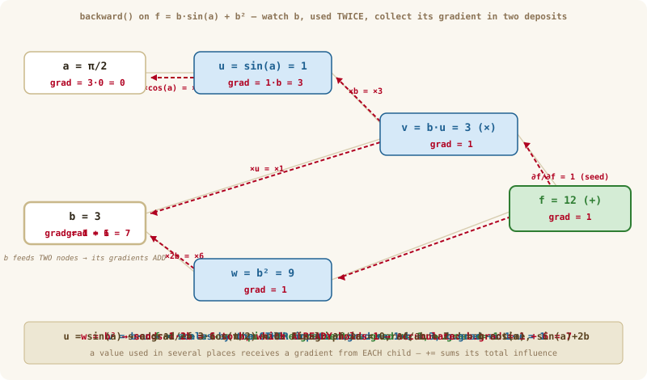
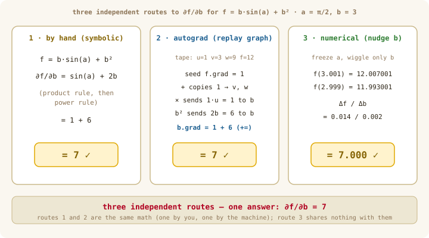

# Deep Dive: Three Routes to the Same Gradient

> Optional reading for Chapter 08 — best read **after** your `value.ts` tests pass. No new code.
>
> **TL;DR — Question:** is autograd really "just the chain rule," or something new?
> **Answer:** it's your own chain rule, reorganized into per-operation steps — proved here by
> computing one gradient four independent ways and watching them all land on the same numbers.
> **Read when:** you doubt the magic, or want the math↔machine dictionary in one place.

The routes, **in the order a student should meet them**. Route 1: by hand, the calculus you already know. Route 1½: the *same* hand computation, reorganized into tiny steps — this is secretly the autograd algorithm, run on paper. Route 2: autograd — a machine executing Route 1½. Route 3: numerical nudging — it shares nothing with the others, which makes it our independent referee.

Two follow-up questions get their own deep dives and are **not** covered here: [why reverse mode is so much cheaper](ch-08-why-reverse-mode.md), and [why symbolic calculus can't replace autodiff](ch-08-symbolic-vs-autodiff.md).

---

## The example

The chapters walked `L = (a·b) + d` — honest, but *linear*, and every input appeared exactly once. Real networks have neither luxury: values pass through curved functions (`tanh`, `exp`, softmax…) and the same value feeds many places. So this deep dive graduates to the smallest function that has both:

$$f(a, b) = b\sin(a) + b^2$$

Notice `b` appears **twice** — once multiplying `sin(a)`, once squared. Hold that thought; it becomes the star of the show.

Pick a concrete point:

$$a = \frac{\pi}{2}, \qquad b = 3$$

so that $\sin(a) = 1$ and $f = 3 \cdot 1 + 9 = 12$.
̌
The questions every route must answer: **∂f/∂a** and **∂f/∂b** at this point.

---

## Route 1 — by hand, the way you learned it

> **∂, refreshed.** If the symbol has gone rusty: $\partial f/\partial a$ means *"wiggle `a` by a tiny amount, **freeze every other input**, and watch how `f` responds."* That freezing is why the rules below say "treat `b` as a constant" — holding the others still is literally what the ∂ notation promises. (Chapter 07 built this idea; this box is all we need of it.)

Differentiate $f = b\sin(a) + b^2$ term by term:

- **With respect to `a`** (treat `b` as a constant): the derivative of $b\sin(a)$ is $b\cos(a)$; the $b^2$ term doesn't contain `a`, so it contributes nothing.
- **With respect to `b`** (treat `a` as a constant): the derivative of $b\sin(a)$ is $\sin(a)$; the derivative of $b^2$ is $2b$.

$$\frac{\partial f}{\partial a} = b\cos(a), \qquad \frac{\partial f}{\partial b} = \sin(a) + 2b$$

At our point:

$$\frac{\partial f}{\partial a} = 3\cos(\pi/2) = 3 \cdot 0 = \boxed{0} \qquad \frac{\partial f}{\partial b} = 1 + 6 = \boxed{7}$$

That surprising zero is real: at $a = \pi/2$, `sin` sits exactly on top of its hill — flat. Wiggling `a` doesn't move $\sin(a)$ at all (to first order), so nothing downstream moves either.

Route 1 works perfectly. Keep its two answers in your pocket — every other route will be judged against them.

---

## Route 1½ — the same math, one tiny equation at a time

Before any machine enters the picture, a change of *style*. Route 1 differentiated $f$ in one shot, holding the whole expression in your head. Route 1½ refuses to differentiate anything bigger than **one operation**. It looks like extra bookkeeping. It is secretly the entire idea behind autograd — which is why this is the most important section of the deep dive.

And to be clear about what we're doing: this is **not a new kind of differentiation**. We will reach exactly Route 1's formulas. We're just reorganizing *the order of the work* — into a form so simple and so rule-bound that, by the end, you'll see no mathematician is required to carry it out.

### Name every intermediate quantity

Instead of differentiating one big expression, give each in-between value its own letter:

$$u = \sin(a), \qquad v = b\,u, \qquad w = b^2, \qquad f = v + w$$

Notice something? **Every equation now contains only one operation.** This is exactly how you'd simplify a messy expression on paper — we've just done it relentlessly.

### Differentiate each small equation

Take the differential of each line — each needs exactly one textbook rule:

$$f = v + w \;\;\Rightarrow\;\; df = dv + dw \qquad \text{(sum rule)}$$

$$v = b\,u \;\;\Rightarrow\;\; dv = u\,db + b\,du \qquad \text{(product rule)}$$

$$w = b^2 \;\;\Rightarrow\;\; dw = 2b\,db \qquad \text{(power rule)}$$

$$u = \sin(a) \;\;\Rightarrow\;\; du = \cos(a)\,da \qquad \text{(derivative of sine)}$$

Nothing clever happened. Four lines, four rules from first-year calculus.

### Substitute, starting from the output

Start at $df$ and substitute downward:

$$df = dv + dw = \underbrace{u\,db + b\,du}_{dv} + \underbrace{2b\,db}_{dw}$$

Substitute $du = \cos(a)\,da$ and replace $u = \sin(a)$:

$$df = b\cos(a)\,da + \big(\sin(a) + 2b\big)\,db$$

### Read off the coefficients

Here the ∂ refresher pays off: "freeze `b`" literally means *set $db = 0$* — and what's left, **the coefficient of $da$, is $\partial f/\partial a$**. A partial derivative is just a coefficient in the differential. That's all it ever was.

$$\frac{\partial f}{\partial a} = b\cos(a) = 0, \qquad \frac{\partial f}{\partial b} = \sin(a) + 2b = 7$$

Route 1's formulas, Route 1's numbers — recovered without ever differentiating $b\sin(a) + b^2$ as a whole. We differentiated four one-operation equations and let substitution assemble the answer.

### Two moments to remember

Two things happened during that substitution, and both get names in Route 2:

1. **The two $db$ terms collected into one coefficient.** $u\,db$ (from the product) and $2b\,db$ (from the square) merged into $(\sin(a) + 2b)\,db$. That's just collecting like terms — but notice *why* there were two: `b` appears in **two** places, so it influences $f$ along two paths, and its total influence is the **sum**. Remember this.
2. **We substituted from the output down.** We started at $df$ and worked toward $da$ and $db$ — from the result back to the inputs. Remember this too.

Now look back at the whole computation. Every step was one baby rule applied to one tiny equation, plus substitution. No insight, no cleverness, no "seeing" the right factorization — **nothing a machine couldn't do**. That machine is Route 2.

---

## Route 2 — autograd: a machine running Route 1½

Autograd computes the same numbers — but no human differentiates anything. **How** the machinery is built is the chapters' job — [08a](../part-2-autodiff/ch-08a-autograd-forward.md) builds the recording, [08b](../part-2-autodiff/ch-08b-autograd-backward.md) builds the replay — and we won't re-teach it here. To follow this route you need only two facts from those chapters, and you've already met the math of both.

**Fact 1 (08a): evaluating `f` leaves behind a record — and it is exactly Route 1½'s list of tiny equations.** A computer never sees $b\sin(a) + b^2$ as one expression anyway; it performs elementary operations one at a time, and autograd makes each result remember its value and where it came from:

```
u = sin(a) = 1      v = b·u = 3      w = b·b = 9      f = v + w = 12
```

```
a ────► [sin] ────► u ──┐
                        ├──► [×] ────► v ──┐
b ──────────────────────┘                  ├──► [+] ────► f
│                                          │
└────────► [b·b] ────────────────────► w ──┘
```

Note `b`'s **two** outgoing edges — the two paths from moment-to-remember #1.

> *(One honesty note: our `Value` class implements `tanh`, `exp`, `log`, `pow` — not `sin`. It changes nothing: any differentiable operation can be a node once you know its one local rule — for `sin`, that's `cos`. Adding `Value.sin()` yourself is Exercise 6.)*

**Fact 2 (08b): `f.backward()` visits the nodes from the output down**, applying each operation's one-line derivative rule to the recorded values — substitution from $df$ downward, mechanized (moment-to-remember #2). Here is the entire replay, and every row is one of Route 1½'s differential lines with our numbers plugged in:

| Visit | Route 1½ said | Machine does |
|---|---|---|
| `f` | $\partial f/\partial f = 1$ | seed: `f.grad = 1` |
| $f = v + w$ | $df = dv + dw$ | `+` copies: `v.grad = 1`, `w.grad = 1` |
| $v = b\,u$ | $dv = u\,db + b\,du$ | `u.grad = 1·b = 3`, `b.grad += 1·u = 1` |
| $w = b^2$ | $dw = 2b\,db$ | `b.grad += 2b = 6` → **`b.grad = 1 + 6 = 7`** |
| $u = \sin(a)$ | $du = \cos(a)\,da$ | `a.grad = 3·cos(π/2) = 3·0 = 0` |

Two rows are worth staring at:

- **`b` collected its gradient in two deposits** — `1` through the product path, `6` through the square path, summed by `+=`. You already did this in Route 1½: it's the two $db$ terms collecting into one coefficient, performed by code instead of algebra. (With `=` instead of `+=`, the second deposit would overwrite the first — a wrong `6`.)
- **`a`'s gradient got gated to `0`** by the recorded $\cos(\pi/2) = 0$ — the same hilltop Route 1 found by algebra, discovered by a machine that never knew it was on a hilltop.

$$\frac{\partial f}{\partial a} = 0 \;\checkmark \qquad \frac{\partial f}{\partial b} = 7 \;\checkmark$$

And here's the part worth sitting with: **the machine never derived $b\cos(a)$ or $\sin(a) + 2b$.** It never saw the whole expression at all. It only knew four index-card rules —

- `+` → copy the gradient
- `×` → scale by the other input
- `(·)²` → scale by $2b$
- `sin` → scale by $\cos$

— and chained them together with recorded values. That is why PyTorch can differentiate a program with millions of operations: it needs gradient rules only for the *primitive* operations; the recorded graph and the chain rule do everything else.

Watch the replay unfold — pay attention to `b`'s gradient box, which fills in **two installments**:

<p align="center">
  
</p>

*Figure 1: Route 2's replay, animated. `b` receives its gradient in two deposits — `1` from the product path, then `+6` from the square path — landing on `7`. And watch the `sin` node gate `a`'s gradient to `0`: the recorded `cos(π/2) = 0` shuts the door.*

### The dictionary, line by line

If you ever lose your footing in Chapter 08, come back to this table — it is the whole bridge between the math and the machine:

| Route 1½ (mathematician) | Route 2 (autograd) | Where in our code |
|---|---|---|
| introduce $u, v, w$ | build graph nodes `u, v, w` | forward pass (08a) |
| $du = \cos(a)\,da$ | `sin`'s local rule: scale by `cos(a)` | that node's `_backward` |
| $dv = u\,db + b\,du$ | `×`'s local rule: scale by the *other* input | `mul`'s `_backward` |
| substitute from $df$ downward | visit nodes output → inputs | `backward()` + reverse `topoSort` (08b) |
| collect the two $db$ terms into one coefficient | `b.grad += …` twice | the `+=` accumulation |
| read off coefficients at $a=\pi/2, b=3$ | read `a.grad`, `b.grad` | after `f.backward()` |

**Reverse-mode differentiation is substitution from the output down — nothing more.** The rest is bookkeeping, and bookkeeping is what computers are for.

---

## Route 3 — numerical: just nudge it and look

Forget calculus entirely. Push each input up by a hair — *the other frozen* — and **measure** how much `f` moves; the definition of a slope from Chapter 07 (centered version):

```
nudge b, freeze a:   f(π/2, 3.001) = 12.007001
                     f(π/2, 2.999) = 11.993001
                     slope = 0.014 / 0.002 = 7.000000

nudge a, freeze b:   f moves by ~0.0000000 either way
                     slope ≈ 0
```

**Same answers again — `7` and `0`.** And this route shares *nothing* with the other three: no chain rule, no tiny equations, no recorded graph — just "change the input, watch the output." Run it yourself:

```bash
bun -e '
const f = (a, b) => b * Math.sin(a) + b * b;
const h = 1e-5, a = Math.PI / 2, b = 3;
console.log("df/da ≈", (f(a + h, b) - f(a - h, b)) / (2 * h));  // ≈ 0
console.log("df/db ≈", (f(a, b + h) - f(a, b - h)) / (2 * h));  // ≈ 7
'
```

(A pleasing detail: for `b` the centered difference is not just close — it's *exact*, because `f` is a quadratic in `b` and the centered formula has no error on quadratics. That's the $O(h^2)$ story from the [Chapter 07 deep dive](ch-07-why-centered-difference.md).)

---

## They all agree — and that agreement is the proof

| Route | How it works | `∂f/∂a` | `∂f/∂b` |
|-------|--------------|:---:|:---:|
| 1. By hand | calculus rules, one shot | **0** | **7** |
| 1½. Tiny steps | same rules, reorganized | **0** | **7** |
| 2. Autograd | a machine replaying Route 1½ | **0** | **7** |
| 3. Numerical | nudge the input, measure | **≈0** | **7** |

<p align="center">
  
</p>

*Figure 2: The routes lined up on `∂f/∂b`. Routes 1, 1½ and 2 are the same mathematics (Route 1½ is literally the proof of that); route 3 is a completely separate brute-force check — all land on `7`.*

Routes 1, 1½ and 2 are the *same mathematics* — so a correctly-coded autograd **cannot** disagree with the hand answer. Route 3 is *independent* — no chain rule anywhere in it — so when the slow-but-honest nudge also says `7`, it rules out a shared mistake. That's exactly why the course uses `numericalGradient` (Route 3) as the **test oracle** for autograd (Route 2): use the fast method everywhere, and spot-check it against the slow one. Fast *and* trustworthy.

One question this deep dive deliberately does **not** answer: on this two-input toy, all four routes cost about the same arithmetic — so *why bother building autograd at all?* The short version: numerical needs `2N` full re-runs for `N` weights, autograd gets **every** gradient for ~2 passes total — a million-fold gap at network scale. The full argument, with figures, is the [why reverse-mode wins](ch-08-why-reverse-mode.md) deep dive. And if you're wondering why we don't just do *symbolic* calculus at scale, that's [its own story](ch-08-symbolic-vs-autodiff.md).

---

## Pen-and-paper exercises

1. For `L = (a + b)·c` with `a=1, b=2, c=3`, compute `∂L/∂a`, `∂L/∂b`, `∂L/∂c` by hand; then replay the recorded graph (seed `L.grad=1`); then nudge each input numerically. Confirm all three agree.
2. Take `L = x³ + x²` at `x = 2`. Draw its graph — `x` feeds **two** children (the cube node and the square node). Trace the two contributions into `x.grad` during the backward sweep and check the accumulated total against `3x² + 2x = 16`.
3. Explain, in one sentence each, why Route 2 can *never* disagree with Route 1 if it's coded correctly, but Route 3 *can* differ slightly — and what that small difference is called (hint: Ch 07 deep dive).
4. **Rerun Route 2** at `a = π/6, b = 2` (now `cos ≠ 0`, so `a`'s gradient survives the gate). Recompute the recorded values `u, v, w, f`, then replay the table row by row — seed, `+`, `×`, square, sine — and confirm you land on `∂f/∂a = b·cos(π/6) = √3` and `∂f/∂b = sin(π/6) + 2b = 4.5`.
5. **Route 1½, on a new function.** For `g(a, b) = a·eᵇ + a²`: introduce intermediates (`u = eᵇ`, `v = a·u`, `w = a²`, `g = v + w`), differentiate each line, substitute from `dg` downward, and read off the coefficients of `da` and `db`. Which variable collects two terms this time, and which `+=` in a backward pass does that collecting correspond to?
6. **Stretch (code, after finishing 08b):** add `Value.sin()` to your implementation. Its `_backward` is one line — the local rule is `cos` of the stored input. Then verify it against `numericalGradient` at a few points, including `a = π/2`, where the gradient should vanish exactly as in Route 2's replay.
