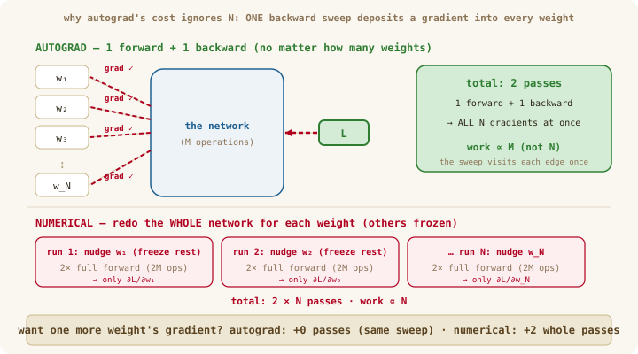
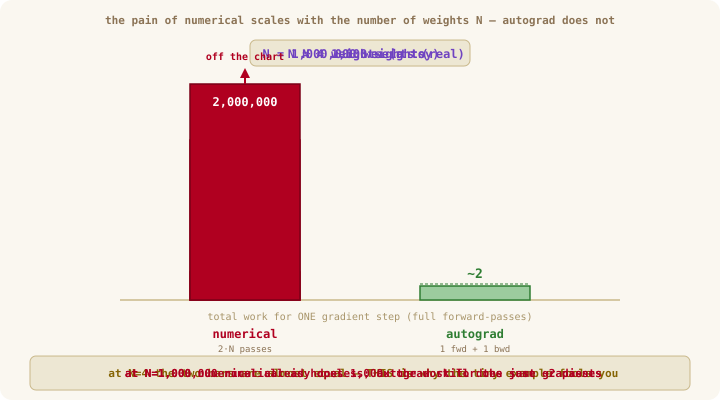

# Deep Dive: Why Reverse-Mode Autodiff Wins

> Optional reading for Chapter 08 — best read **after** 08b. No new code.
>
> **TL;DR — Question:** why is *one* backward pass enough to get **every** gradient — and
> why must that pass walk the graph in reverse topological order?
> **Answer:** the backward sweep's cost is set by the *size of the computation*, not the
> *number of weights* (~2 passes total, whether there are ten weights or ten million); and
> reverse-topological order is the only order that guarantees a node's gradient is complete
> before it fires.
> **Read when:** the "O(1) passes" claim sounds too good to be true, or your gradients come
> out wrong and you suspect the visiting order.

---

## The setup

A network has **one** output that matters — the scalar loss `L` — and **millions** of inputs that matter: every weight. Training needs `∂L/∂θ` for *all* of them, every step. Two numbers describe the situation: **`M`** = how many operations one forward pass costs, and **`N`** = how many weights need gradients. Watch how each method's total work grows with them.

---

## Part 1 — counting the cost

### Numerical differentiation (Ch 07): `2·N·M`

To get the gradient of **one** weight, the centered difference runs the *entire* forward pass twice (once at `θ+h`, once at `θ−h`). And it can only nudge one weight at a time — that `N` is the **partial-derivative loop**, and there is no way around it:

```
for each weight wᵢ  (i = 1 … N):          ← this loop is the N
    freeze every other weight
    wᵢ → wᵢ + h ;  run the FULL forward → L₊     ← pass 1   (M ops)
    wᵢ → wᵢ − h ;  run the FULL forward → L₋     ← pass 2   (M ops)
    ∂L/∂wᵢ = (L₊ − L₋) / 2h
```

This is *literally* the code you wrote in Ch 07: `numericalGradientTensor` loops over every element, perturbs **only that one** (on a copy, so the rest stay frozen), and runs `fn` twice. A small network with `N = 1,000,000` weights and a 10 ms forward pass would need ~**5.5 hours per training step**. Dead on arrival — but invaluable as a *correctness check* on a handful of values, which is exactly how the course uses it.

### Forward-mode autodiff: also `O(N)`

There's a slick way to get *exact* derivatives in one pass by carrying a derivative alongside each value ("dual numbers" — the *tangent mode* you may have seen in videos). But each pass tracks the derivative with respect to **one chosen input** (seed that input's derivative to 1, all others to 0). To cover `N` inputs you need `N` passes. Great when you have few inputs and many outputs — the exact *opposite* of a neural network.

### Reverse-mode autodiff (Ch 08): `~2·M` — the `N` is gone

**Autograd never loops over weights.** It runs the forward pass **once** (computing and recording every intermediate value), then does **one** backward sweep. That sweep is a single walk over the graph that visits **each edge exactly once** — and there are about `M` edges (one per operation). At each edge it does a tiny fixed amount of work: multiply the incoming gradient by the local rule and add it to the parent. So the backward pass costs `~M`, *set by the size of the computation* — **not** by how many of the leaves happen to be weights.

The weights are just **leaves of that one graph**. As the single sweep flows backward, it *passes by* every leaf and deposits that leaf's gradient on the way through. It doesn't restart for each weight; all `N` gradients fall out of the *same* walk:

<p align="center">
  
</p>

*Figure 1: The same backward sweep fills **every** weight's gradient. Top — autograd: one forward, one backward; the sweep walks the graph once and drops a gradient into each weight-leaf as it passes (`~2` passes, work ∝ `M`). Bottom — numerical: a fresh pair of forward passes for **each** weight, with the others frozen (`2N` passes, work ∝ `N`).*

The decisive question to feel the difference: **"what does it cost to also get the gradient of one more weight?"**

- **Numerical:** another `+2` full forward passes (a brand-new run of the whole network for that weight).
- **Autograd:** `+0`. That weight was already a leaf in the graph; the one sweep you were doing anyway already deposited its gradient.

(You can watch this in miniature in the [three routes deep dive](ch-08-three-ways-to-a-gradient.md): one sweep fills `a`'s gradient *and* both of `b`'s deposits — nothing restarts per input.)

### The scoreboard

| Method | Passes for all `N` gradients | Good when |
|--------|------------------------------|-----------|
| Numerical | ~`2N` forward | never (only spot-checks) |
| Forward-mode | `N` | few inputs, many outputs |
| **Reverse-mode** | **~2 (one fwd, one bwd)** | **many inputs, one output ← neural nets** |

Plug in a small-but-real network — `M = 1,000,000` operations, `N = 1,000,000` weights:

| Method | Formula | Operations for ONE gradient step |
|--------|---------|----------------------------------|
| Numerical | `2·N·M` | `2 × 1,000,000 × 1,000,000` = **2,000,000,000,000** (2 trillion) |
| Autograd | `~2·M` | **~2,000,000** (2 million) |

**A million times less work — for the identical gradients.** And a model needs *millions* of such steps. That is the difference between "trains overnight" and "never finishes."

<p align="center">
  
</p>

*Figure 2: Why toy examples hide the difference. At small `N` the two bars are nearly equal — which is exactly why a two-input example (like the one in the three-routes deep dive) makes all methods look equally easy. Crank `N` up and the numerical bar climbs with it (`2N`), while autograd stays flat at ~2 passes no matter what. The pain is in the slope, and toys are too small to show any slope.*

**This is the whole reason deep learning is computationally possible.** A network is "one output (the loss), enormous inputs (the weights)" — the exact shape reverse mode is built for. Backprop isn't a clever optimization bolted on; it's the only mode whose cost doesn't explode with the number of weights.

### Why numerical *can't* do better (and autograd can)

The killer word is **reuse**. Numerical can't reuse work; autograd is built on it.

Picture two early weights `w₁`, `w₂`, with 100 more operations stacked on top before the loss:

- **Numerical for `w₁`:** nudge `w₁`, run those 100 ops. **Numerical for `w₂`:** nudge `w₂`, run those *same 100 ops all over again*. Every weight re-pays the full downstream cost. It has no choice — numerical treats the network as a **sealed black box**: the only way it can learn about a weight is to wiggle it and watch the final output.
- **Autograd:** runs forward once, then in the backward pass computes "how sensitive the loss is to the output of those 100 ops" **one time**, and cheaply hands that shared gradient to both `w₁` and `w₂`. It **opened the box** — it recorded every intermediate step, so the chain rule lets gradients to many weights ride the *same* backward computation.

> **One sentence:** numerical recomputes everything from scratch for every weight; autograd computes the shared pieces once and distributes them. On a two-input toy there is almost nothing to share — which is precisely why toys hide the whole advantage.

### Which to pick — the verdict

| Route | Human effort | Compute cost | Accuracy | Use it for… |
|-------|:---:|:---:|:---:|---|
| **By hand** | ❌ derive a formula per weight (impossible at 124M) | cheap | exact | *understanding* one operation |
| **Numerical** | ✅ trivial to code | ❌ `O(N)` — a million× too slow | ❌ approximate | *checking* a few gradients |
| **Autograd** | ✅ trivial to use | ✅ `O(1)` passes | ✅ exact | **everything real** |

Autograd is the only method that's cheap on **both** human effort *and* compute, *and* exact. That's the entire reason it's the engine of every model in this course — with `numericalGradient` kept around as the slow-but-independent referee in the tests.

---

## Part 2 — why reverse *topological* order is the only correct order

The backward pass has a strict rule: **a node may push gradient to its parents only after it has received gradient from *all* of its children.** Push too early and you send a half-finished number.

Consider `x` used twice: `L = x² + x`. The node `x` has two children (the `²` node and the `+` node). Its true gradient is the **sum** of what both children send back. If the backward pass visited `x` after only the `²` child had contributed, `x.grad` would be wrong — missing the `+ x` term.

**Topological order** is precisely an ordering where every node appears after all of its inputs. Walk it in **reverse** and you get the mirror guarantee: every node is visited only after all of its *children* — so by the time we call `node._backward()`, `node.grad` is already complete. The `+=` accumulation then finishes the job safely.

```
forward topo order:   x,  x²,  x,  +        (inputs before outputs)
reverse:              +,  x², x...          (outputs before inputs)
                      ▲ every node fully accumulated before it fires
```

Any order that violates this — say, plain depth-first without the post-order append, or visiting in forward order — can fire a node before its gradient is complete, producing silently wrong gradients that a numerical check (Part 1) would then catch.

> **Acyclic matters too.** Topological order only exists for a DAG. That's why the graph must be acyclic — a cycle would mean "a value depends on itself," and there'd be no valid order to accumulate in. (Recurrent nets *look* cyclic but are "unrolled" into a DAG over time before backprop.)

---

## The payoff

Putting both parts together: reverse-mode autodiff computes **every** gradient in a network for about the price of a single extra forward pass, and the reverse-topological walk guarantees each one is exact. That combination — cheap *and* correct, regardless of how many millions of weights — is what makes training large models feasible at all.

---

## Pen-and-paper exercises

1. For `L = x² + x` at `x = 3`, hand-trace the backward pass. Show how `x.grad` ends at `2x + 1 = 7` only because both children accumulated with `+=`.
2. A function has 2 inputs and 500 outputs. Which mode (forward or reverse) is cheaper for the full set of derivatives, and by roughly what factor?
3. Sketch a 3-node graph and find an ordering that is *not* reverse-topological. Trace it and identify the exact node whose gradient comes out wrong.
4. **Count the cost.** A network costs `M = 50,000` operations per forward pass and has `N = 20,000` weights. How many operations does numerical differentiation need for one full gradient step (`2·N·M`)? How many does autograd need (`~2·M`)? What's the ratio? Now imagine you must run 100,000 training steps — estimate the total for each.
5. Suppose a weight `w` sits at the very start of the network, with `T` operations stacked on top of it before the loss. Explain why numerical pays the cost of all `T` ops to get `w`'s gradient, but autograd has already paid for those `T` ops during the single backward pass it does anyway. (This is the "reuse" point in one example.)
