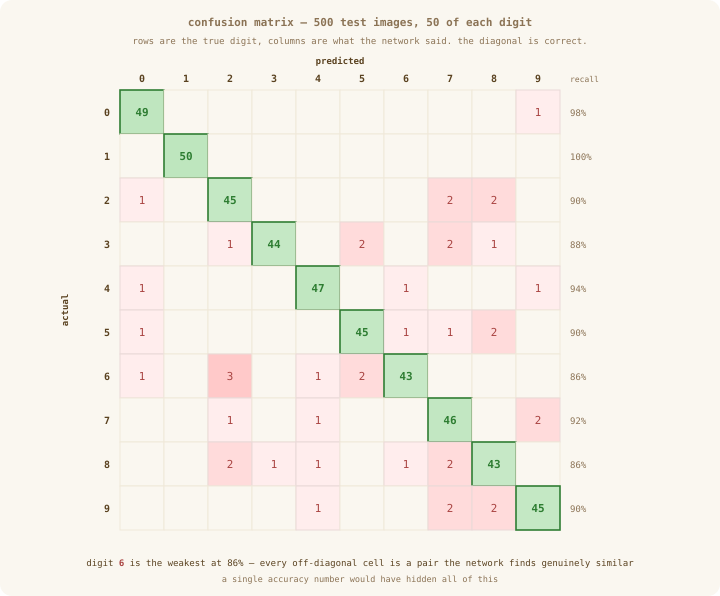
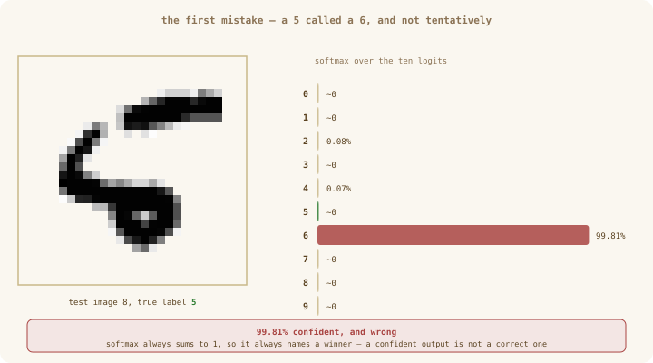

# Deep Dive — A three-hidden-layer network on MNIST

**Extends:** Chapter 15 (The Training Loop)
**Build it:** `exercises/deep-dive-mnist-dense.ts` — seven stubs to fill in, then `bun run exercises/deep-dive-mnist-dense.ts`

> Every number in this document was produced by a correct implementation of that file, so it doubles as the answer key: if your run lands near 91% test accuracy with 100% train accuracy, you have it right.

Every chapter so far has trained on a toy. XOR is four rows. The circle from the Ch 15 exercise is a thousand points in two dimensions. Both were chosen because you can hold them in your head.

This is the other kind of test. **784 inputs, ten classes, three hidden layers, 111,146 parameters, and a dataset nobody solves by inspection.** The question is not whether neural networks work — it is whether *the library you built* is a real one.

The answer is yes, and the interesting part is what it gets wrong.

> **Nothing new is imported.** `Linear` (Ch 13), `relu` (Ch 11), `crossEntropyFromLogits` (Ch 12), `Adam` (Ch 14) and `argmax` (Ch 05). The only code written for this deep dive is a file reader and a batching helper, and neither is machine learning.

---

## The data, and the four decisions before any of it

MNIST is 70,000 handwritten digits, 28×28 pixels, greyscale. Before a single weight is initialised, four choices have already been made about it, and each one is a place beginners lose days.

### 1. What an image *is*, to the network

<div align="center">
  
</div>

You look at that picture and see a seven. The network never sees a picture at all.

**A digital image is a grid of dots.** Each dot stores one number: how dark it is. `0` is blank paper, `255` is solid ink, and everything between is a shade of grey. That is all a "pixel" is — one number, for one dot.

These digits are **28 dots across and 28 dots down**, so one image is

$$28 \times 28 = 784 \text{ numbers.}$$

But our `Tensor` holds a straight *row* of numbers, not a grid. So we flatten the grid: read the top row of dots left to right, then the next row, then the next, until all 28 rows are laid end to end in one line of 784. That is the row-major layout from Ch 01, and now it is doing real work.

**Flattening throws something away, and it is worth knowing what.** In the grid, a dot and the dot directly beneath it are touching. Once flattened they sit 28 places apart in a long line, with nothing marking them as related — and nobody ever tells the network they were neighbours. Any of that it needs, it has to work out for itself, from examples alone.

> Think of a page of text retyped as one enormous line, with no line breaks. Every word is still there. The layout that made it readable is gone.

This is the honest limitation of the kind of network we are building — a **dense** network, meaning every unit connects to every unit, with no notion of which inputs are near which. There is a different design (a *convolutional* network) that builds the grid relationship in from the start. We are not building one, and this course goes toward attention instead. But it is why the accuracy here has a ceiling, and it is better to know that now than to be puzzled by it at the end.

### 2. Sampling — choosing which images to use

**"Sampling" just means picking a smaller set when you cannot use everything.** That is the whole word.

The full MNIST collection is 70,000 images and 54 MB, which is too big to keep inside a course repository. So we keep a smaller set — 2,000 for training, 500 for testing. The question is *which* 2,000, and the obvious answer is wrong.

**The obvious answer:** take the first 2,000 in the file. Simple, and it introduces a problem that is hard to spot later.

The digits are not evenly spread through the file. Suppose the slice you grabbed happened to be heavy on the digit `1` — say 150 of your 500 test images were `1`s. Now build a network that ignores the picture completely and answers `"1"` every single time. It scores **30%**. Three times better than guessing, from a model that never looked at the input.

That is the trap: **the score is no longer trustworthy**, because you cannot tell a network that learned something from one that noticed which answer is most common.

**The fix is to take the same number of each digit.** Two hundred of each for training, fifty of each for testing:

```text
  training images per digit
  0:200  1:200  2:200  3:200  4:200  5:200  6:200  7:200  8:200  9:200
```

Now every digit is equally likely, so pure guessing scores exactly **1 in 10 = 10%**, and anything above 10% is something the network actually learned. The score means what you want it to mean again.

> The technical word for "take the same amount from each group" is **stratified**. You will see it in dataset documentation; it is not more complicated than the line above.

`scripts/make_mnist_subset.py` does the picking and documents the file format.

### 3. Scaling — why every pixel is divided by 255

Each pixel is stored as a whole number from `0` to `255`. Before the network sees it, we divide by 255 so it becomes a decimal between `0.0` and `1.0`:

$$x_{\text{used}} = \frac{x_{\text{stored}}}{255}$$

A dot storing `255` becomes `1.0`. A dot storing `128` becomes about `0.5`. Nothing about the picture changes — the same dots are still the same relative darkness. Only the size of the numbers changes.

**And that turns out to matter a great deal.** Here is why, without the algebra.

The first layer's job is to multiply 784 input numbers by 784 weights and add them all up. Chapter 13 chose the starting size of those weights *on the assumption that the inputs would be around 1*. That was the whole point of the `he` formula $\sqrt{2 / \text{inputDim}}$ — pick weights small enough that adding up 784 of these products gives a sensible-sized answer rather than an enormous one.

Now feed in raw values of up to `255` instead. Every one of those 784 products is up to 255 times bigger than the weights were designed for, so the sum is wildly too large. Chapter 11 already showed what happens to a unit fed a huge number: it lands far out on the flat part of the curve, where the gradient is nearly zero and learning stalls.

**The network will not crash.** It will train, slowly and badly, and nothing in the output will tell you why. One line of code, and it is holding up everything above it.

### 4. One-hot targets — why `[500, 10]` and not `[500]`

The correct answer for an image is a single digit — say `7`. But the network does not output a digit. It outputs **ten numbers**, one score per possible answer, and the biggest score is its guess.

So the correct answer has to be written in that same shape before the two can be compared. Ten numbers, a `1` in the position of the right answer and `0` everywhere else:

```text
  label 7  →  [0, 0, 0, 0, 0, 0, 0, 1, 0, 0]
                                    ↑
                             position 7 (counting from 0)
```

That is called **one-hot** — one position is "hot", the rest are cold. It is not a clever trick; it is just the answer, rewritten so it lines up with the output.

Because both sides are now ten numbers wide, the loss can compare them position by position. That is exactly what `crossEntropyFromLogits` expects, and Ch 12 built it around this shape on purpose: with the answer as a row of ten, picking out the score of the *right* digit is a `mul` and a `sum`, both of which autograd already knows how to differentiate.

> **The pitfall Ch 12 already caught.** It is tempting to skip the one-hot and just read the right digit's score straight out of the data. It gives the identical loss value — and a wrong gradient, because reaching into `.data` takes the number *out of the graph*, so `backward()` can no longer trace it. The loss looks correct and the network never learns properly.

So targets have shape `[count, 10]`, matching the model's output exactly.

---

## The architecture, and where the parameters actually are

<div align="center">
  
</div>

Four `Linear` layers, `relu` between each pair, nothing after the last:

$$784 \;\rightarrow\; 128 \;\rightarrow\; 64 \;\rightarrow\; 32 \;\rightarrow\; 10$$

**Why a funnel?** Each layer has to describe its input using fewer numbers than it received. `128` is not enough room to store a 784-pixel image, so the layer is forced to keep whatever distinguishes digits and discard the rest. Stack three of those and the network is repeatedly asked to compress — and the only compressions that survive training are the ones that keep the loss down.

That is the intuition. Be honest that it is an intuition: the widths `128, 64, 32` are conventional, not derived. Ch 15's rule still applies — wide enough that losing a few units does not matter, then stop.

> **If "hidden layer" is still a fuzzy phrase, read [What a hidden layer actually does](ch-15-what-hidden-layers-do.md) first.** It takes the question apart from the beginning — why `relu` on its own bends nothing, why one unit is exactly one bend, why a layer's *width* is simply how many bends you get, and why these widths shrink here while XOR's expand. It also measures how many layers are worth having, and finds the answer is different for a plain curve than for images.

**Where the parameters are is not intuitive at all.** A layer's parameter count is $(\text{in} \times \text{out}) + \text{out}$:

| layer | shape | weights | biases | total | share |
|---|---|---|---|---|---|
| 1 | `784 → 128` | 100,352 | 128 | **100,480** | 90.4% |
| 2 | `128 → 64` | 8,192 | 64 | 8,256 | 7.4% |
| 3 | `64 → 32` | 2,048 | 32 | 2,080 | 1.9% |
| 4 | `32 → 10` | 320 | 10 | 330 | 0.3% |
| | | | | **111,146** | |

**The first layer is 90% of the network.** The three deeper layers together are under 10%. When people say a model has *N* parameters, that number is usually dominated by whichever layer touches the widest thing — here, the raw image.

### One image, every shape

<div align="center">
  
</div>

Every step is `y = xWᵀ + b` from Ch 13, then a gate from Ch 11. Read it once and the implementation writes itself.

Two details in that trace worth stating outright:

**The batch dimension changes nothing.** The trace shows `[1, 784]`; training uses `[64, 784]`. Every shape below simply gains the same first number. That is the whole reason batching is free.

**The last layer has no activation.** It emits ten raw **logits** — unbounded scores, not probabilities. `crossEntropyFromLogits` applies the softmax internally (Ch 12's log-sum-exp trick). Apply `softmax` yourself first and it happens twice; Ch 15 measured that failure — it does not crash, it just learns badly and stops short.

---

## Batching, shuffling, epochs

Three words that get used together and mean different things.

<div align="center">
  
</div>

### A batch: how many images vote on each step

Training is a loop of *look, compare, adjust*. Each **adjust** is one small nudge to the weights — one `optimizer.step()`. And before you can nudge, you have to decide which way to nudge.

**That direction comes from looking at images. The question is: how many?**

Try the two extremes.

**One image at a time.** The network looks at a single `3`, works out "I should lean more toward 3", and nudges. Then it sees a single `7` and nudges toward 7s — partly undoing what it just did. It lurches, because every step follows the opinion of exactly one image, and one image is not a fair sample of what digits look like.

**All 2,000 at once.** Now the direction is excellent — it accounts for every image. But you only get to nudge *once* per pass through the data. Over 30 passes that is **30 nudges in the entire run**. The direction is perfect and the network barely moves.

So it is a trade, and the table is the whole argument:

| images per step | steps per pass | each step follows |
|---|---|---|
| 1 | 2,000 | one image's opinion — jerky and unreliable |
| **64** | **31** | **the average of 64 opinions — steady, and still plenty of steps** |
| 2,000 (all) | 1 | everything at once — but only 30 steps in the whole run |

**A batch is that middle choice: how many images vote before each nudge.** Here, 64.

Mechanically, 64 images go in together as one `[64, 784]` block. Ten scores come out for each, and the loss for the batch is **the average of the 64 individual losses** — that is the `mean` Ch 12 built into every loss function. One average loss, one `backward()`, one `step()`.

> Averaging 64 opinions does not make the direction *correct*, just far less erratic than one. That is all a bigger batch buys you.

### An epoch: one pass through all the images

Once the batch size is settled, an **epoch** is simply "keep taking batches until every image has been used once".

```text
  2000 images ÷ 64 per batch  =  31 batches, with 16 images left over
```

So one epoch is **31 nudges**, and we run 30 epochs:

```text
  30 epochs × 31 batches = 930 nudges in the whole run
```

930 steps, adjusting 111,146 numbers, in about 83 seconds.

**And those 16 leftovers?** The loop only takes full batches of 64, so each epoch ignores 16 images. That sounds careless — until you see the next idea.

### Shuffling: why the order must change every time

The file is neatly organised: all 200 zeros, then all 200 ones, then all the twos. Tidy, and **disastrous if you leave it that way.**

Cut that order into batches of 64 and look at what the first batch contains: **64 zeros.** Nothing else. Asked "which way should I nudge?", the honest answer for that batch is *"predict zero, always"* — because for these 64 images, that is correct every single time. The next batch is another 64 zeros, pushing the same way again.

Then the ones arrive and the network is dragged toward "always predict one", undoing it. Then the twos. Each step is confidently pulling in a direction that is right for one digit and wrong for the other nine.

**Shuffling fixes it by dealing the images into a new random order before every epoch.** Now each batch of 64 holds a mixture of all ten digits, so the average direction has to satisfy all of them at once — and that is the direction you actually want.

It also rescues the 16 leftovers. Because the order is redrawn every epoch, **it is a different 16 that get skipped each time**. Over 30 epochs no image is systematically ignored. With a fixed order, the same 16 images would never be trained on at all.

### "But if the images keep changing, how does anything add up?"

This is the right question to ask here, and it comes from having understood the earlier chapters properly.

In Chapter 15, XOR had four rows and **all four went through on every single step**. The input never changed. So training looked like: *one fixed input, weights improving over many steps.* That picture was completely correct — for XOR.

Now the input appears to change constantly: 64 images, then a different 64, then a reshuffle. If the network is looking at something different every time, what stops each step from undoing the last?

**The answer is that the weights are the only thing that persists, and that is enough.**

There is exactly one weight matrix per layer, and it is never rebuilt. Data flows *through* it and is discarded; the weights stay. So the nudges accumulate in the most literal way possible — by addition:

```text
  start        W₀
  after step 1 W₁ = W₀ − lr · g₁
  after step 2 W₂ = W₁ − lr · g₂  =  W₀ − lr · (g₁ + g₂)
  after step 3 W₃ = W₂ − lr · g₃  =  W₀ − lr · (g₁ + g₂ + g₃)
```

**The weight matrix *is* the running total.** Nothing else needs to remember anything, which is why `zeroGrad()` clearing `.grad` every step is harmless — `.grad` is scratch space for one step, while `W` is the accumulated result of all of them.

**And the batches are not pulling in different directions.** The real goal is to lower the loss across *all 2,000 images* — that single number is what training is minimising. No batch can measure it without looking at everything, so each batch of 64 produces an **estimate** of it. Different batches give slightly different estimates *of the same quantity*, and estimates that scatter around the truth average out over many steps.

> Ask "how tall is the average person in this city?" You could measure all million residents once — exact, and enormously slow. Or measure 64 people, get a close answer, measure another 64, get another close answer. The samples differ; they are not disagreeing about different cities.

**And your instinct to just feed everything in does work — it is simply a worse deal.** Here is that exact experiment: the same images, the same 30 passes over them, and near-identical total computation. The only difference is how often the weights are allowed to move.

```text
  batch 64, 30 epochs      930 nudges   59,520 image-passes   train 100.0%   test 90.4%   81 s
  ALL 2000, 30 epochs       30 nudges   60,000 image-passes   train  89.6%   test 83.0%   24 s
```

All-at-once is the XOR setup, applied here unchanged. It is not broken — it learned, reaching 83%. It is *behind*, because 30 nudges is simply not many, however good each one is. It was even faster in wall-clock time, and still lost by seven points.

**That is the whole trade.** A perfect direction you can only follow 30 times beats nothing — but it loses to a rough direction you can follow 930 times.

---

## The loop, unchanged

This is the point of the whole exercise. Scaling from four XOR rows to 111,146 parameters changed the *data pipeline* completely and changed the training loop **not at all**:

```typescript
optimizer.zeroGrad();                              // 1. forget
const logits = model.forward(new TensorValue(x));  // 2. guess
const loss = crossEntropyFromLogits(logits, y);    // 3. score
loss.backward();                                   // 4. blame
optimizer.step();                                  // 5. move
```

Same five lines as Ch 15. One `backward()` call still fills all eight parameter tensors, still by the rule traced by hand in Ch 15: each layer blames its own `W` and `b`, then hands what is left to the layer beneath. With four layers it is the same two jobs, four times.

---

## What happened

<div align="center">
  
</div>

```text
  epoch     loss   train acc   test acc
      1   1.6025      77.0%      71.8%
      3   0.3522      93.8%      86.8%
      5   0.1787      97.1%      88.2%
     10   0.0420      99.6%      91.0%
     15   0.0127     100.0%      90.8%
     30   0.0018     100.0%      91.4%
```

**Train accuracy reaches 100% at epoch 15 and the test accuracy never moves again.** The loss keeps falling — by a further factor of seven — and buys nothing. The best test score, 91.8%, was at epoch 22; the last eight epochs were pure memorisation of 2,000 specific images.

This is the picture Ch 12 promised: **the loss is what you optimise, not what you care about.** Here you can watch them come apart.

### Where the mistakes are

<div align="center">
  
</div>

91.4% means 43 mistakes out of 500. A single number cannot tell you whether those are spread evenly or concentrated — the matrix can. The weakest digit is **6, at 86% recall**, and the confusions are not random: they are pairs that genuinely share strokes.

### Confidently wrong

<div align="center">
  
</div>

The first mistake in the test set is a `5` called a `6` — with **99.81% confidence**.

This is worth sitting with. `softmax` normalises ten numbers so they sum to 1. It will *always* produce a winner, and it will produce a confident-looking winner whenever one logit is somewhat larger than the others. **Confidence is not correctness, and the network has no way to say "I don't know."** Nothing in the loss ever asked it to.

---

## Was the depth worth it?

Three hidden layers, and the honest comparison is against simpler models on the same data, same optimizer, same 30 epochs. Five runs each, because `Linear`'s initialisation is random and a single run is not a measurement:

| model | parameters | test accuracy (min / median / max) | train |
|---|---|---|---|
| chance | — | 10.0% | — |
| linear only, `784 → 10` | 7,850 | 86.8 / **87.8** / 88.4 | 94.5% |
| one hidden layer, `784 → 128 → 10` | 101,770 | 89.0 / **89.8** / 90.8 | 99.8% |
| three hidden layers *(this)* | 111,146 | 91.0 / **91.2** / 91.2 | 99.7% |

**A model with no hidden layer at all — just `784 → 10`, a linear classifier — already gets 87.8%.** The first hidden layer buys two points. The next two buy one and a half more.

So depth *does* help here, and by a second measure it helps more than the medians suggest: look at the spread. The one-hidden-layer model ranges over 1.8 points depending on how its weights were initialised; the three-layer model ranges over **0.2**. Extra capacity made the result not just better but *repeatable* — a network with more units to spare is less at the mercy of a few unlucky dead ones, which is the redundancy argument from Ch 15's width section showing up again at a different scale.

But keep the size of the win in proportion. Three hidden layers and 111,146 parameters bought **3.4 points over having no hidden layer at all**, and the model is stuck at 91% while a human reads these digits at essentially 100%. That last gap is not something more layers will close, and the 99.7% train accuracy is the proof: the network has already extracted everything those 2,000 images contain. It is not short of capacity — it is short of data.

More images would help. Convolution, which builds in the fact that neighbouring pixels are related — the very fact flattening destroyed on the first page of this document — would help more.

---

## What this proves about the library

The point was never the accuracy. It was this:

- **Four stacked layers train correctly.** One `backward()` fills eight parameter tensors, and the `parameters()` contract from Ch 13 scaled without modification.
- **`crossEntropyFromLogits` handles ten classes** and a `[64, 10]` batch, log-sum-exp and all.
- **`Adam` manages 111,146 parameters** with per-parameter moment state, and the bias correction from Ch 14 is doing its job in the first steps — the loss falls from 1.60 to 0.62 in a single epoch.
- **It is fast enough to be useful.** 930 optimizer steps in 83 seconds, in pure TypeScript, with a `matMul` that is three nested loops.

Nothing in `src/` was changed to make this run. **The library is finished enough to be a real one.**

---

## What is deliberately missing

Every one of these is a later chapter, not an oversight:

| missing | why it would help | where |
|---|---|---|
| **Dropout** | the 100%/91% gap is exactly what dropout is for | Ch 20 |
| **LayerNorm** | steadier gradients through deeper stacks | Ch 20 |
| **Convolution** | encodes that neighbouring pixels are related — the fact flattening destroyed | not in this course |
| **More data** | the actual binding constraint here | — |

The course goes to attention rather than convolution, because attention is what a transformer needs. But MNIST is where you can *see* why a dense layer on raw pixels is the wrong tool, and that is worth having seen before Part 5 argues for a different one.

---

## Further reading

- [What a hidden layer actually does](ch-15-what-hidden-layers-do.md) — the companion to this dive: one unit is one bend, how many units and how many layers to use, expanding versus contracting, and counting parameters
- `docs/part-3-neural-net-primitives/ch-15-training-loop.md` — the loop this reuses unchanged
- `docs/deep-dives/ch-09-one-rule-many-layers.md` — why one `backward()` suffices for four layers
- `docs/deep-dives/ch-05-why-subtract-the-max.md` — the numerical care inside the softmax used here
