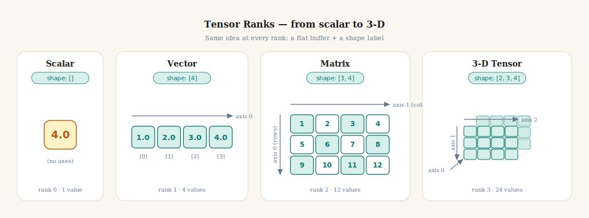
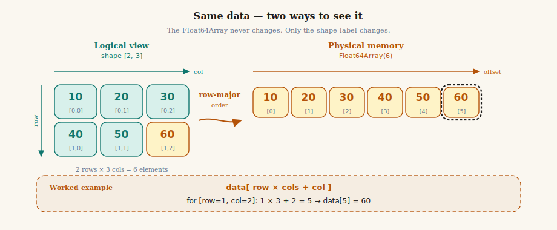
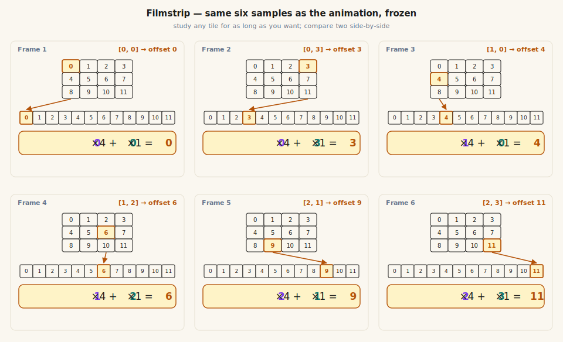
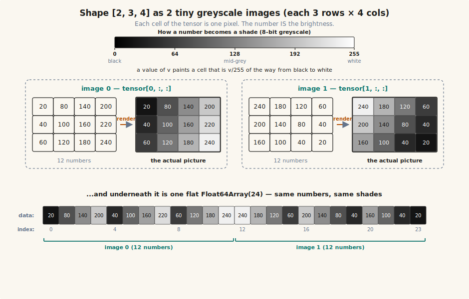
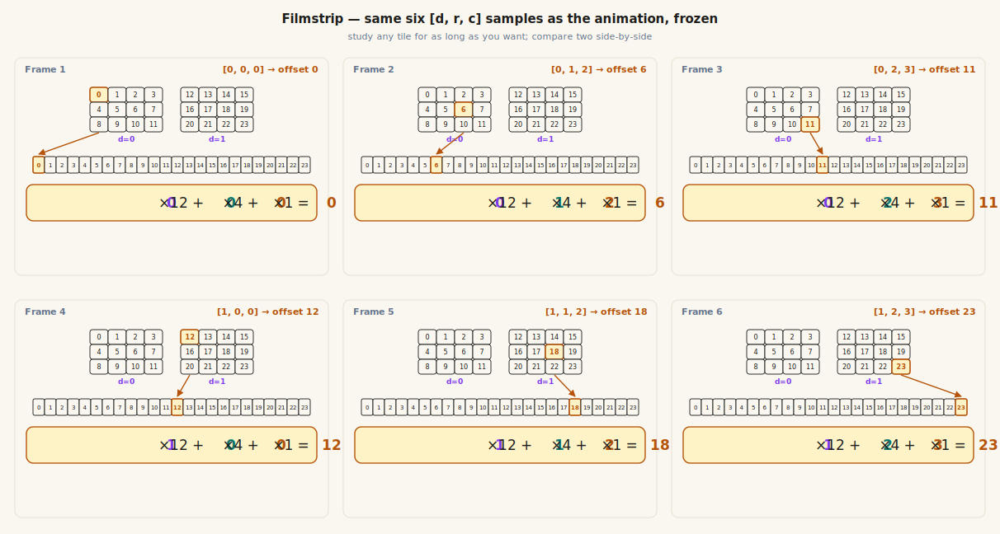

# Chapter 01: Tensor Type System

> **Part 1 of 6 — Tensor Library**
> Source: [`src/tensor/types.ts`](../../src/tensor/types.ts)
> Tests: [`src/tensor/types.test.ts`](../../src/tensor/types.test.ts)
> Exercise: [`exercises/ch-01-tensor-type-system.ts`](../../exercises/ch-01-tensor-type-system.ts)

---

## Learning Goals

By the end of this chapter you can:

- Explain what a tensor is as a flat buffer plus a shape label.
- Identify the rank and shape of common neural-network tensors — from an MNIST image
  to a batch of CNN feature maps to a transformer attention block.
- Compute the flat memory offset for any logical N-D index using the row-major formula.
- Explain why reshape and transpose are cheap (they change metadata, not data).
- Implement the `Tensor` interface and its five utility functions in strict TypeScript.

---

## Intuition First — What is stored in memory, really?

Before any math: **a tensor is just a list of numbers with a name tag.** It is the
single data structure that flows through *every* neural network ever built — the pixels
of an image, the weights of a linear regression, the activations of a CNN, the hidden
state of an RNN, the attention scores of a transformer. All of these are tensors.
Learning to think in tensors is the first and most important step in machine learning.

Imagine you have six numbers written in a single row on a whiteboard:

```text
10   20   30   40   50   60
```

That is all a tensor's **data buffer** ever is — one flat, straight line of numbers.
In JavaScript, that line is a `Float64Array`. The numbers sit one after another in RAM
at fixed 8-byte intervals, exactly like the cells of an Excel column.

Now put a sticky note next to it that says `shape = [2, 3]`. That sticky note is a **promise**:
"read these six numbers as 2 rows and 3 columns." The numbers do not move. Only the
interpretation changes.

Change the sticky note to `shape = [6]` — now you have a vector. Change it to `shape = [1, 2, 3]`
— now you have a 3-D tensor. Same data, different interpretation. The memory does not
care; the shape array is metadata you carry separately.

That is the entire concept. Everything else in this chapter is working out the details:
how to translate a logical index like `[1, 2]` into a flat offset, how to validate that
a shape matches the data buffer, and how to do that translation efficiently.

> **Why this matters for any neural network**
> Whether you are training a linear regression on housing prices, classifying MNIST
> digits with a CNN, processing audio with an RNN, or running a transformer, the
> machine sees only flat buffers of numbers with shape labels. A 28×28 MNIST image
> is a flat `Float64Array(784)` with shape `[28, 28]`. A batch of 32 RGB photos is a
> flat `Float64Array(32*3*224*224)` with shape `[32, 3, 224, 224]`. A transformer
> attention block is a flat `Float64Array` with shape `[batch, heads, seqLen, seqLen]`.
> *Same idea, different sticky notes.* Master this chapter and you have mastered the
> data structure that underlies every model in the course — and every model in
> modern deep learning.

---

## The Mental Model

Every tensor has three parts you need to hold in your head:



*Figure 1: The four ranks you will use most often. Each is the same kind of object — a flat buffer
plus a shape label — just with a different number of dimensions.*

The vocabulary you must internalise:

| Term | Meaning | For shape `[2, 3, 4]` |
|------|---------|----------------------|
| **rank** | Number of dimensions (axes). A matrix has rank 2. | rank = 3 |
| **axis** | One dimension of the tensor, numbered from 0. Axis 0 is the outermost. | axes 0, 1, 2 |
| **shape** | Size along each axis as an array. | `[2, 3, 4]` |
| **ndim** | Same as rank — `shape.length`. | 3 |
| **size** | Total number of elements — the product of all shape values. | 24 |
| **data** | The actual numbers, stored flat in one `Float64Array`. | `Float64Array(24)` |

A useful test: read a shape left-to-right as nested containers. `[2, 3, 4]` means
*"2 things, each of which is 3 things, each of which is 4 numbers"*. Depending on
the model, those nested containers could be:

- **CNN:** 2 images, each with 3 colour channels, each channel a length-4 row.
- **RNN:** 2 sequences, each 3 timesteps long, each timestep a length-4 vector.
- **Transformer:** 2 sentences, each 3 tokens long, each token a length-4 embedding.
- **Tabular ML:** 2 mini-batches, each with 3 samples, each sample a length-4 feature vector.

The shape `[2, 3, 4]` is the same flat 24 numbers in all four cases — only your
interpretation changes. Memorise this nesting rule; it applies to every model, every
layer, every operation in the rest of the course.

---

## Concepts

### 1. From logical grid to flat memory

A matrix of shape `[2, 3]` looks like a 2-row, 3-column grid to you. The computer sees it
as six numbers in a straight line.



*Figure 2: The grid is only a way of reading the flat buffer. The data never moves.*

The mapping rule/formula (how Grid for this case is mapped with flat array) for **row-major** (C-order) layout — used by NumPy, PyTorch, and us —
is:

$$\Large \boxed{\text{offset} = \text{row} \times \text{cols} + \text{col}}$$

For a `[2, 3]` tensor, element `[1, 2]` lives at:

$$\Large 1 \times 3 + 2 = \boxed{5}$$

So `data[5]` is the value at logical position row 1, column 2.

To make the rule feel automatic rather than something you compute laboriously every
time, the animation below picks a different cell every 1.6 seconds and shows you
where it lands in flat memory — same picture, six worked examples. (Uses a slightly
larger `[3, 4]` shape so there's room to roam.)



*Figure 2b (animated): Each frame highlights one cell in the grid and the matching
slot in the flat buffer, with the formula
$\text{offset} = \text{row} \times 4 + \text{col} \times 1$ filled in for that
specific cell. After a couple of loops you should be able to predict the offset
before the next frame arrives — that's the row-major rule clicking into place.*

**Need to pause and think?** The animation has no pause button (SVGs loaded
from Markdown can't carry playback controls), so the same six samples are also
rendered below as static tiles. Dwell on any one for as long as you want; compare
any two side-by-side.



*Figure 2c (filmstrip): the six frames of Figure 2b, frozen.*

**Why row-major and not column-major?** Row-major matches how nested arrays read
left-to-right (`[[10,20,30],[40,50,60]]` lays out as `10,20,30,40,50,60`). It also
matches NumPy's default and most ML libraries. Fortran and MATLAB use column-major;
we will not.

### 2. Shape vocabulary across neural networks

The same handful of ranks shows up in *every* model. Here is one example of each rank
from several model families — notice how the **interpretation** changes but the
**structure** does not:

| Rank | Example shape          | Where it appears                                            | Total floats |
|------|------------------------|-------------------------------------------------------------|--------------|
| 0    | `[]`                   | a loss value, a learning rate, an accuracy score            | 1            |
| 1    | `[10]`                 | logits over 10 MNIST classes; a 10-feature input row        | 10           |
| 1    | `[784]`                | one MNIST image flattened (28 × 28)                         | 784          |
| 2    | `[32, 784]`            | a batch of 32 flattened MNIST images                        | 25,088       |
| 2    | `[100, 50]`            | a dense layer's weight matrix (50 → 100)                    | 5,000        |
| 3    | `[32, 28, 28]`         | a batch of 32 greyscale images (`batch × H × W`)             | 25,088       |
| 4    | `[32, 3, 224, 224]`    | a batch of 32 RGB images (`batch × channels × H × W`) — CNN   | ~4.8 M       |
| 4    | `[32, 64, 56, 56]`     | output of a CNN layer (`batch × filters × H × W`)            | ~6.4 M       |
| 3    | `[32, 100, 128]`       | an RNN's batched sequence (`batch × timesteps × hidden`)    | 409,600      |
| 3    | `[8, 64, 512]`         | a transformer's activations (`batch × seq × d_model`)       | 262,144      |
| 4    | `[8, 8, 64, 64]`       | transformer attention scores (`batch × heads × seq × seq`)  | 262,144      |

> **Quick glossary** — *do not memorise these now; just skim so the table makes sense.
> Every term below has its own chapter later in the course.*
>
> - **MNIST** — a famous dataset of 70,000 hand-drawn digits (0–9), each a 28×28 greyscale
>   image. The "Hello World" of machine learning.
> - **batch** — a group of training examples processed together in one forward pass.
>   `batch=32` means we feed 32 images (or sentences) through the model at once.
> - **logits** — the *raw* output numbers of a classifier, before turning them into
>   probabilities. A 10-class model outputs a length-10 vector of logits — one number
>   per class. The biggest number wins.
> - **features** — the input numbers describing one example. A house-price model might
>   use 5 features (square footage, bedrooms, age, lot size, zip code).
> - **dense layer** (a.k.a. fully connected or linear layer) — the simplest neural-network
>   layer. It multiplies its input vector by a weight matrix. A layer that maps 50 inputs
>   to 100 outputs needs a `[100, 50]` weight matrix.
> - **greyscale / RGB** — greyscale images have 1 channel (brightness); RGB images have
>   3 channels (red, green, blue). That is why the shape grows from `[H, W]` to
>   `[3, H, W]`.
> - **CNN** (Convolutional Neural Network) — the standard architecture for image tasks.
>   Each layer applies many small filters across the image, producing a stack of
>   "feature maps" — hence the 4-D shape `[batch, filters, H, W]`.
> - **filters / channels** — both words mean "one of the parallel feature dimensions of
>   an image-like tensor." `channels` usually refers to the *input* (3 for RGB);
>   `filters` to the *output* of a conv layer (often 32, 64, 128…).
> - **RNN** (Recurrent Neural Network) — processes data one timestep at a time and
>   carries a hidden state forward. Used for audio, time-series, and (historically) text.
> - **timesteps / seq** — the length of a sequence. 100 timesteps could mean 100 audio
>   samples, 100 days of stock prices, or 100 words in a sentence.
> - **hidden / d_model** — the size of the internal feature vector each timestep or
>   token gets transformed into. Bigger = more capacity but more memory.
> - **transformer** — the architecture behind GPT, BERT, and most modern language models.
>   We build one from scratch in Part 6.
> - **attention scores / heads** — see Chapter 22. For now: a transformer with 8 heads
>   and sequence length 64 produces an `[8, 64, 64]` block of "how much does each token
>   look at every other token" numbers, per example in the batch.

Reading a shape is mostly pattern recognition that you build with practice:

- `[N, F]` — "N samples, F features." Classic ML inputs and dense-layer outputs.
- `[N, C, H, W]` — "N images, C channels, H rows, W columns." The CNN convention.
- `[N, T, D]` — "N sequences, T timesteps, D features each." The RNN/transformer convention.
- `[N, H, T, T]` — "N examples, H heads, T-by-T attention map." Transformer-specific.

Every layer you ever write — dense, convolution, recurrence, attention — is just a
rule for turning a tensor of one shape into a tensor of another shape.

### 3. Worked example — `[2, 3, 4]` step by step

Let us trace a real 3-D tensor end to end. Shape `[2, 3, 4]` is small enough to
follow by hand, but the *exact* same logic scales to a `[32, 3, 224, 224]` batch of
ImageNet photos or a `[8, 1024, 768]` transformer activation. Pick whichever mental
label helps you:

- A batch of **2 tiny greyscale images**, each **3 rows tall and 4 columns wide**
  (12 pixels per image, 24 numbers in total).
- A batch of **2 short sequences**, each **3 timesteps** long, each timestep a length-**4** feature vector.
- Just **2 × 3 = 6 vectors of length 4** — 24 numbers, period.

The first reading is worth pausing on, because it makes the whole "tensor" idea
concrete. Each number in the tensor is literally the **brightness of one pixel**:
`0` is pitch black, `255` is bright white, anything in between is a shade of grey.
Looking at a tensor and looking at an image are the same thing — only the rendering
changes.



*Figure 3: Shape `[2, 3, 4]` read as two tiny greyscale pictures. The number `20` paints
a dark grey cell; `240` paints a near-white cell. The flat `Float64Array(24)` at the bottom
holds the same 24 numbers in row-major order — image 0's 12 pixels first, then image 1's
12 pixels. Real RGB photos work exactly the same way, just with shape `[batch, 3, H, W]`
and three colour-channel slabs instead of one.*

**Now the question this section answers:** if you hand me a 3-D index like `[1, 2, 3]`,
where does that element actually live in the flat `Float64Array(24)`?

Before we plug any numbers in, let's compare the 3-D rule against the 2-D rule you
already know. Stacked top-to-bottom so your eye can spot the **single new term**:

$$
\Large
\begin{aligned}
\text{2D} \;\; [r, c] \;\;\,&:\;\; \text{offset} = \phantom{d \times (R \cdot C) + {}} r \times C + c \\
\text{3D} \;\; [d, r, c] &:\;\; \text{offset} = \textcolor{#b45309}{d \times (R \cdot C)} + r \times C + c
\end{aligned}
$$

Read top-to-bottom: **the 2-D formula is the tail of the 3-D formula.** Going from
rank 2 to rank 3 just *prepends one extra term* — the depth index `d` times the size
of one whole slab `R · C`. Everything you learned a minute ago still applies; you
only added a new outermost step. (Rank 4 would prepend yet another term, and so on —
that's the pattern the general formula in §4 captures.)

For our `[2, 3, 4]` tensor, $R \cdot C = 3 \times 4 = 12$, so one depth step jumps
**12 cells** in the flat buffer. That `12` is `stride[0]`, named properly in the
next section.

To make the answer visible, the figure below uses a useful trick: **inside each cell
we print that cell's own flat-buffer offset.** So you can read the answer straight
off the picture — the cell at position `[1, 2, 3]` contains the number `23`, so the
answer is offset 23. Then we derive the same answer from the formula.

![Three-panel diagram showing (1) the logical 3-D view of shape [2,3,4] as two 3×4 slabs with each cell labelled by its flat-buffer offset, (2) the same 24 cells as one flat Float64Array(24) with colour-coded brackets, and (3) the formula offset = 1×12 + 2×4 + 3×1 = 23 with colour-matched terms](../assets/ch-01/worked-example-234.svg)

*Figure 4: One tensor, three views. **Panel 1 (logical 3-D view):* shape `[2, 3, 4]`
drawn as two 3×4 slabs. **Panel 2 (flat buffer):** the same 24 cells laid out as a
single `Float64Array(24)`. **Panel 3 (formula):** the same answer derived from
$1 \times 12 + 2 \times 4 + 3 \times 1 = 23$. The colours are the link between them:
purple = axis 0 (stride 12), teal = axis 1 (stride 4), amber = axis 2 (stride 1).*

**How to read the formula by walking the picture:**

- The index along **axis 0** is `1`. In the top panel, that means *"go to the second
  slab"*. In the buffer panel, the purple bracket says one such step skips a 12-cell
  block — that is `stride[0] = 12`. Contribution: $1 \times 12 = 12$.
- The index along **axis 1** is `2`. In the top panel, that means *"go down to the
  third row of that slab"*. The teal bracket says one row inside a slab is 4 cells
  wide — that is `stride[1] = 4`. Contribution: $2 \times 4 = 8$.
- The index along **axis 2** is `3`. In the top panel, that means *"go to the fourth
  cell of that row"*. The amber tick says one column step is just 1 cell —
  `stride[2] = 1`. Contribution: $3 \times 1 = 3$.
- Total: $12 + 8 + 3 = 23$. The target cell in the highlighted slab is the one
  labelled `23`. The picture and the formula agree.

The numbers `12`, `4`, and `1` in that calculation are exactly the **strides** of
this tensor — the topic of the next section.

Figure 4 worked one example. To turn it into a *pattern* in your head, the animation
below cycles through six different `[d, r, c]` positions — both slabs, several rows,
several columns — lighting up the matching cell in 3-D, the matching slot in the flat
buffer, and an updated formula line each time.

![Animated trace: two 3×4 slabs above a 24-cell flat buffer; every 1.8 seconds a different [d, r, c] index lights up in both views with an arrow connecting them and a colour-coded offset formula d×12 + r×4 + c×1 = offset updating below](../assets/ch-01/trace-3d.svg)

*Figure 4b (animated): Same three-view layout as Figure 4, but stepping through six
sample indices on a loop. Watch how the arrow's landing position moves in 12-cell
jumps when **d** changes (purple), 4-cell jumps when **r** changes (teal), and
1-cell steps when **c** changes (amber). Those jump sizes **are** the strides.*

**Same pause story as Figure 2b** — six static tiles below for as long a dwell as you need.



*Figure 4c (filmstrip): the six frames of Figure 4b, frozen.*

### 4. Strides — a precise formula

The "skip count" for each axis is called a **stride**. For a contiguous tensor (one
where the buffer is laid out in the natural row-major order):

$$\Large \boxed{\text{stride}[i] = \prod_{j=i+1}^{\text{ndim}-1} \text{shape}[j]}$$

*In English:* stride along axis `i` is the product of all shape sizes that come **after**
it. Why? Because to move one step along axis `i` you have to skip past one full "block"
made up of every inner axis.

For shape `[2, 3, 4]`:
- `stride[0] = 3 × 4 = 12` — moving to the next outer block skips one full 3×4 = 12-element slab
- `stride[1] = 4`         — moving to the next row skips 4 columns
- `stride[2] = 1`         — the innermost axis advances one element at a time

The **general flat-index formula** using strides:

$$\Large \boxed{\text{offset} = \sum_{i=0}^{\text{ndim}-1} \text{indices}[i] \times \text{stride}[i]}$$

This one formula handles every rank uniformly. A scalar (rank 0) gives an empty sum
— offset 0 — which is exactly right. A vector (rank 1) collapses to `i × 1 = i`. A
matrix gives the familiar `row × cols + col`. A 4-D CNN feature map or attention
tensor gives a four-term sum.

**The staircase, all the way up.** The boxed formula above is short, but it hides a
pattern that's clearer when you write it out across ranks. Each new outermost axis
**prepends one more `(index × stride)` term** — nothing else changes:

$$
\Large
\begin{aligned}
\text{2D} \;\; [r, c]            \;\;&:\; \text{offset} = \phantom{b \cdot s_3 + ch \cdot s_2 + {}} r \cdot s_1 + c \cdot s_0 \\
\text{3D} \;\; [d, r, c]         \;\;&:\; \text{offset} = \phantom{b \cdot s_3 + {}} \textcolor{#b45309}{d \cdot s_2} + r \cdot s_1 + c \cdot s_0 \\
\text{4D} \;\; [b, ch, r, c]     \;\;&:\; \text{offset} = \textcolor{#b45309}{b \cdot s_3 + ch \cdot s_2} + r \cdot s_1 + c \cdot s_0 \\
\text{N-D} \;\; [i_{n-1}, \dots, i_0] &:\; \text{offset} = \sum_{i=0}^{n-1} \mathrm{idx}_i \cdot s_i
\end{aligned}
$$

Here $s_i = \text{stride}[i]$. The innermost stride $s_0$ is always `1`. Every other
stride is just *"size of everything inside me"* — `s_1 = C`, `s_2 = R · C`,
`s_3 = Ch · R · C`, and so on. A rank-5 tensor (say a batch of video clips,
`[batch, time, ch, H, W]`) would prepend yet another `t · s_4` term; the rule never
changes.

**From staircase to code.** Once you see the formula as a sum, the implementation
writes itself — it's a single loop walking from the innermost axis outward and
multiplying as it goes:

```typescript
function flatIndex(shape: number[], indices: number[]): number {
  let offset = 0;
  let stride = 1; // innermost axis always has stride 1
  // Walk from innermost axis outward, accumulating index * stride.
  for (let i = shape.length - 1; i >= 0; i--) {
    offset += indices[i] * stride;
    stride *= shape[i]; // next axis up has stride = (this axis's stride) * (this axis's size)
  }
  return offset;
}
```

Trace it by hand for shape `[2, 3, 4]`, indices `[1, 2, 3]`:

| iter `i` | `indices[i]` | `stride` before | `offset` after        | `stride` after |
|----------|--------------|-----------------|-----------------------|----------------|
| 2        | 3            | 1               | `0 + 3·1 = 3`          | `1·4 = 4`      |
| 1        | 2            | 4               | `3 + 2·4 = 11`         | `4·3 = 12`     |
| 0        | 1            | 12              | `11 + 1·12 = 23`       | `12·2 = 24`    |

Same `23` we read off Figure 4. And notice: we never built an explicit `strides`
array — the loop multiplied strides up as it went. That trick works *only* for
contiguous tensors (the only kind in Ch 01). When non-contiguous views (transpose,
slice) arrive in a later chapter, we'll precompute `strides[]` once and the loop
becomes a one-liner `reduce` over `indices[i] * strides[i]`.

> 📝 **Do not skip the pen-and-paper step.** Before you open the exercise file:
>
> 1. Write the four-row staircase (2-D, 3-D, 4-D, N-D) out by hand. No peeking.
> 2. Pick your own shape, say `[3, 2, 5]`, and your own indices, say `[2, 1, 4]`.
>    Compute the offset on paper twice — once by plugging into the formula
>    `2·(2·5) + 1·5 + 4`, and once by running the loop in your head and filling in a
>    trace table like the one above.
> 3. Only when both answers agree, type the `flatIndex` implementation from memory.
>
> This 10-minute habit is the difference between *recognising* the formula on a page
> and *recalling* it from a blank editor. Every algorithm in this course — attention
> scores, softmax, backprop chains — rewards the same routine.

![A 2×4 grid showing stride[0]=4 and stride[1]=1 with buffer annotations](../assets/ch-01/stride-walkthrough.svg)

*Figure 5: Strides tell you how many cells to skip in the flat buffer when you move one step
along each axis. Moving right skips 1. Moving down skips 4 (the number of columns).*

> **Note on this chapter:** We do *not* store strides in the `Tensor` interface yet —
> they can always be recomputed from `shape`. We will only need explicit strides in a
> later chapter when we add non-contiguous views (transpose, slicing). For now,
> `flatIndex` recomputes them on the fly.

### 5. Why strides make reshape and transpose cheap

Reshape does not copy the data. It only replaces the shape array (and recomputes strides).
Transpose does not copy the data either — it only **swaps two entries** in the strides array.

Example. A `[2, 3]` tensor has shape `[2, 3]` and strides `[3, 1]`. Its transpose has
shape `[3, 2]` and strides `[1, 3]`. The underlying `Float64Array` is unchanged; we are
literally just reading the same six numbers in a different order via different strides.
This is why `transpose` runs in O(1) time regardless of how big the tensor is.

The trade-off: a transposed tensor is **non-contiguous**. Its strides no longer follow
the natural `product of trailing shape` rule. We do not need to handle this in Ch 01 —
our `flatIndex` only handles the contiguous case — but it is the reason later chapters
will add an explicit `strides` field.

### 6. What is actually in memory — bytes and sizes

`Float64Array` stores 64-bit IEEE-754 doubles. Each element is **8 bytes**. So:

| Shape                | Elements      | Bytes        | Where you meet it |
|----------------------|---------------|--------------|-------------------|
| `[10]`               | 10            | 80 B         | logits for a 10-class classifier |
| `[784]`              | 784           | ~6 KB        | one flattened MNIST image |
| `[32, 784]`          | 25,088        | ~196 KB      | a batch of 32 MNIST images |
| `[32, 3, 224, 224]`  | 4,816,896     | ~37 MB       | a batch of ImageNet RGB photos (CNN input) |
| `[1024, 1024]`       | 1,048,576     | 8 MB         | a single dense weight matrix |
| `[50000, 768]`       | 38,400,000    | ~293 MB      | a vocabulary embedding table |

This is why everyone in machine learning cares about shapes so much: each shape is
also a memory cost and a compute cost. A naive operation on a `[50000, 768]`
embedding table touches 293 MB of RAM every time. A batch of ImageNet photos at
Float64 is already 37 MB before any computation. Even in this from-scratch course,
you will notice a slowdown when tensors get above ~10 MB.

This is also why production frameworks default to **Float32** (4 bytes) or even
**Float16** (2 bytes) — they cut the memory in half or quarter for the same shape.
We use Float64 here because correctness beats speed in a learning project; we will
revisit precision in the quantization chapter.

### 7. The Tensor interface

The actual declaration in `src/tensor/types.ts`:

```typescript
export interface Tensor {
  readonly data: Float64Array;  // flat storage, row-major order
  readonly shape: number[];     // e.g. [batch, seq, dModel]
  readonly ndim: number;        // shape.length
  readonly size: number;        // product of all shape values
}
```

Four design decisions baked into this declaration:

1. **`data` is `Float64Array`, not `number[]`.** A typed array stores raw bytes contiguously;
   a `number[]` is a JS array of boxed values that can silently hold `undefined` or strings.
   Typed arrays also let us hand off the buffer to lower-level routines later (e.g. WASM,
   GPU) without conversion.
2. **Everything is `readonly`.** A tensor is a **value**, like a string. If you want a
   different shape, you build a different tensor. This rule prevents whole classes of
   bugs where two pieces of code think they own the same shape array and quietly mutate it.
3. **`ndim` and `size` are stored, not derived.** They are always equal to `shape.length`
   and `product(shape)`, so they are redundant. We store them anyway because reading a
   number is much faster than recomputing a product, and these two values are read on
   every operation.
4. **No `strides` field (yet).** Until we have views, shape uniquely determines strides,
   so storing strides would be duplication. Chapter ~6 will add a `strides` field when
   views first appear.

---

## What to Implement

These are the exact exports you need to write in [`src/tensor/types.ts`](../../src/tensor/types.ts):

| Export | Description |
|--------|-------------|
| `interface Tensor` | Core type: `data`, `shape`, `ndim`, `size` |
| `createTensor(data, shape)` | Wrap a flat `number[]` into a `Tensor`. Validate that `data.length === product(shape)`. |
| `scalar(value)` | Create a rank-0 tensor with `shape = []` and exactly one element. |
| `isTensor(value)` | Runtime type guard — returns `true` if the value has the right shape. |
| `flatIndex(shape, indices)` | Convert an N-D index array to a flat offset using the row-major formula. |
| `toString(t)` | Human-readable string showing shape and sampled values for debugging. |

### Validation rules

- `createTensor` must throw if `data.length !== product(shape)`. Be loud, not silent.
- `createTensor` must defensively copy: `new Float64Array(data)` and `[...shape]`. Never
  hold a reference to caller-owned arrays.
- `flatIndex` must throw if any index is `< 0`, `>= shape[axis]`, or if
  `indices.length !== shape.length`.
- `scalar` produces exactly one element: `shape = []`, `size = 1`, `data.length = 1`.
- The product of an empty shape array is `1` by convention (the multiplicative identity).
  This is what makes scalars work.

### A code trace for `flatIndex`

The full walk-through — staircase, loop, and trace table for `[2, 3, 4]`, `[1, 2, 3] → 23`
— lives in [§4 above](#4-strides--a-precise-formula). Re-read it once before opening
the exercise file; the signature you implement is **`flatIndex(shape, indices)`**
(matches the stub in `src/tensor/types.ts`).

### A code trace for `createTensor`

`createTensor([10, 20, 30, 40, 50, 60], [2, 3])` should produce:

```text
{
  data:  Float64Array(6)  ← [10, 20, 30, 40, 50, 60]
  shape: [2, 3]           ← a fresh copy of the caller's array
  ndim:  2
  size:  6
}
```

The critical line is `data.length === product(shape)`. Compute the product first, then
throw with a clear message if it does not match:

```text
Error: data length 7 does not match shape [2, 3] (expected size 6)
```

A good error message is part of the contract — it is how Future-You debugs a failing
gradient in a 4-D CNN tensor twenty chapters from now.

### `toString` for debugging

For a `[2, 3]` tensor your `toString` might produce:

```text
Tensor(shape=[2, 3], size=6) [10, 20, 30, 40, 50, 60]
```

For large tensors, truncate (e.g. show the first 8 values and an ellipsis). You will
thank yourself when a CNN feature map of shape `[32, 64, 56, 56]` or an attention
tensor of shape `[8, 8, 64, 64]` shows up in a test failure and you need to inspect
it at a glance.

---

## Common Pitfalls

- **Wrong data type in the interface.** The stub declares `readonly data: Float64Array`,
  not `data: number[]`. Passing a plain array triggers a TypeScript error. Use
  `new Float64Array(data)` inside `createTensor` to convert.
- **Off-by-one in `flatIndex`.** A tensor of shape `[2, 3]` has valid row indices 0 and 1,
  not 0 through 2. Check `indices[i] < shape[i]`, not `<= shape[i]`.
- **Forgetting the empty-shape edge case.** A `scalar` has `shape = []`. The stride
  formula produces an empty product, which is conventionally 1 (the multiplicative identity).
  `size` must be 1 and `data.length` must be 1.
- **Mutating the shape array after construction.** Once inside the Tensor object, `shape`
  should never be mutated externally. Copy it in `createTensor`: `shape: [...shape]`.
- **Confusing rank and size.** Shape `[4]` has rank 1 and size 4. Shape `[2, 2]` has
  rank 2 and size 4. Both have the same number of elements, but very different meaning.

---

## How to Verify

Run the tests and the exercise. Both should pass cleanly with no warnings:

```bash
bun test src/tensor/types.test.ts
```
```bash
bun run exercises/ch-01-tensor-type-system.ts
```

---

## Self-Check Questions

1. What is the flat offset of element `[1, 2]` in a tensor of shape `[3, 4]`?
   *(Answer: 1 × 4 + 2 = 6)*

2. What are the strides of a tensor with shape `[5, 6, 7]`?
   *(Answer: stride[0] = 42, stride[1] = 7, stride[2] = 1)*

3. Why does reshape not copy the data buffer?
   *(It only replaces the shape array and recomputes strides; the `Float64Array` is unchanged.)*

4. What happens to `size` and `ndim` for a scalar tensor?
   *(Both are 1 and 0 respectively — shape is `[]`, so `ndim = 0` and `size = product([]) = 1`.)*

5. A batch of MNIST images has shape `[32, 28, 28]`. What is the flat offset of pixel
   `[5, 10, 14]` — row 10, column 14 of the 6th image?
   *(stride[0] = 784, stride[1] = 28, stride[2] = 1, so offset = 5×784 + 10×28 + 14 = 4204.)*

6. A CNN feature map has shape `[batch, channels, height, width]` = `[32, 64, 56, 56]`.
   What is the stride of the `channels` axis?
   *(stride[1] = 56 × 56 = 3136 — moving to the next channel skips one full H×W feature map.)*

7. A transformer attention tensor has shape `[batchSize, numHeads, seqLen, seqLen]`.
   What is the stride of the `numHeads` axis?
   *(stride[1] = seqLen × seqLen — moving to the next head skips one full seqLen×seqLen block.)*

---

## Further Reading

- [NumPy — N-dimensional array internals](https://numpy.org/doc/stable/reference/arrays.ndarray.html) — the design our `Tensor` type mirrors; read the section on strides.
- [Eli Bendersky — Strides in NumPy](https://eli.thegreenplace.net/2015/memory-layout-of-multi-dimensional-arrays) — clearest single explainer of row-major layout and strides.
- [PyTorch — `torch.Tensor` reference](https://pytorch.org/docs/stable/tensors.html) — names and conventions we will roughly follow.
- [3Blue1Brown — Essence of Linear Algebra](https://www.3blue1brown.com/topics/linear-algebra) — geometric intuition for vectors, matrices, and linear maps.

---

## Next Chapter

**[Tensor Creation](ch-02-tensor-creation.md)** — turn this type into real objects: zeros, ones, random, and from-array constructors.
