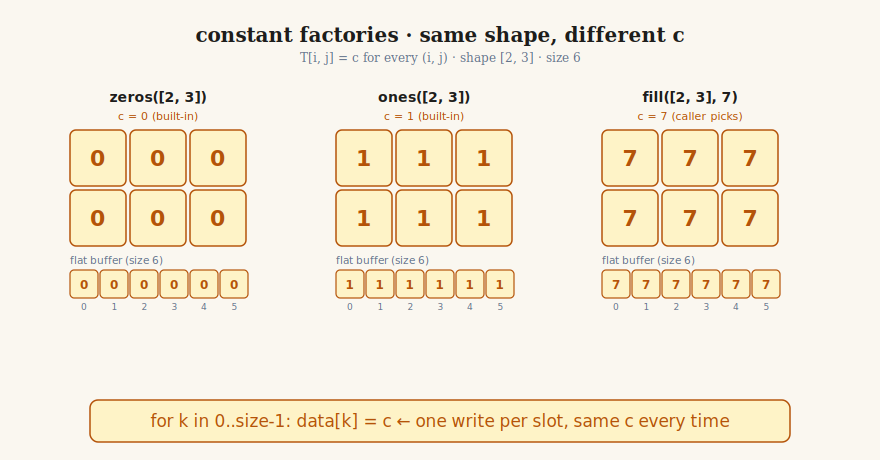
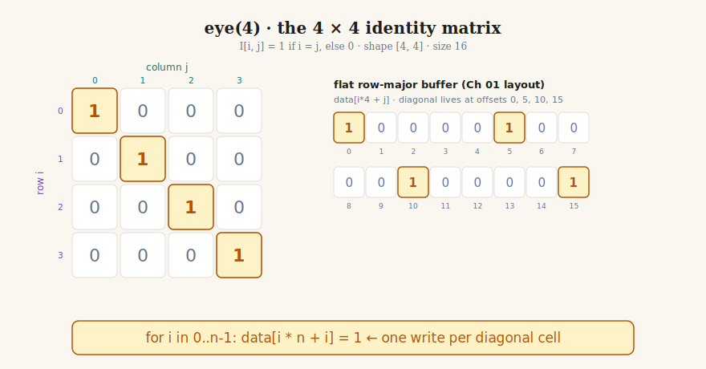
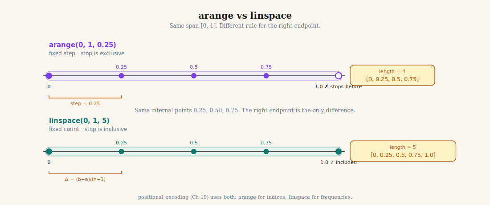
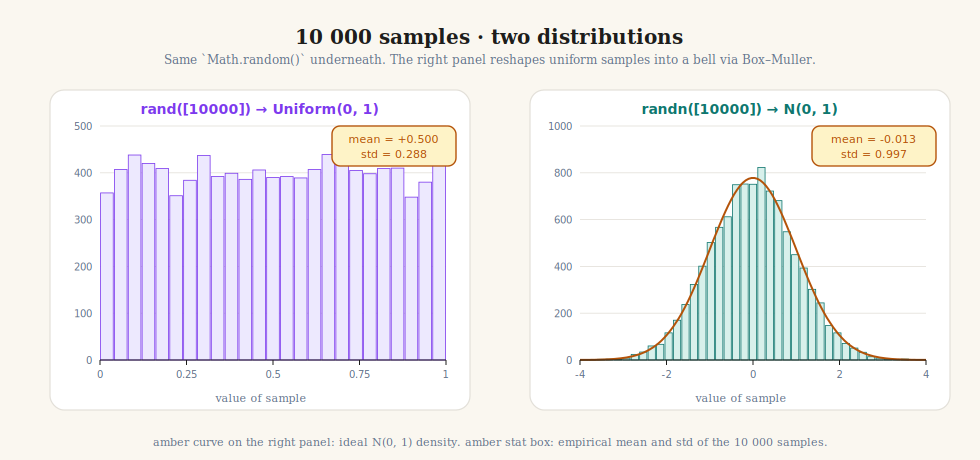
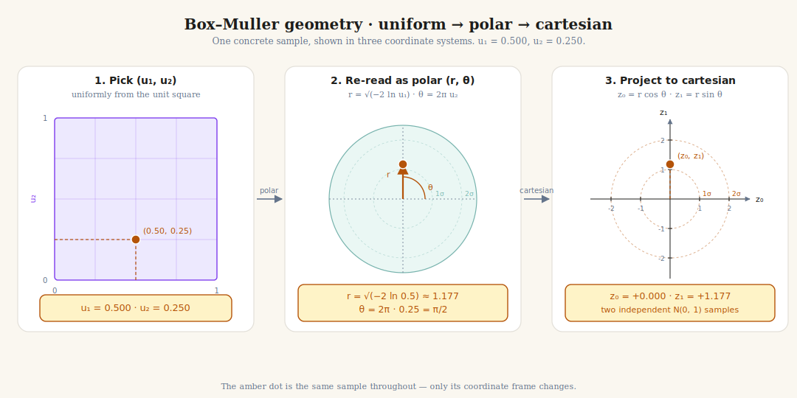

# Chapter 02: Tensor Creation

> **Part 1 of 6 — Tensor Library (NumPy-like Foundation)**
> Code: [`src/tensor/creation.ts`](../../src/tensor/creation.ts)
> Tests: [`src/tensor/creation.test.ts`](../../src/tensor/creation.test.ts)
> Exercise: [`exercises/ch-02-tensor-creation.ts`](../../exercises/ch-02-tensor-creation.ts)

---

## Learning Goals

By the end of this chapter you can:

- **Explain** why a neural network refuses to learn when every weight starts at zero.
- **Implement** the constant factories `zeros`, `ones`, `fill`, and `fullLike` so they share one body.
- **Implement** `eye`, `arange`, and `linspace` from scratch.
- **Use** the Box–Muller formula to build `randn` without any math library.
- **Verify** an empirical `randn` sample has mean ≈ 0 and standard deviation ≈ 1.

---

## Intuition First — Where do the numbers come from?

In Chapter 01 we built the `Tensor` *shape* — a label plus a flat buffer. We did **not** build the numbers
inside it. A `Tensor` with no values is like a spreadsheet with the column widths set but every cell still
empty. This chapter fills the cells.

There are exactly **two ways** to produce values:

1. **Code that fills with a known pattern** — all zeros, all ones, the integers `0..n-1`, the diagonal of an
   identity matrix. These are deterministic. Every run produces the same numbers.
2. **Code that fills with randomness** — uniform noise on `[0, 1)` or normal noise centred at zero. These
  are used later to initialise model weights.

Why do we need randomness at all? Because of one very stubborn property of gradient descent:

> **The symmetry trap.**
> If every weight in a layer starts identical, every neuron computes the same thing, every neuron receives
> the same gradient, and every neuron updates by the same amount — *forever*. The network has no
> mathematical way to differentiate one neuron from another. Random initialisation is what breaks the
> symmetry; without it, training is silently broken.

This is why `randn` (standard-normal random numbers) matters so much. It is how most weight matrices in our
library will get their starting values.

**Why this chapter matters later** — you do not need to know transformers yet. For now, the important point
is simple: later parts of the course will need these factories everywhere.

| Later thing we will build | Created with |
|---|---|
| Position indices | `arange(0, seq_len)` |
| Weight matrices | `randn([rows, cols])` |
| Bias vectors | `zeros([d_model])` |
| Constant-filled masks | `fill([rows, cols], value)` |
| Identity-matrix test cases | `eye(n)` |

Many later chapters build directly on the factories in this file.

---

## The Mental Model

A creation function answers only **three questions**:

1. **What shape do I want?** Example: `[2, 3]`
2. **How many numbers does that shape need?** Example: `2 * 3 = 6`
3. **What should each number be?** Example: all `0`, all `1`, counting values, or random values

After that, the function simply wraps the result as a `Tensor`.

```text
want `ones([2, 3])`
  │
  ▼
shape = [2, 3]
  │
  ▼
size = 2 * 3 = 6
  │
  ▼
make 6 slots: [_, _, _, _, _, _]
  │
  ▼
fill them with 1: [1, 1, 1, 1, 1, 1]
  │
  ▼
wrap as Tensor(shape=[2, 3], data=[...])
```

That is the whole chapter.

- `zeros` and `ones` change only the fill value.
- `fill` lets the caller choose the fill value.
- `eye` fills only the diagonal with `1`.
- `arange` and `linspace` fill with a number pattern.
- `rand` and `randn` fill with random samples.

So the real job is not "learn many unrelated functions". The real job is: learn one pattern,
then change only the filling rule.

Now we will walk through the chapter in the same order the ideas become difficult:

1. **Constant factories** — easiest: every slot gets the same value.
2. **`eye`** — still simple: mostly zeros, but the diagonal gets `1`.
3. **`arange` and `linspace`** — now the values follow a counting pattern.
4. **`rand` and `randn`** — same shape-allocation pattern, but the values come from randomness.

If you keep that roadmap in your head, the chapter stops being a list of separate APIs. It becomes
one idea with four variations.

---

## Concepts

Each section below is one stop on that roadmap. The shape-allocation steps are always the same. The only thing that changes from section to section is the **filling rule** — the answer to the third question from the Mental Model.

---

### 1. Constant factories — `zeros`, `ones`, `fill`, `fullLike`

This is the simplest filling rule: **every slot gets the same constant.** The four functions here are all the same idea; they differ only in how you tell them which constant to use.

You use constant factories when the **shape matters immediately, but the values are simple**. Very often the first thing you need is just "make me a blank grid of this shape" or "make me another grid with the same layout, but fill every slot with one value." So this section is really about learning the most basic way to create data on purpose.

> **Use it when** you want to create a tensor quickly and every position should begin with the same number.
>
> **Picture this**: you want a 3 by 3 board that starts completely empty, so every cell should be `0`. Or you already have a 2 by 2 result and want another 2 by 2 tensor with the same layout, but filled with `9` so you can clearly spot it in the output.

Why does this matter if the computer is generating all the numbers anyway? Because neural-network code still needs **starting values** and **control values**. A tensor full of `0` can mean "start with nothing yet." A tensor full of `1` can mean "leave these values unchanged when multiplying" or "turn every position on." Constant-filled tensors are the simplest way to tell the program how to begin, what to keep, and what to compare against.

In other words: these tensors are not interesting because the numbers are fancy. They are important because simple numbers often control the rest of the computation.

$$
\Large
\boxed{\,T[i_1, i_2, \ldots, i_n] = c \quad \text{for all valid index tuples}\,}
$$

In plain English: *every cell of `T` holds the same constant `c`.* The four functions only differ in
how `c` is chosen.

The symbol $c$ is just a fixed number — `0`, `1`, or anything the caller supplies. The phrase
*"for all valid index tuples"* is the math way of saying *"for every cell, no matter how you index it."*
That is the entire definition.

**Example:**

```typescript
zeros([2, 3])
// → [[0, 0, 0],
//    [0, 0, 0]]

ones([2, 3])
// → [[1, 1, 1],
//    [1, 1, 1]]

fill([2, 3], 7)
// → [[7, 7, 7],
//    [7, 7, 7]]

// fullLike copies the shape from an existing tensor:
const t = ones([2, 2]);
fullLike(t, 9)
// → [[9, 9],
//    [9, 9]]
```

For shape `[2, 3]`, the three calls above produce these matrices:

$$
\text{zeros} = \begin{pmatrix} 0 & 0 & 0 \\ 0 & 0 & 0 \end{pmatrix}
\qquad
\text{ones} = \begin{pmatrix} 1 & 1 & 1 \\ 1 & 1 & 1 \end{pmatrix}
\qquad
\text{fill}(\cdot, 7) = \begin{pmatrix} 7 & 7 & 7 \\ 7 & 7 & 7 \end{pmatrix}
$$



*Figure 1: Same shape `[2, 3]`, three different constants. The grid view (top) and the flat row-major view (bottom) carry exactly the same six values — the constant simply fills every slot. `zeros` and `ones` are convenience names for the two most common choices of `c`; `fill` lets the caller pick any constant.*

In code, every cell of a tensor of shape `[2, 3]` lives at one of six flat offsets `0..5` (Ch 01
row-major rule). The implementation walks `k` from `0` to `size - 1` and writes the same `c` at every
offset — one short loop covers `zeros`, `ones`, and `fill`.

| Function | How `c` is chosen | Typical use |
|---|---|---|
| `zeros(shape)` | `c = 0` | blank starting state |
| `ones(shape)` | `c = 1` | all-on switches or simple test inputs |
| `fill(shape, value)` | `c = value` (caller-supplied) | any constant-filled tensor |
| `fullLike(t, value)` | `c = value`, shape inherited from `t` | "same layout as this tensor, new constant value" |

If these four functions feel repetitive, that is a good sign. They are supposed to be repetitive.
`zeros`, `ones`, and `fullLike` are thin wrappers around `fill`.

**Implementation rule:** write `fill` first; the others are one-liners that call `fill`.

### 2. Identity matrix — `eye(n)`

The filling rule changes slightly: instead of every slot getting the same constant, *most* slots get `0` and only the slots where the row index equals the column index get `1`. Those slots form the diagonal. We call the result an **identity matrix**.

You use `eye` when you need a matrix that means **"leave the vector unchanged."** In this chapter, that mostly makes it useful for tests and for building intuition about matrix structure. Later, identity-like patterns show up whenever we want a transformation that starts as "do nothing" before learning changes it.

> **Use it when** you need the simplest matrix that preserves a vector instead of changing it.
>
> **Picture this**: you just wrote matrix multiplication and want one test where the answer is obvious. If `A = eye(3)`, then `A @ x` should give back the same 3-number vector `x` with no surprises.

Why does this matter if the computer can already multiply matrices by itself? Because we still need a **known reference case**. `eye(n)` gives us the clearest possible answer for "nothing should change here." That makes it useful for testing, checking whether code is correct, and building more complex matrix operations from a simple case we fully understand.

In other words: the identity matrix matters because it gives us a trusted do-nothing transformation. In neural-network code, trusted simple cases are how we catch bugs before the model becomes complicated.

$$
\Large
\boxed{\,I_{ij} = \delta_{ij} = \begin{cases} 1 & \text{if } i = j \\ 0 & \text{otherwise} \end{cases}\,}
$$

In plain English: put `1` when the row number and column number are the same; otherwise put `0`.

The symbol $\delta_{ij}$ is the **Kronecker delta** — read it as "1 when the two indices match, 0 when
they don't". That is the entire definition.

**Example:**

```typescript
eye(3)
// → [[1, 0, 0],
//    [0, 1, 0],
//    [0, 0, 1]]
```

For $n = 4$:

$$
I_4 = \begin{pmatrix}
1 & 0 & 0 & 0 \\
0 & 1 & 0 & 0 \\
0 & 0 & 1 & 0 \\
0 & 0 & 0 & 1
\end{pmatrix}
$$



*Figure 2: Only the diagonal cells where row index equals column index are 1. Everything else is 0. Reading down the diagonal, this is the matrix-shaped version of "do nothing".*

In code, `[i, j]` lives at flat offset `i * n + j` (Ch 01 row-major rule). The diagonal entries are exactly
the offsets where `i == j`, so we walk `i` from `0` to `n - 1` and write a `1` at offset `i * n + i`. Every
other slot stays at its allocated `0`.

Most of the time you will use `eye` in tests, because it is an easy matrix to recognise by sight.

### 3. Sequence factories — `arange` and `linspace`

The filling rule is now a counting pattern: each slot gets a different value — the next number in an evenly-spaced sequence. `arange` and `linspace` are two ways to describe that same kind of sequence, and they differ in one key detail.

You use sequence factories when the numbers themselves are meant to represent **positions, steps, or evenly spaced sample points**. That makes them useful for indexing, building tiny test inputs, and later for things like coordinate-style inputs where the spacing between values matters.

> **Use it when** the values are not arbitrary data but a pattern you want to control exactly.
>
> **Picture this**: you need the index list `0, 1, 2, 3, 4` to walk across one tensor dimension, or you need exactly 5 evenly spaced points between `0` and `1` to test a formula on known inputs.

Why does this matter if the machine can generate numbers automatically? Because sometimes the numbers are not just data — they are the **structure** of the task. If you want to draw a small plot, you need x-values at controlled positions. If you want to test a formula, you need known sample points. If you want to step through a sequence one position at a time, you need a clean counting pattern.

In neural-network work, this shows up whenever position matters. A model reading a sentence, a signal, or a time series still needs some notion of "first, second, third, ..." Sequence factories give us those ordered positions in the simplest possible way.

One concrete picture: if you want to sketch the curve $y = x^2$ on five points between `0` and `1`, `linspace(0, 1, 5)` gives the x-values `[0, 0.25, 0.5, 0.75, 1]`. Then you can square each one to get the y-values. The spacing is the point.

**`arange(start, stop, step?)` — fixed step, `stop` is exclusive.**

$$
\Large
\boxed{\,\texttt{arange}(a, b, s) = \big[\,a,\; a+s,\; a+2s,\; \ldots,\; a+(n-1)s\,\big]\;\text{where } n = \left\lceil \tfrac{b - a}{s} \right\rceil\,}
$$

In plain English: start at `a`, keep adding `s`, and stop before you would reach or pass `b`.

**Example:**

```typescript
arange(0, 5)      // → [0, 1, 2, 3, 4]
arange(2, 10, 2)  // → [2, 4, 6, 8]
```

**`linspace(start, stop, n)` — fixed count, `stop` is inclusive.**

$$
\Large
\boxed{\,\texttt{linspace}(a, b, n) = \big[\,a,\; a+\Delta,\; a+2\Delta,\; \ldots,\; b\,\big]\;\text{where } \Delta = \tfrac{b - a}{n - 1}\,}
$$

In plain English: choose exactly `n` points, spread them evenly, and make sure the last point is `b`.

**Example:**

```typescript
linspace(0, 1, 5)  // → [0, 0.25, 0.5, 0.75, 1.0]
linspace(2, 8, 4)  // → [2, 4, 6, 8]
```

If the formulas feel similar, reduce them to this memory trick:

- `arange` = **I know the step**.
- `linspace` = **I know how many points I want**.
- `arange` stops before the endpoint.
- `linspace` includes the endpoint.

The picture makes the difference unmissable:



*Figure 3: `arange` keeps the step fixed and stops **before** the endpoint. `linspace` keeps the count fixed and **lands on** the endpoint. Same span, different endpoint behaviour.*

This difference matters because off-by-one mistakes are easy here:

- Use `arange` when you know the step.
- Use `linspace` when you know how many points you want.

### 4. Uniform random — `rand(shape)`

The last variation: instead of computing the fill value from a formula, we **draw it from a random source.** For `rand`, that source is `Math.random()` — JavaScript's built-in uniform random number generator. The shape-allocation steps are exactly the same as before; we just call `Math.random()` instead of writing a constant or computing an index.

We build `rand` mostly because the next function, `randn`, needs it as a starting point.

You use `rand` when you want quick random values in a known range, especially for experiments and sanity checks. In this course, its biggest job is conceptual: it gives us the raw randomness that Box–Muller will later convert into the normal randomness needed for model parameters.

> **Use it when** you want fast sample values in `[0, 1)` and do not care about bell-curve behaviour yet.
>
> **Picture this**: you want to check that your tensor creation code fills every slot, or you need two ordinary random inputs before running them through Box–Muller to build `randn`.

Why does this matter if the machine generates numbers anyway? Because **randomness is a tool**. We use it when we want to break ties, explore many possibilities, or test code with inputs we did not handpick. `rand` gives the simplest, fastest kind of randomness: every value in `[0, 1)` is equally likely. That makes it ideal for quick experiments, sanity checks, and as the raw material for more advanced random patterns.

In other words: `rand` is not interesting because the numbers are special. It is important because controlled randomness is one of the most useful inputs we can give to numerical code.

**Example:** *(values change every run)*

```typescript
rand([4])  // → [0.13, 0.81, 0.42, 0.05]  (illustrative)
```

The exact values change every run, but they always stay between `0` and `1`.

Before we talk about the formula for `randn`, look at the output shape of the two random factories:



*Figure 4: 10 000 samples from `rand` versus `randn`. `rand` spreads values across `[0, 1)`. `randn`
clusters values around `0`. The important point is not the statistics yet. The important point is that
both functions still follow the same chapter pattern: choose a shape, fill the slots, wrap as a tensor.*

### 5. Normal random — `randn(shape)` via Box–Muller

Same filling pattern as `rand` — draw a random value for each slot — but a **different kind of randomness.** `rand` gives values spread flat across `[0, 1)`. `randn` gives values clustered around `0` with a bell-curve shape. JavaScript does not ship this second kind, so we have to build a converter ourselves.

The converter is called **Box–Muller**. It takes two uniform random numbers from `Math.random()` and turns them into two normal random numbers. Every call to `randn` runs this converter.

You use `randn` when random values should usually stay near `0`, with fewer large values far away from `0`. That pattern shows up constantly in machine learning, especially when we initialise weights so a model starts from small, varied numbers instead of all zeros or all ones.

> **Use it when** you want small mixed values around `0` instead of flat randomness between `0` and `1`.
>
> **Picture this**: you are creating the very first weight matrix of a model. If every weight starts at `0`, many neurons behave the same way. `randn` breaks that symmetry by giving nearby-but-not-identical starting values.

Why does this matter if the machine can already give us flat random numbers? Because **the shape of the randomness affects the result**. Flat randomness treats `0.99` as just as likely as `0.01`, which is too aggressive when we want most starting values to be small and only a few to be large. The bell-curve pattern from `randn` keeps most numbers close to `0` and rarely produces extreme values, which is exactly what we want when starting a model: enough variety to avoid identical neurons, but small enough that the model does not blow up before learning begins.

In other words: `randn` is the first time we care not just about *getting* random numbers, but about *what those random numbers look like overall*.

Think of `randn` as a 4-step recipe:

1. Pick two ordinary random numbers `u1` and `u2` using `Math.random()`.
2. Convert them into a radius and angle.
3. Convert that radius-angle pair into two coordinates.
4. Use those two coordinates as the two normal samples.

If this is the first hard part of the chapter for you, that is normal. You do **not** need to derive this
formula from scratch. You only need to implement the recipe correctly and verify it with tests.

> **Curious why the recipe uses `sin`, `cos`, and a radius-angle pair?** That is the *geometric* part
> of the story, and it is genuinely beautiful — the short version is that a 2-D standard normal is
> *rotationally symmetric*, so you can sample its angle and radius independently, then read off the
> two coordinates. The full intuition (with the change-of-variables sketch) lives in the optional
> [Deep Dive — Box–Muller: Why It Works](../deep-dives/ch-02-box-muller.md#1-why-does-boxmuller-work).
> Skip it for now if you only want to ship the chapter; the formula below is all you need to write code.

The math for steps 2 and 3 is:

- radius: $r = \sqrt{-2 \ln u_1}$
- angle: $\theta = 2 \pi u_2$

In code-like form, the flow is:

```typescript
const u1 = Math.random();
const u2 = Math.random();

const r     = Math.sqrt(-2 * Math.log(u1));
const theta = 2 * Math.PI * u2;

const z0 = r * Math.cos(theta);  // first normal sample
const z1 = r * Math.sin(theta);  // second normal sample (saved for next call)
```

Then the Cartesian projection of that polar point is a pair of independent standard-normal samples:

$$
\Large
\boxed{\;
\begin{aligned}
z_0 &= \sqrt{-2 \ln u_1}\, \cos(2\pi u_2) \\
z_1 &= \sqrt{-2 \ln u_1}\, \sin(2\pi u_2)
\end{aligned}
\;}
$$

That is the **Box–Muller transform**, and it is the entire algorithm.

In plain English: we start with two uniform random numbers, run them through this formula, and get two
normal random numbers back.

**Example:** *(values change every run)*

```typescript
randn([4])  // → [0.31, -1.12, 0.08, 1.44]  (illustrative)
```

The exact numbers change every run. The difference from `rand`: these values can be negative and tend to
cluster around `0` rather than spread evenly across `[0, 1)`.



*Figure 5: The **same sample** is shown three times. **Left**: start with two uniform random numbers `(u₁, u₂)` inside the unit square. **Middle**: reinterpret that same sample as polar coordinates `(r, θ)`. **Right**: project it onto the usual x-y plane to get the two normal samples `(z₀, z₁)`. The amber dot is the same point all the way through; only the coordinate system changes.*

How to read Figure 5:

1. **Left panel** — `u1` and `u2` come from `Math.random()`. At this stage they are just ordinary uniform random values.
2. **Middle panel** — the Box–Muller formulas convert those values into a radius `r` and an angle `θ`.
3. **Right panel** — that radius-angle pair is turned into the final coordinates `z0` and `z1`.

If the picture still feels abstract, ignore the geometry and remember the simpler programming story:

```
two uniform random numbers in
  → Box–Muller formula
  → two normal random numbers out
```

You do not need to understand the geometry deeply to implement this. For this chapter, remember only:

1. `Math.random()` gives uniform random values.
2. Box–Muller converts two uniform values into two normal values.
3. We test the result by checking mean ≈ 0 and standard deviation ≈ 1.

**One small optimisation.** Each Box–Muller call gives us *two* samples ($z_0$ and $z_1$). If the caller
asked for only one right now, we save the second one in a variable and reuse it on the next call.

This makes `randn` faster without changing the result.

---

### Where you will see these factories again

These eight functions are not just chapter exercises. They are the raw materials for everything that
comes later. Whenever a future chapter says *"create a tensor of …"*, it is calling back to one of these.
A quick map of what to expect:

| Factory | Where it shows up next | Why that chapter needs it |
|---|---|---|
| `zeros` | **Ch 07–10** (autograd), **Ch 13** (layers), **Ch 15** (optimizers) | Gradient buffers start at zero; biases start at zero; optimizer momentum starts at zero. |
| `ones` | **Ch 13** (LayerNorm), **Ch 21** (attention masks) | The "scale" parameter of LayerNorm starts at one; an all-ones mask means "attend to every position". |
| `fill` / `fullLike` | **Ch 21** (padding masks), **Ch 23** (causal attention) | Masking works by filling forbidden positions with a large negative number so softmax ignores them. |
| `eye` | **Ch 04** (matmul tests), **Ch 26–27** (residual connections) | The identity matrix is the gold-standard test case for matrix multiplication and the conceptual basis of "add the input back" residual paths. |
| `arange` | **Ch 19** (positional encoding), **Ch 21** (causal masks) | Transformers need a vector of position indices `[0, 1, 2, …, seq_len-1]` to know where each token sits. That is exactly `arange`. |
| `linspace` | **Ch 11** (activations), **Ch 19** (sinusoidal positions) | Plotting an activation curve over a fixed range, and sampling the frequency grid for sinusoidal positional encodings, both want evenly spaced sample points. |
| `rand` | **Ch 13** (dropout), **Ch 30** (sampling from a language model) | Dropout flips coins to decide which neurons to keep. Sampling tokens from a probability distribution starts with a uniform random number. |
| `randn` | **Ch 13** (Linear layer), **Ch 18** (token embeddings), **Ch 22–24** (attention weights) | Every learnable weight matrix in the entire transformer starts life as `randn(...)` scaled by a small factor. This is the single most-used factory in the book. |

You do not need to remember this table. The point is: every factory in this chapter pays for itself many
times over. When you reach Ch 19 and a position vector pops out of `arange`, or Ch 23 and a causal mask
appears via `fill(..., -Infinity)`, or Ch 13 and a Linear layer is born from `randn`, you will already
know exactly what is happening.

---

## What to Implement

| Symbol | Description |
|---|---|
| `zeros(shape)` | Tensor of given shape, every element `0`. |
| `ones(shape)` | Tensor of given shape, every element `1`. |
| `fill(shape, value)` | Tensor of given shape, every element equal to `value`. |
| `fullLike(t, value)` | Tensor with the same shape as `t`, every element equal to `value`. |
| `eye(n)` | The $n \times n$ identity matrix. |
| `arange(start, stop, step?)` | 1-D tensor `[start, start+step, ..., < stop]`. `step` defaults to `1`. |
| `linspace(start, stop, n)` | 1-D tensor of `n` evenly spaced values, both endpoints included. |
| `rand(shape)` | Tensor of given shape, each element drawn from `Uniform(0, 1)` via `Math.random()`. |
| `randn(shape)` | Tensor of given shape, each element drawn from `Normal(0, 1)` via Box–Muller with buffering. |

**Validation rules.**

Do not try to memorise this list. Treat it as a checklist while you write tests.

- `shape` must contain only non-negative integers. Empty shape `[]` is allowed and produces a scalar.
- `eye(n)` requires `n >= 0`. `n = 0` produces a `0 × 0` tensor (size `0`, valid).
- `arange(start, stop, step)` requires `step !== 0`. If `(stop - start)` and `step` have opposite signs the
  result is empty (`length 0`), matching NumPy.
- `linspace` requires `n >= 0`. `n = 0` returns an empty tensor; `n = 1` returns `[start]`.
- `randn` and `rand` require `shape` whose product is non-negative. A product of `0` returns an empty tensor.

**Edge cases worth a test.**

- `zeros([])` → scalar `0`. `ones([])` → scalar `1`.
- `arange(5, 5)` → empty tensor (length 0).
- `arange(0, 10, -1)` → empty tensor.
- `linspace(3, 3, 4)` → `[3, 3, 3, 3]`.
- `eye(0)` → tensor with `shape = [0, 0]` and `data.length = 0`.
- `randn` called with shape that has odd total size — the buffering must still work; the leftover unbuffered
  sample is discarded only when the shape is exhausted, never silently lost mid-fill.

---

## Common Pitfalls

- **Shadowing the constant case.** Writing `zeros` and `ones` from scratch instead of as one-liners on top
  of `fill`. Three independent loops means three places to introduce a bug.
- **`Math.log(0)` blowing up `randn`.** `Math.random()` can return exactly `0`. Without a guard,
  `Math.log(0)` is `-Infinity`, `-2 * -Infinity` is `Infinity`, and `Math.sqrt(Infinity)` is `Infinity` —
  one bad sample poisons the entire tensor. Clamp `u1` to `Math.max(Math.random(), Number.EPSILON)`.
- **Forgetting to cache the second Box–Muller sample.** A naïve implementation throws `z_1` away every call,
  doubling the cost. The fix is one module-level variable, not a refactor.
- **Sharing one `Float64Array` between two tensors.** If you write `return { data: existing, shape, ... }`
  twice with the same `existing` buffer, mutating one tensor mutates the other. Always allocate a fresh
  buffer per factory call.
- **Linspace step using `n` instead of `n - 1`.** `linspace(0, 1, 5)` should produce
  `[0, 0.25, 0.5, 0.75, 1.0]` — five points, four gaps, $\Delta = 1/4$. Dividing by `n` instead of `n - 1`
  gives `[0, 0.2, 0.4, 0.6, 0.8]` and silently loses the right endpoint.
- **Arange floating-point drift.** Computing each value as `start + i * step` is more stable than
  accumulating `current += step` in a loop — accumulated error compounds and the last value drifts away
  from `stop - step`.

---

## How to Verify

```bash
bun test src/tensor/creation.test.ts
```

```bash
bun run exercises/ch-02-tensor-creation.ts
```

Success looks like: every test green, and the exercise prints `randn mean` and `randn std` within ±0.05 of
`0` and `1` respectively for a sample of size 10 000.

---

## Self-Check Questions

1. `arange(0, 10, 2)` produces what? How many elements does it have? *(Answer: `[0, 2, 4, 6, 8]`, length 5.)*
2. `linspace(0, 1, 5)` produces what? Why is the divisor `n - 1` and not `n`?
   *(Answer: `[0, 0.25, 0.5, 0.75, 1.0]`. Five points create four gaps, so each gap has width
   `(stop - start) / (n - 1)`.)*
3. Why must $u_1 > 0$ in Box–Muller? What does `Math.log(0)` evaluate to in JavaScript?
4. If you want exactly 5 points from `0` to `1`, including both endpoints, should you use `arange` or
  `linspace`? Why?
  *(Answer: `linspace`, because it fixes the number of points and includes the endpoint.)*
5. If you implement `eye` by setting *every* `data[i * n + j]` to `i === j ? 1 : 0` inside a double loop,
   the function works but does extra writes. What is a faster pattern that touches each cell at most once?

---

## Coding Exercises

These are open-ended. There are no answers in the chapter. Build them, run them, check the output.

---

**Exercise 1 — Diagonal fill (easy)**

Without calling `eye`, write a function `diagonal(n: number, value: number): Tensor` that creates
an `n × n` tensor that is all-zero except the main diagonal, which holds `value`.

Start from `zeros([n, n])`. Then write a single loop that touches only the diagonal offsets.
Verify it gives the same output as `fullLike(eye(n), value)` when `value = 1`.

*Why this helps:* it locks in the offset formula `data[i * n + i]` in your hands, not just your eyes.
The same pattern appears in Ch 09 when we zero-out specific gradients and in Ch 23 when we mask
the causal diagonal.

---

**Exercise 2 — Sin curve from `linspace` (intermediate)**

Use `linspace(0, 2 * Math.PI, 64)` to generate 64 evenly-spaced x-values from 0 to $2\pi$.
Then build a second 1-D tensor `y` where `y[i] = Math.sin(x[i])`.

Check:
- `x[0]` should be exactly `0` and `x[63]` should be exactly `2 * Math.PI` (endpoint pinning).
- `y[0]` should be `≈ 0` and `y[63]` should be `≈ 0` (since $\sin(2\pi) \approx 0$).
- `y[16]` should be `≈ 1` (the peak at $\pi/2$).

*Why this helps:* this is the exact pattern you will use in Ch 19 when building sinusoidal positional
encodings for the transformer. The `x` tensor is the frequency grid; the `y` tensor is the encoding
itself.

---

**Exercise 3 — Empirical standard deviation of `randn` (intermediate)**

Without using any library, sample `5000` values with `randn([5000])` and compute:

1. The **mean**: $\bar{x} = \frac{1}{N}\sum x_i$. It should be within `0.05` of `0`.
2. The **variance**: $\sigma^2 = \frac{1}{N}\sum (x_i - \bar{x})^2$. It should be within `0.1` of `1`.
3. The **fraction** of values that fall in $(-1, 1)$. It should be close to `0.683` (the 68–95–99.7
   rule for a unit normal).

Print all three numbers and see whether they match the expected values for $\mathcal{N}(0, 1)$.

*Why this helps:* weight initialisation in Ch 13 scales `randn` output by a small factor. Before you
can reason about whether that scaling is correct, you need to trust that `randn` really does produce
a unit normal. This exercise gives you that trust from first principles.

---


- **NumPy — array creation routines.** The API our factories mirror. Comparing your output against NumPy's
  `np.zeros`, `np.eye`, `np.arange`, `np.linspace` is a quick sanity check.
  <https://numpy.org/doc/stable/reference/routines.array-creation.html>

- **PyTorch — `torch.randn` documentation.** Same function, different language.
  <https://pytorch.org/docs/stable/generated/torch.randn.html>

- **Deep dive: Box–Muller — why it works, buffering details, pen-and-paper exercise.** Optional. Read
  this only after you have `randn` working and you're curious *why* the formula produces Normal samples.
  [docs/deep-dives/ch-02-box-muller.md](../deep-dives/ch-02-box-muller.md)

---

## Next Chapter

**[Chapter 03: Elementwise Operations and Broadcasting](ch-03-elementwise-ops-broadcasting.md)** — now that
we can fabricate tensors from shapes, the next question is how to combine two of them. Chapter 03
introduces elementwise arithmetic and the broadcasting rules that let a `[3]` vector add to a `[2, 3]`
matrix as if the vector had been duplicated row by row.
