# Chapter 03: Elementwise Ops & Broadcasting

> **Part 1 of 6 — Tensor Library (NumPy-like Foundation)**
> Code: [`src/tensor/ops.ts`](../../src/tensor/ops.ts)
> Tests: [`src/tensor/ops.test.ts`](../../src/tensor/ops.test.ts)
> Exercise: [`exercises/ch-03-elementwise-ops.ts`](../../exercises/ch-03-elementwise-ops.ts)

---

## Learning Goals

By the end of this chapter you can:

- **Explain** what an elementwise operation is and why it is a position-by-position rule.
- **Apply** the two broadcasting rules to decide whether two shapes are compatible.
- **Implement** `broadcastShapes`, `broadcast`, `add`, `sub`, `mul`, and `div` from scratch.
- **Use** `addScalar`, `mulScalar`, and `applyFn` as the building blocks for later layers and activations.
- **Verify** that a small tensor operation is correct by checking both the output values and the output shape.

---

## Intuition First — How can a tiny tensor act like a bigger one?

Chapter 02 answered the question: **where do tensor values come from?** Chapter 03 answers the next one:
**what do we do with those values once we have them?**

Start with the simplest case. If you have two spreadsheets with exactly the same layout, you add them
cell by cell. Top-left plus top-left. Bottom-right plus bottom-right.

Broadcasting is the rule that lets shapes differ while the operation still makes sense. A smaller tensor can
*act like* a bigger one without you writing a manual nested loop.

One easy way to think about it is this: **broadcasting reuses a smaller pattern across a bigger shape**.
Sometimes that smaller pattern is just one number, so broadcasting looks like scaling or shifting a whole
array. But it can also be one row reused across many rows, one column reused across many columns, or one
small grid reused across many larger grids.

Why is it called **broadcasting**? Because one small value, row, or column gets **sent out everywhere it is
needed**. In everyday language, a radio station broadcasts one signal to many listeners at once. Here, a
small tensor broadcasts its values across a larger shape.

The everyday picture is a tax table stamped across many receipts:

- one receipt might be shape `[items, price_fields]`
- the tax row might be shape `[price_fields]`
- you still want to add that same tax row to every item

That is broadcasting. The small tensor is reused across the axes where its size is `1` or missing.

Why does this matter later? Because code often needs to reuse one small pattern across many positions:

- add the same 3-number adjustment row to every row in a table
- multiply a whole tensor by one single number
- reuse one "block these positions" grid across many examples at once
- apply the same rule to every element in a tensor

If Chapter 02 was "make the numbers", Chapter 03 is "transform the numbers, one position at a time".

---

## The Mental Model

> **Quick word for the rest of this chapter — what is an "axis"?**
>
> An **axis** is just *one direction* you can move in inside a tensor. A shape like `[3, 4]` has two
> axes: axis `0` (the "rows" direction) and axis `1` (the "columns" direction). The numbers `3` and `4` are
> the **sizes** of those axes — how many positions exist along each direction.
>
> Throughout this chapter we use these words for the same thing:
>
> - **axis** — one direction in the tensor (this is the precise word, and the one the code uses)
> - **dimension** — same idea as axis; you will see this in papers and library docs
> - **shape entry** / **shape position** — the number at position `k` of the shape array is the size of axis `k`
> - **row / column** — friendly names for axis `0` and axis `1` when the tensor is 2-D
>
> So when we say "stretch along an axis of size `1`", we mean: pick one direction in the tensor whose size is `1`,
> and repeat the same values along that direction. When we say "size-`1` axis", we mean a `1` somewhere in the
> shape array, like the `1` in `[3, 1]` or the leading `1` in `[1, 4]`.

There are really only **two cases** in this chapter.

### Case A — same shape: pair positions directly

```text
A.shape = [2, 3]
B.shape = [2, 3]

A: [a00 a01 a02]      B: [b00 b01 b02]
   [a10 a11 a12]         [b10 b11 b12]

result[i, j] = op(A[i, j], B[i, j])
```

### Case B — different but compatible shapes: reuse along size-1 axes

```text
A.shape:      [3, 1]   = one number per row
B.shape:      [1, 4]   = one number per column
---------------------- align from the right
result shape: [3, 4]

A reuses its one column across every column slot:
[1 1 1 1]
[2 2 2 2]
[3 3 3 3]

B reuses its one row across every row slot:
[10 20 30 40]
[10 20 30 40]
[10 20 30 40]

now add matching positions:
[1+10  1+20  1+30  1+40]
[2+10  2+20  2+30  2+40]
[3+10  3+20  3+30  3+40]

so A + B becomes:
[11 21 31 41]
[12 22 32 42]
[13 23 33 43]
```

Read that example as: **A chooses the row number, B chooses the column number**. Each output cell uses one
value from the left side and one value from the top side.

- top-left cell: `1 + 10 = 11`
- middle cell of row 2: `2 + 30 = 32`
- bottom-right cell: `3 + 40 = 43`

The same four steps drawn as pictures — start with the two source shapes, watch the column reuse itself,
watch the row reuse itself, then read off the final sum:

![Four-frame filmstrip showing shape [3,1] and shape [1,4] tensors, then the column reused four times, then the row reused three times, then the final 3 by 4 sum grid](../assets/ch-03/broadcasting-merge-frames.svg)

*Figure 1: Broadcasting `[3, 1] + [1, 4] → [3, 4]` as four still frames. Frame 1 shows the two source tensors. Frame 2 reuses A's single column across all four column slots (faded copies). Frame 3 reuses B's single row across all three row slots. Frame 4 is the elementwise sum.*

The animated version of the same four frames is helpful if you want to **see the reuse happen**:



*Figure 2: The same four frames, animated. Each frame holds for two seconds and the loop restarts. Notice that nothing new is being computed during the "stretch" frames — the values from A and B are just being repeated to fill an axis of size `1`.*

So this is not mysterious "shape magic". It is just a compact way to build a full table from one column
pattern and one row pattern.

### Case C — when broadcasting refuses

The natural next question is: *if broadcasting can stretch, why can't it stretch any pair of shapes?*
The answer is the single most important sentence in this chapter:

> **Broadcasting can REUSE a size-`1` axis. It cannot INVENT new positions out of an axis that already has many.**

A picture makes this obvious. The same axis-pair question has only three outcomes:

![Three side-by-side panels. Left: shape [1] stretches to shape [4] with one value reused four times, marked allowed. Middle: shape [4] paired with shape [4] one-to-one, marked allowed. Right: shape [2] versus shape [4] with question-mark cells and dashed crossing arrows, marked rejected with the tag 'no rule for 2 to 4'](../assets/ch-03/broadcasting-rules.svg)

*Figure 3: The three possible outcomes per axis. Left — a size-`1` axis has only one value, so reusing it across `4` slots is unambiguous. Middle — equal sizes pair one-to-one with no decision to make. Right — size `2` already contains two distinct positions, so the system would have to invent a rule to map them onto `4` output slots. Broadcasting refuses to guess, so the operation fails.*

Read the right panel carefully. Each `?` slot in `[4]` is being pulled at by *both* `a` and `b` from `[2]`,
because there is no natural way to decide which source value belongs to which output position. Two distinct
inputs cannot be silently fanned out to four outputs without choosing a rule, and broadcasting deliberately
does not choose one. So the operation is rejected.

This is why the rule is so strict:

- size `1` is special, because **there is only one value, so reusing it has no ambiguity**.
- any other size is concrete data, so it cannot be silently expanded into a different size.
- two non-`1` sizes that disagree are an immediate `incompatible shapes` error.

Keep this three-step picture in your head:

1. **Align shapes from the right.**
2. **Check each axis** against the picture above: equal sizes → pair, one side is `1` → stretch, anything else → reject.
3. **Run the same elementwise loop** you already understand.

---

## Concepts

Each concept below adds one layer to the same story. We begin with the trivial case where shapes already
match, then we allow size-`1` axes to stretch, then we package that logic into reusable helpers.

---

### 1. Elementwise arithmetic — `add`, `sub`, `mul`, `div`

This is the easiest case: **the two tensors already have the same shape**, so each output position comes
from the two input positions with the same index.

You use elementwise arithmetic when the two tensors mean the **same kind of thing at the same positions**.
If two matrices are both shape `[batch, d_model]`, then adding them is simply "add the matching entries".

> **Use it when** both tensors already line up position-by-position.
>
> **Picture this**: you have one 2 by 3 grid of scores and another 2 by 3 grid of corrections. Each cell
> in the second grid tells you how much to adjust the matching cell in the first grid.

Why does this matter if a loop could always do the same work manually? Because this is one of the most
common patterns in the whole library. Residual additions, loss computations, scaling, masking, parameter
updates, and many activation formulas all reduce to "apply the same scalar rule at every position".

In other words: elementwise ops matter because they turn scalar math into tensor math.

$$
\Large
\boxed{\,C[i_1, i_2, \ldots, i_n] = A[i_1, i_2, \ldots, i_n] \; \odot \; B[i_1, i_2, \ldots, i_n] \,}
$$

In plain English: the output cell at a given index is the scalar operation `\odot` applied to the two
input cells at that same index.

The symbol $\odot$ here does **not** mean one specific operation. It is a placeholder for `+`, `-`, `*`,
or `/`, depending on which function we are implementing.

**Example:**

```typescript
const a = createTensor([1, 2, 3, 4], [2, 2]);
const b = createTensor([10, 20, 30, 40], [2, 2]);

add(a, b)
// → [[11, 22],
//    [33, 44]]

mul(a, b)
// → [[10, 40],
//    [90, 160]]
```

For shape `[2, 2]`, the `add` example is simply:

$$
\begin{pmatrix}
1 & 2 \\
3 & 4
\end{pmatrix}
+
\begin{pmatrix}
10 & 20 \\
30 & 40
\end{pmatrix}
=
\begin{pmatrix}
11 & 22 \\
33 & 44
\end{pmatrix}
$$

In code, this is the Chapter 01 flat-buffer rule again: if the shapes match, then position `k` in the
output depends only on `a.data[k]` and `b.data[k]`. One single loop over `0..size-1` is enough.

> **Why this matters for transformers**
> Later, residual connections are just `add(x, block(x))`. The formula looks fancy in papers, but in code
> it is still a position-by-position addition.

### 2. Broadcasting rules — `broadcastShapes(a, b)`

The elementwise rule stays the same, but now the shapes may differ. Broadcasting answers one question:
**can these two shapes be made to line up by stretching the size-`1` axes?**

You use `broadcastShapes` when you need to know the output shape *before* doing the actual arithmetic.
This is the shape-logic gatekeeper for every later broadcasted op.

> **Use it when** the values should combine elementwise, but one tensor is smaller along some axes.
>
> **Picture this**: you have a 4 by 3 table of numbers and one extra row `[1, 3]` that should be added to
> every row of that table. You do not want to hand-write four copies of the same row. You want one rule that
> says "reuse this row everywhere it fits".

Why does this matter if the smaller tensor could be copied explicitly? Because shape bugs are expensive.
`broadcastShapes` gives us a precise yes/no check before we touch any data, and it tells us the result shape.

In other words: broadcasting is not about saving keystrokes. It is about making shape reuse explicit and safe.

$$
\Large
\boxed{\,
\text{axis } k \text{ is compatible if } a_k = b_k \;\text{or}\; a_k = 1 \;\text{or}\; b_k = 1,
\qquad
r_k = \max(a_k, b_k)
\,}
$$

In plain English: line the shapes up from the **right**. At each axis, either the sizes match, or one of
them is `1`. If that rule holds for every axis, the result takes the larger size at each axis.

The symbols $a_k$ and $b_k$ mean "the size of axis `k` in the right-aligned versions of the two shapes".
The symbol $r_k$ is the size of axis `k` in the output shape.

**Example:**

```typescript
broadcastShapes([3, 1], [1, 4])
// → [3, 4]

broadcastShapes([2, 3], [3])
// → [2, 3]

broadcastShapes([3, 4], [3])
// → Error: incompatible shapes
```

For `[3, 1]` and `[1, 4]`:

$$
\begin{aligned}
A &: [3, 1] \\
B &: [1, 4] \\
R &: [\max(3, 1),\; \max(1, 4)] = [3, 4]
\end{aligned}
$$

![A column vector of shape [3,1] and a row vector of shape [1,4] combining into a 3 by 4 result grid, with the three broadcasting rules listed below](../assets/ch-03/broadcasting-grid.svg)

*Figure 4: Broadcasting does not change the scalar operation. It only decides which values are reused. The left tensor stretches across columns because its second axis is `1`; the top tensor stretches across rows because its first axis is `1`. The result shape keeps the larger size on each axis.*

Implementation note: pad the shorter shape with leading `1`s until both have the same length, then walk
axis by axis through the padded arrays. If an axis pair is incompatible, throw immediately. Otherwise push
`max(a_k, b_k)` into the result shape.

> **Why this matters for transformers**
> Attention masks often have shape `[1, 1, seq, seq]` and get added to scores of shape
> `[batch, heads, seq, seq]`. Broadcasting is what makes one mask work for every batch item and every head.

### 3. Materializing the stretch — `broadcast(t, shape)`

Now that we can decide the output shape, we need a concrete tensor whose data really has that shape.
This chapter takes the simplest learning-friendly route: **materialize the broadcasted tensor explicitly**.

You use `broadcast` when you want to turn the conceptual stretching rule into an actual tensor that later
code can read position by position without any special cases.

> **Use it when** you want the rest of the code to act as if both inputs already have the same shape.
>
> **Picture this**: you have one bias row `[[0.1, 0.2, 0.3]]` and you want a real `[4, 3]` tensor where that
> same row appears four times, so the final addition loop can stay simple.

Why does this matter if NumPy avoids copying with stride tricks? Because this course is about understanding
the logic first. A fully materialized broadcast is not the most memory-efficient choice, but it is the
clearest bridge from the rules to the implementation.

In other words: we are choosing the simplest correct implementation now, so later optimisations have a clean base.

$$
\Large
\boxed{\,
\text{out}[i_1, \ldots, i_n] = t\big[\,s_1(i_1), \ldots, s_n(i_n)\,\big],
\quad
s_k(i_k) = \begin{cases}
0 & \text{if } t\text{'s axis } k \text{ has size } 1 \\
i_k & \text{otherwise}
\end{cases}
\,}
$$

In plain English: when an input axis has size `1`, every output index along that axis maps back to input
index `0`. Otherwise the index passes through unchanged.

The helper function $s_k(i_k)$ is the index-mapping rule for axis `k`. It answers: *which input index should
this output index read from?*

**Example:**

```typescript
const bias = createTensor([0.1, 0.2, 0.3], [1, 3]);
const out = broadcast(bias, [4, 3]);

// → [[0.1, 0.2, 0.3],
//    [0.1, 0.2, 0.3],
//    [0.1, 0.2, 0.3],
//    [0.1, 0.2, 0.3]]
```

For this example, the first axis of `bias` has size `1`, so output rows `0`, `1`, `2`, and `3` all map
back to input row `0`. The second axis has size `3`, so the column index passes through unchanged.

Implementation note: do not try to be clever with strides yet. For each output element, compute which input
index it should read from using the size-`1` rule above, then copy that value into the new buffer.

### 4. Convenience wrappers — `addScalar`, `mulScalar`, `applyFn`

Once binary elementwise ops work, two very useful special cases fall out almost for free: applying a scalar
to every element, and applying a unary function to every element.

You use scalar wrappers when one side of the operation is a single number, and `applyFn` when the same unary
rule should hit every cell independently.

> **Use it when** the tensor structure stays the same and only the per-element rule changes.
>
> **Picture this**: divide every attention score by `sqrt(d_k)`, or clamp every negative value to zero with
> a ReLU-like rule. The shape should not change; only the numbers should.

Why does this matter if a raw loop could always do it? Because these are the *verbs* that later layers will
reuse everywhere. Activation functions, loss functions, scaling factors, and normalization steps all build
on the idea "same shape in, same shape out, one scalar rule per cell".

In other words: `applyFn` is the bridge from plain arithmetic to learnable neural-network behaviour.

$$
\Large
\boxed{\,\texttt{applyFn}(T, f)[i_1, i_2, \ldots, i_n] = f\big(T[i_1, i_2, \ldots, i_n]\big)\,}
$$

In plain English: keep the tensor shape exactly the same, but replace every value by `f(value)`.

The symbol $f$ is any unary scalar function such as `x => Math.max(0, x)` or `x => x * x`.

**Example:**

```typescript
const x = createTensor([-3, -1, 0, 2, 5], [5]);

addScalar(x, 10)
// → [7, 9, 10, 12, 15]

mulScalar(x, 2)
// → [-6, -2, 0, 4, 10]

applyFn(x, value => Math.max(0, value))
// → [0, 0, 0, 2, 5]
```

Implementation note: `addScalar` and `mulScalar` can be thin wrappers over the binary ops by pairing the
tensor with a scalar-shaped helper tensor, or by directly looping over the flat buffer. `applyFn` is even
simpler: allocate a same-sized output buffer, call `fn` on each element, preserve the original shape.

> **Why this matters for transformers**
> Chapter 11 builds activation functions on top of `applyFn`. Chapter 22 scales attention scores with
> `mulScalar`. Chapter 26 relies on repeated elementwise arithmetic for residual and normalization steps.

### Where you will see these ops again

These functions are not isolated chapter exercises. They are the everyday arithmetic layer underneath nearly
every later module in the course.

| Symbol / concept | Where it shows up next | Why that chapter needs it |
|---|---|---|
| `add` / `sub` | **Ch 09** (gradient descent), **Ch 13** (linear layer), **Ch 26** (residuals) | Parameters update by subtraction; biases are added; residual paths add one tensor back into another. |
| `mul` / `div` | **Ch 11** (activations), **Ch 20** (LayerNorm / Dropout), **Ch 22** (attention scaling) | Scaling and normalization are elementwise multiplication and division. |
| `broadcastShapes` / `broadcast` | **Ch 13** (bias add), **Ch 20** (normalization stats), **Ch 21** (masks) | Small tensors must act like larger ones across batch, sequence, or head axes. |
| `addScalar` / `mulScalar` | **Ch 14** (optimizers), **Ch 20** (dropout scaling), **Ch 22** (divide by `sqrt(d_k)`) | Learning-rate steps and attention scaling are scalar-on-tensor operations. |
| `applyFn` | **Ch 11** (ReLU / tanh / sigmoid), **Ch 12** (losses), **Ch 20** (softmax pieces) | Many later functions are just "apply this scalar formula to every element". |

You do not need to memorise this table. The point is simply that Chapter 03 gives the library its basic
arithmetic language. Later chapters will speak that language constantly.

---

## What to Implement

| Symbol | Description |
|---|---|
| `broadcastShapes(a, b)` | Return the broadcast result shape for two shapes, or throw if they are incompatible. |
| `broadcast(t, shape)` | Materialize a new tensor of `shape` by reusing `t` along any size-`1` axes. |
| `add(a, b)` | Elementwise addition with broadcasting. |
| `sub(a, b)` | Elementwise subtraction with broadcasting. |
| `mul(a, b)` | Elementwise multiplication with broadcasting. |
| `div(a, b)` | Elementwise division with broadcasting. |
| `addScalar(t, s)` | Add scalar `s` to every element of `t`. |
| `mulScalar(t, s)` | Multiply every element of `t` by scalar `s`. |
| `applyFn(t, fn)` | Return a same-shape tensor whose elements are `fn(t.data[i])`. |

Validation rules and edge cases:

- Broadcasting always aligns shapes from the **right**, never from the left.
- At each axis, the sizes must either match or one of them must be `1`.
- `broadcastShapes([3], [4])` must throw, because neither size is `1` and they are not equal.
- `broadcast(t, shape)` must preserve the original values of `t`; it returns a **new** tensor.
- All elementwise ops must preserve the broadcast result shape exactly.
- `applyFn` must preserve the input shape exactly and apply `fn` independently to every element.

---

## Common Pitfalls

- Aligning shapes from the **left** instead of the right. Broadcasting is always a right-alignment rule.
- Forgetting to pad the shorter shape with leading `1`s before comparing axes.
- Allowing sizes like `3` and `4` to broadcast just because they are both non-zero. They are incompatible unless one is `1`.
- Reusing the same input index on the wrong axis when materializing a broadcasted tensor. Only size-`1` axes map back to input index `0`.
- Returning the wrong result shape after a successful broadcast. The output takes the larger size on every compatible axis.
- Letting `applyFn` accidentally change the shape or mutate the input tensor instead of creating a fresh output.

---

## How to Verify

```bash
bun test src/tensor/ops.test.ts
bun run exercises/ch-03-elementwise-ops.ts
```

Success means all tests are green and the exercise prints the expected elementwise, scalar, and broadcasted outputs.

---

## Self-Check Questions

1. Can `[5, 3]` broadcast with `[3]`? What is the result shape?
   *(Answer: yes. Right-align `[3]` as `[1, 3]`, so the result shape is `[5, 3]`.)*
2. Why is `[3, 4]` incompatible with `[3]` even though both shapes contain a `3`?
   *(Answer: right alignment compares the last axis first, so it compares `4` with `3`. They are neither equal nor `1`.)*
3. If `bias` has shape `[1, 3]` and `activations` has shape `[4, 3]`, which axis is being stretched when you compute `add(activations, bias)`?
4. What should `broadcastShapes([2, 1, 4], [3, 4])` return?
   *(Answer: pad `[3, 4]` to `[1, 3, 4]`, then take axiswise maxima to get `[2, 3, 4]`.)*
5. In Chapter 21, why is a mask shape like `[1, 1, seq, seq]` useful instead of storing a separate full mask for every batch item and every attention head?
   *(Answer: broadcasting lets one shared mask be reused across those axes, which keeps the logic simple and avoids manual copies.)*

---

## Coding Exercises

These are open-ended. There are no answers in the chapter. Build them, run them, and check the output.

---

**Exercise 1 — Broadcast a bias row (easy)**

Create a tensor `bias` of shape `[1, 4]` and a target shape `[3, 4]`. Use `broadcast` to materialize the
full tensor and print it.

Start with something simple like `bias = [[0.5, 1.0, 1.5, 2.0]]`. Then verify that each output row is
identical to the original bias row.

Check:
- the output shape is exactly `[3, 4]`
- row 0, row 1, and row 2 are identical
- the original `bias` tensor is unchanged

*Why this helps:* this is the exact pattern you will use in Ch 13 when adding one bias vector to every row of a linear-layer output.

---

**Exercise 2 — Row vector plus column vector (intermediate)**

Build one tensor of shape `[3, 1]` and another of shape `[1, 4]`. Use `add` to combine them and inspect the
full `[3, 4]` result.

Choose small numbers you can check in your head, such as `[[1], [2], [3]]` and `[[10, 20, 30, 40]]`.
Then write the expected answer on paper before you run the code.

Check:
- the result shape is `[3, 4]`
- every row differs because the left tensor changes by row
- every column differs because the top tensor changes by column

*Why this helps:* later mask and bias logic often combines tensors that stretch along different axes at the same time. This exercise builds that intuition early.

---

**Exercise 3 — Build ReLU from `applyFn` (intermediate)**

Use `applyFn` to implement a small helper `relu(t)` that maps negative numbers to `0` and keeps positive
numbers unchanged.

Test it on a 1-D tensor like `[-3, -1, 0, 2, 5]`, then on a 2-D tensor of your own choice.

Check:
- all negative inputs become `0`
- all non-negative inputs are preserved
- the output shape exactly matches the input shape

*Why this helps:* Ch 11 turns `applyFn` into the first real activation functions. This is your first preview of that pattern.

---

## Further Reading

- **NumPy — Broadcasting.** The canonical explanation of the exact rules this chapter implements.
  <https://numpy.org/doc/stable/user/basics.broadcasting.html>

- **PyTorch — Broadcasting semantics.** Same rules, phrased from a deep-learning library point of view.
  <https://pytorch.org/docs/stable/notes/broadcasting.html>

- **JAX — Thinking in JAX.** Useful later when you want to compare how the same broadcasting rules appear in another tensor system.
  <https://docs.jax.dev/en/latest/notebooks/thinking_in_jax.html>

---

## Next Chapter

**[Chapter 04: Matrix Ops](ch-04-matrix-ops.md)** moves from position-by-position arithmetic to the first
operation where indices mix across axes: matrix multiplication. Chapter 03 taught us how to combine matching
positions and how to stretch smaller tensors safely; Chapter 04 teaches us how one row interacts with one
column to produce a new value.
