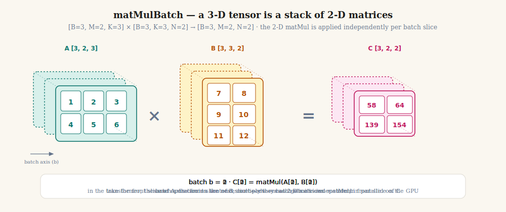

# Chapter 04: Matrix Operations

> **Part 1 of 6 — Tensor Library (NumPy-like Foundation)**
> Code: [`src/tensor/linalg.ts`](../../src/tensor/linalg.ts)
> Tests: [`src/tensor/linalg.test.ts`](../../src/tensor/linalg.test.ts)

---

## Learning Goals

By the end of this chapter you will be able to:

- **Explain** why matrix multiplication contracts the inner dimension and what that means for shapes.
- **Implement** `matMul` for 2-D matrices using a triple loop, reading the result of each `C[i,j]` as a dot product.
- **Implement** batched `matMul` that applies 2-D matrix multiply across a leading batch dimension.
- **Implement** `transpose`, `reshape`, `flatten`, `squeeze`, and `unsqueeze` as shape-manipulation helpers.
- **Implement** `concat` and `stack` to join tensors along existing or new axes.
- **Describe** where each of these operations appears in the attention formula and the linear layer.

---

## Intuition First — Why does matrix multiplication exist at all?

### The real question it answers

Imagine you're building a music recommendation system. You have **4 users**, and for each user you've measured how much they like 3 genres: pop, rock, jazz. You also have **5 songs**, and for each song you know its genre profile.

```
Users [4 × 3]            Songs [3 × 5]
(one row per user)        (one col per song)
(one col per genre)       (one row per genre)

          pop  rock jazz          s0   s1   s2   s3   s4
user 0  [ 0.9  0.1  0.5 ]  pop [ 0.7  0.8  0.9  0.0  0.5 ]
user 1  [ 0.2  0.8  0.3 ]  rock[ 0.3  0.1  0.0  0.9  0.7 ]
user 2  [ 0.5  0.5  0.9 ]  jazz[ 0.8  0.2  0.4  0.5  0.1 ]
user 3  [ 0.0  0.9  0.2 ]
```

**The question:** How much will user 0 enjoy song 2?

To answer it, you need to combine **all three** of user 0's genre preferences with **all three** of song 2's genre scores simultaneously:

```
score(user 0, song 2) = 0.9 × 0.9   +   0.1 × 0.0   +   0.5 × 0.4
                      = 0.81         +   0.00         +   0.20
                      = 1.01
```

That single sum — multiply each feature pair, then add — is called a **dot product**. One dot product gives one score.

Now the real power: **to get ALL user–song scores at once** (4 users × 5 songs = 20 scores), you do this dot product for every user-row against every song-column simultaneously. That is **matrix multiplication**.

```
Users [4 × 3]  ×  Songs [3 × 5]  =  Scores [4 × 5]
               ↑ ↑
     inner dims must match (both 3 = "number of genres")
```

Every cell of the result is one dot product. The entire 4×5 score table comes from one `matMul`.

---

### Why row × column? Why not some other combination?

This question is worth a dedicated stop. There are several ways you could imagine combining two matrices. Here is why only row × column works:

| Attempt | What you'd compute | Why it fails |
|---|---|---|
| **row × column** ✓ | All features of one user vs all features of one song | Gives one scalar — a meaningful compatibility score |
| row × row | User features vs user features | You'd compare users to users, not users to songs. Also gives a vector of 3 values, not a single score |
| column × column | Genre scores of Users vs genre scores of Songs | Compares genres, not user-song pairs. And they may have different lengths |
| elementwise (A * B) | Only works if shapes are equal. No summation | Gives a vector, not a scalar — you still can't compare full profiles |

The fundamental requirement is: **to measure how well two complete profiles align, you need a single number that combines all their features together**. The dot product (multiply each pair, sum everything) is exactly that number. And row × column is the only arrangement where one matrix holds complete "input profiles" as rows and the other holds complete "output profiles" as columns.

---

### What happens if the inner dimensions don't match?

```
Users  [4 × 3]  ×  Songs  [5 × 3]   ← WRONG: inner dims are 3 and 5
```

User 0's row has 3 genre values. Song 0's row also has 3 genre values. But if you tried to pair them as row × row, you'd be multiplying genre slot 1 of the user with genre slot 1 of the song — that part works. But the shape says there are 5 song rows and 3 user columns. The 4th and 5th song rows have no corresponding user column to multiply with. **The feature spaces don't align.** The sum is undefined.

The rigid rule — inner dims must match — is not an arbitrary mathematical quirk. It's a guarantee that feature slot $k$ in A is the **same kind of thing** as feature slot $k$ in B. If they don't match, you're summing apples and oranges.

---

### The neural network connection

In a neural network's **linear layer** (Ch 13):
- A = `input` tensor `[batch, features_in]` — each row is one data point's features
- B = `weights` matrix `[features_in, features_out]` — each column is one output neuron's weights
- C = `matMul(A, B)` → `[batch, features_out]` — each cell is "how much does data point i activate neuron j"

It is the same dot-product-as-compatibility-score idea, scaled up to millions of parameters. This single function call is what makes neurons "fire": they compute their weighted sum of inputs.

---

### The other operations in this chapter

`transpose`, `reshape`, `squeeze`, `concat` do **no arithmetic at all** — they only rearrange or relabel data. They exist because the shapes coming out of one layer rarely align perfectly with the shapes the next layer expects. They are plumbing, not computation.

---

## The Mental Model

### matMul: row × column → one number

```
A [3 × 4]          B [4 × 5]              C [3 × 5]
┌─────────────┐    ┌──────────────────┐   ┌──────────────────┐
│ → row i     │    │ ↓  ↓  ↓  ↓  ↓   │   │                  │
│ [a b c d]   │  × │ col              │ = │  C[i,j]          │
│             │    │  j               │   │  = a*B[0,j]      │
│             │    │                  │   │  + b*B[1,j]      │
└─────────────┘    └──────────────────┘   │  + c*B[2,j]      │
                                          │  + d*B[3,j]      │
                                          └──────────────────┘
```

Each output cell `C[i,j]` is the **dot product** of row `i` of A and column `j` of B.

### reshape / transpose: same data, new label

```
data = [1, 2, 3, 4, 5, 6]        (6 numbers, never move)

reshape to [2, 3]:    reshape to [3, 2]:    transpose [2,3] → [3,2]:
┌─────────┐           ┌───────┐             ┌───────┐
│ 1  2  3 │           │ 1  2  │             │ 1  4  │
│ 4  5  6 │           │ 3  4  │             │ 2  5  │
└─────────┘           │ 5  6  │             │ 3  6  │
                      └───────┘             └───────┘
```

`reshape` keeps rows in reading order. `transpose` swaps which axis is "rows" and which is "columns" — the data is copied into a new order.

---

## Concepts

### 1. Matrix Multiplication — `matMul`

`matMul` is the core operation of every neural network layer. It is where numbers actually mix together — in `transpose` and `reshape` they only move around.

> **Use it when** you need to compute "how much does each input profile match each output profile" — the dot product of every row of A with every column of B.

#### Animation — watch the row sweep across the columns

The animation below steps through all 9 output cells of a 3×2 × 2×3 multiply. Watch how one **blue row** of A pairs with one **green column** of B to produce one **amber cell** of C.


*Each step: pick one row of A (blue) and one column of B (green). Multiply element-wise and sum → one cell of C (amber). The formula bar at the bottom shows the exact arithmetic.*

#### The formula

$$\Large \boxed{C[i,j] = \sum_{k=0}^{K-1} A[i,k] \cdot B[k,j]}$$

In plain English: cell `C[i,j]` is the dot product of **row `i` of A** with **column `j` of B**. Every pair of indices `(i, j)` produces exactly one output cell.

**Shape rule:**

$$A \in \mathbb{R}^{M \times K},\quad B \in \mathbb{R}^{K \times N} \implies C \in \mathbb{R}^{M \times N}$$

$K$ is consumed. $M$ and $N$ survive. This is why a `[3,4] × [4,5]` gives `[3,5]` — the 4 disappears.

#### Worked trace (smallest useful example)

```
A = [[1, 2],    B = [[7, 8, 9 ],    C = A × B
     [3, 4],         [10,11,12]]
     [5, 6]]

C[0,0]: row 0 of A = [1,2],  col 0 of B = [7,10]  → 1×7 + 2×10 = 27
C[0,1]: row 0 of A = [1,2],  col 1 of B = [8,11]  → 1×8 + 2×11 = 30
C[1,0]: row 1 of A = [3,4],  col 0 of B = [7,10]  → 3×7 + 4×10 = 61
  ...9 cells total, each from one row × one column dot product.
```

Notice the pattern: as `j` increases (moving across columns of B), the **row stays the same** and only the column changes. As `i` increases, a new row of A is used. This is the three-loop structure:

```typescript
for i in 0..M       // which row of A (and row of C)
  for j in 0..N     // which col of B (and col of C)
    for k in 0..K   // step through the shared inner dimension
      C[i,j] += A[i,k] * B[k,j]
```

**Example:**

```typescript
const A = createTensor([1, 2, 3, 4], [2, 2]); // [[1,2],[3,4]]
const B = createTensor([1, 0, 0, 1], [2, 2]); // identity matrix
matMul(A, B);
// → [[1,2],[3,4]]  — multiplying by identity leaves A unchanged
// This is the matrix equivalent of n × 1 = n.
```

**Implementation note:** three nested loops — `i` over rows of A, `j` over columns of B, `k` over the shared inner dim. The flat offsets are `i*K+k` for A and `k*N+j` for B.

> **Why this matters for transformers:** In Ch 22 (self-attention), the query–key score matrix is `matMulBatch(Q, transpose(K))`. In Ch 13 (linear layer), the forward pass is `matMul(input, weights)`. The user–song example from the Intuition section maps exactly: users=inputs, songs=weight vectors, scores=activations.

### 2. Batched Matrix Multiplication — `matMulBatch`

In the transformer, Q, K, V are not 2-D matrices — they are 3-D tensors with a batch dimension: `[batch, seq, dHead]`. You need to apply `matMul` to every "slice" along the batch axis independently.

> **Use it when** you have a stack of matrices (batch of sentences, or multiple attention heads) and need to multiply each matrix pair independently.
> **Picture this** You have 8 spreadsheet pairs stacked on top of each other. `matMulBatch` multiplies each pair and gives you 8 result sheets stacked together.

$$\Large \boxed{\text{matMulBatch}(A, B)[b] = \text{matMul}(A[b],\; B[b])}$$

**Shape rule:** `[B, M, K] × [B, K, N] → [B, M, N]`. The leading batch axes must match; the 2-D multiply happens on the last two axes.

#### Animation — the 3-D view: a stack of independent 2-D matMuls



*A 3-D tensor of shape `[B, M, K]` is **B stacked copies of an `[M, K]` matrix**, drawn here in isometric view as slabs receding into the page along the batch axis. Each animation cycle highlights one batch index `b`: the corresponding slice of A pairs with the matching slice of B and produces the matching slice of C. The 2-D matMul itself is identical to Section 1 — `matMulBatch` is just "do that `B` times, one per slab." On a GPU, all `B` matMuls run in parallel.*

**Implementation note:** slice out each `b`-th 2-D matrix from A and B using `b * M * K` and `b * K * N` as base offsets into the flat data. Call the inner 2-D multiply logic for each slice, then concatenate results.

> **Why this matters for transformers:** Multi-head attention (Ch 23) processes all heads simultaneously as a batched matmul. Shape `[batch, heads, seq, dHead]` — the batch *and* heads dimensions are both leading batch dims.

### 3. Transpose — `transpose`

Transpose swaps the axes of a tensor. For a 2-D matrix, it turns rows into columns and vice versa.

> **Use it when** you need to flip which axis is "rows" and which is "columns" before a matrix multiply.
> **Picture this** A spreadsheet with 4 rows and 3 columns becomes a spreadsheet with 3 rows and 4 columns. The data is the same; the reading direction changes.

$$\Large \boxed{A^T[i,j] = A[j,i]}$$

For N-D tensors, an optional `axes` argument specifies a permutation. `transpose(t, [0, 2, 1])` on a `[B, M, N]` tensor produces `[B, N, M]` — it keeps axis 0 (batch) fixed and swaps axes 1 and 2.

**Example:**

```typescript
const A = createTensor([1, 2, 3, 4, 5, 6], [2, 3]);
// A = [[1,2,3],[4,5,6]]
transpose(A);
// → shape [3,2]: [[1,4],[2,5],[3,6]]
```

**Implementation note:** the new shape is the old shape with axes reordered per `axes` (default: reversed). For each output position, compute its multi-axis index in the new shape, permute those indices back to the original axis order, then read from the input using `flatIndex`.

> **Why this matters for transformers:** `QK^T` in attention is `matMul(Q, transpose(K))`. K has shape `[batch, seq, dHead]`; after `transpose(K, [0, 2, 1])` it becomes `[batch, dHead, seq]`, which is exactly what `matMulBatch` needs.

### 4. Reshape and Flatten

Reshape changes the shape metadata without changing which number is which. The only constraint: total element count must stay equal.

> **Use it when** a layer produces a flat output but the next layer expects a grid, or vice versa.
> **Picture this** You have 12 tiles arranged in a 2×6 grid. Reshape lets you re-frame them as 3×4 or 4×3 or just a row of 12 — the tiles themselves never move.

$$\Large \boxed{\prod \text{oldShape} = \prod \text{newShape}}$$

A `-1` in `newShape` means "infer this dimension from the others."

**Example:**

```typescript
const t = createTensor([1,2,3,4,5,6], [2,3]);
reshape(t, [3,2]);   // → [[1,2],[3,4],[5,6]]
reshape(t, [6]);     // → [1,2,3,4,5,6]  (flatten)
reshape(t, [-1,2]);  // → [3,2]  (-1 inferred as 6÷2=3)
flatten(t);          // → shape [6]  (shorthand for reshape to 1-D)
```

**Implementation note:** validate `product(newShape_without_-1) * (-1 slot)` equals `t.size`. Replace `-1` with the inferred value. Copy `t.data` into a new tensor with the new shape (shallow clone of the data array is fine).

### 5. Squeeze and Unsqueeze

These two helpers add or remove size-1 dimensions. They exist to satisfy the shape contracts between layers without changing any values.

> **Use it when** you need to insert a broadcast-friendly dimension, or remove a leftover size-1 axis after a reduction.
> **Picture this** `unsqueeze` is like putting a tray into a box — the tray doesn't change, but now it has a "slot" label. `squeeze` takes it back out.

$$\Large \boxed{\text{unsqueeze}(t, \text{axis}): [\ldots] \to [\ldots, 1, \ldots]}$$

```typescript
const t = createTensor([1,2,3,4], [2,2]);  // shape [2,2]
unsqueeze(t, 0);  // → shape [1,2,2]
unsqueeze(t, 1);  // → shape [2,1,2]
squeeze(unsqueeze(t, 0), 0);  // → shape [2,2]  (round-trip)
```

**Implementation note:** `unsqueeze` inserts a `1` at position `axis` in the shape array. `squeeze` removes the `1` at position `axis`. Both functions copy `t.data` unchanged — only the shape metadata changes.

> **Why this matters for transformers:** Attention masks have shape `[batch, 1, 1, seq]`. The two size-1 dimensions are there to broadcast across heads and query positions. They are inserted with `unsqueeze`.

### 6. Concat and Stack

`concat` joins tensors along an **existing** axis. `stack` creates a **new** axis and stacks tensors along it.

> **Use it when** you have multiple tensors that belong together — `concat` if they share an axis, `stack` if you want to treat them as a new collection.
> **Picture this** `concat` is stapling pages together lengthwise (pages stay as pages). `stack` is binding separate notebooks into a shelf — each book becomes one slot in a new dimension.

**Concat:**

$$\Large \boxed{\text{concat}([T_1, T_2, \ldots], \text{axis}): \text{size along axis} = \sum_i T_i.\text{shape[axis]}}$$

All other axes must match exactly.

**Stack:**

$$\Large \boxed{\text{stack}([T_1, T_2, \ldots], \text{axis}): \text{new axis of size} = \text{number of tensors}}$$

All tensors must have identical shape.

```typescript
const a = createTensor([1,2,3], [3]);
const b = createTensor([4,5,6], [3]);
concat([a, b], 0);          // → shape [6]: [1,2,3,4,5,6]
stack([a, b], 0);           // → shape [2,3]: [[1,2,3],[4,5,6]]
stack([a, b], 1);           // → shape [3,2]: [[1,4],[2,5],[3,6]]
```

**Implementation note for concat:** compute the output shape (sum of sizes along the concat axis), allocate the output buffer, then copy each input tensor's data into the right slice. The tricky part is computing the correct flat offset for each input — treat all axes except the concat axis as stride multipliers.

**Implementation note for stack:** `unsqueeze` each tensor at `axis` to insert the new dimension, then `concat` them. This reduces `stack` to one `unsqueeze` call per tensor plus one `concat` call.

> **Why this matters for transformers:** Multi-head attention (Ch 23) splits Q/K/V into heads with `reshape`, processes each head, then `concat`s the head outputs along the last axis. `stack` is used when building batches from individual sequences.

### Where you will see these operations again

| Operation | Where it shows up next | Why that chapter needs it |
|---|---|---|
| `matMul` | **Ch 13** (Linear layer) | forward pass: `output = matMul(input, weights)` |
| `matMulBatch` | **Ch 22** (Self-attention) | `QK^T` score matrix across a batch |
| `transpose` | **Ch 22** (Self-attention) | flip K from `[B, seq, d]` to `[B, d, seq]` |
| `reshape` | **Ch 23** (Multi-head attention) | split/merge head dimension |
| `unsqueeze` | **Ch 21** (Masks) | add broadcast dims to mask tensor |
| `concat` | **Ch 23** (Multi-head attention) | merge all head outputs |
| `stack` | **Ch 28** (Sequence data) | build a batch from a list of sequences |

These operations are the plumbing between every layer. You will use them so often they will feel automatic.

---

## What to Implement

| Function | Signature | Description |
|---|---|---|
| `matMul` | `(a, b) => Tensor` | 2-D matrix multiply. Shape: (M,K)×(K,N)→(M,N) |
| `matMulBatch` | `(a, b) => Tensor` | Batched matmul over all leading dims |
| `transpose` | `(t, axes?) => Tensor` | Permute axes. Default: reverse all |
| `reshape` | `(t, shape) => Tensor` | Change shape; validates total size; supports `-1` |
| `flatten` | `(t, startAxis?) => Tensor` | Collapse axes from `startAxis` onward to one dim |
| `squeeze` | `(t, axis) => Tensor` | Remove the size-1 dim at `axis` |
| `unsqueeze` | `(t, axis) => Tensor` | Insert a size-1 dim at `axis` |
| `concat` | `(tensors, axis) => Tensor` | Join along an existing axis |
| `stack` | `(tensors, axis) => Tensor` | Stack along a new axis |

---

## Common Pitfalls

**1. Inner dimension mismatch in matMul**

`matMul(A, B)` requires `A.shape[1] === B.shape[0]`. The most common mistake: multiplying `[3, 4]` by `[3, 4]` because both tensors are "the same shape". They are not — the inner dims are 4 and 3.

```
A [3, 4] × B [3, 4]   ← ERROR: inner dims are 4 ≠ 3
A [3, 4] × B [4, 5]   ← OK: inner dim 4 = 4
```

**2. Forgetting to transpose K before matMul**

In attention, you want $Q \cdot K^T$. K has shape `[batch, seq, dHead]`. If you pass K directly to `matMulBatch(Q, K)` you will get an inner-dim mismatch because K's last axis is `dHead` (same as Q's last axis). You must first `transpose(K, [0, 2, 1])` to get `[batch, dHead, seq]`.

**3. reshape vs transpose confusion**

`reshape([2,3] → [3,2])` re-reads elements in row-major order — the data order changes meaning. `transpose([2,3] → [3,2])` swaps axes so `A^T[i,j] = A[j,i]`. These produce different numbers.

```typescript
const A = createTensor([1,2,3,4,5,6], [2,3]);
reshape(A, [3,2]);   // [[1,2],[3,4],[5,6]] — just re-reads sequentially
transpose(A);        // [[1,4],[2,5],[3,6]] — swaps row/col
```

**4. squeeze on the wrong axis**

`squeeze(t, axis)` throws (or silently does nothing) if `t.shape[axis] !== 1`. Always check the actual shape before squeezing.

**5. Using -1 in reshape more than once**

Only one axis can be `-1` (inferred). Two `-1`s is an error because the system cannot determine both unknowns from a single product equation.

---

## How to Verify

Run the test suite:

```bash
bun test src/tensor/linalg.test.ts
```

Spot-check `matMul` manually:

```bash
bun -e '
import { createTensor } from "./src/tensor/types.ts";
import { matMul } from "./src/tensor/linalg.ts";
const A = createTensor([1,2,3,4,5,6], [2,3]);
const B = createTensor([7,8,9,10,11,12], [3,2]);
console.log(matMul(A, B).shape);  // [2, 2]
console.log(Array.from(matMul(A, B).data));  // [58, 64, 139, 154]
'
```

Check the attention-style pipeline:

```bash
bun -e '
import { createTensor } from "./src/tensor/types.ts";
import { matMul, transpose } from "./src/tensor/linalg.ts";
// Simulate Q [2,3] @ K^T [3,2] → scores [2,2]
const Q = createTensor([1,0,1, 0,1,0], [2,3]);
const K = createTensor([1,0,1, 0,1,0], [2,3]);
const scores = matMul(Q, transpose(K));
console.log(scores.shape);   // [2,2]
console.log(Array.from(scores.data));  // [2,0,0,1]
'
```

Three-step sanity check for all other ops:
1. `reshape(t, [-1])` should produce a flat tensor of the same size.
2. `concat([t, t], 0)` should double the first dimension.
3. `unsqueeze` then `squeeze` at the same axis should round-trip to the original shape.

---

## Self-Check Questions

1. What shape does `matMul(zeros([3, 7]), zeros([7, 5]))` produce? Why?
2. Why does `matMul(zeros([3, 4]), zeros([3, 4]))` throw an error?
3. K has shape `[batch, seq, dHead]`. What must its shape be after `transpose` so that `matMulBatch(Q, K_T)` with Q `[batch, seq, dHead]` produces `[batch, seq, seq]`?
4. `unsqueeze(t, 0)` on a `[3, 4]` tensor gives `[1, 3, 4]`. What does `unsqueeze(t, 1)` give?
5. You have 12 attention heads, each producing `[batch, seq, 64]`. You want to `concat` them into `[batch, seq, 768]`. Which axis do you concat along?
6. `reshape(t, [2, -1])` on a `[3, 4]` tensor — what is the inferred dimension?

---

## Coding Exercises

1. **Verify the identity property:** create a 3×3 identity matrix and confirm that `matMul(A, identity)` equals A for any 3×3 matrix A.
2. **Reconstruct transpose from reshape:** Can you get from `[[1,2,3],[4,5,6]]` (shape `[2,3]`) to `[[1,4],[2,5],[3,6]]` (shape `[3,2]`) using only `reshape`? Try it — you should find you cannot.
3. **Build `matMulBatch` from `matMul`:** slice the batch dimension manually in a loop, call `matMul` on each pair, then `stack` the results. Verify it matches the built-in.
4. **Attention-score sanity test:** with Q = K = ones([2, 4]), compute `matMul(Q, transpose(K))`. What is every element of the result, and why?

---

## Further Reading

- [Deep Dive — Why does matrix multiplication use row × column? (history, proofs, geometry)](../deep-dives/ch-04-why-matmul.md) *(optional — covers Arthur Cayley's 1858 derivation, the function-composition proof in plain English, and why AI specifically chose this math)*
- NumPy broadcasting + matmul docs — the canonical reference for axis semantics.
- [Ch 22 — Self-attention](../part-5-attention/ch-22-self-attention.md) is where all of these ops work together for the first time.

---

## Next Chapter

**Ch 05: Reduction & Stat Ops** — `sum`, `mean`, `max`, `min`, `argmax`, `variance`, `std` along arbitrary axes. These power softmax, LayerNorm, and loss computation.

