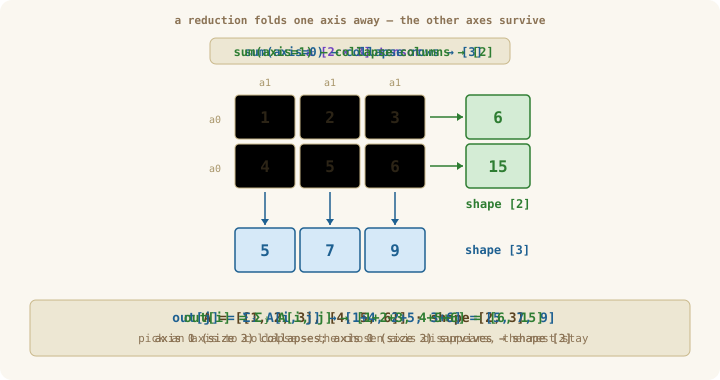
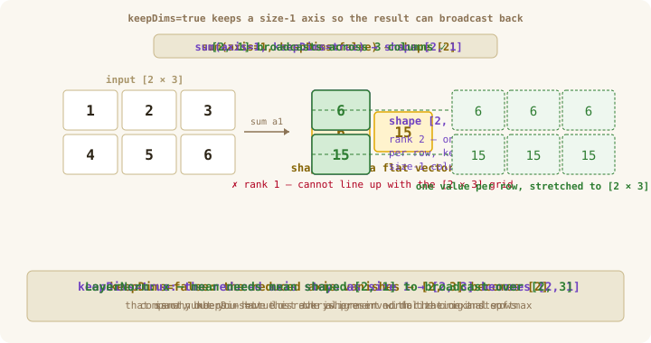
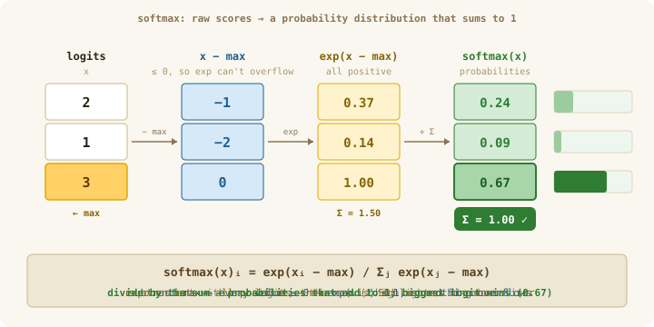

# Chapter 05: Reductions

> **Part 1 of 6 — Tensor Library**
> Source: [`src/tensor/reduce.ts`](../../src/tensor/reduce.ts)
> Tests: [`src/tensor/reduce.test.ts`](../../src/tensor/reduce.test.ts)
> Exercise: [`exercises/ch-05-reductions.ts`](../../exercises/ch-05-reductions.ts)

---

## Learning Goals

By the end of this chapter you can:

- Implement the reductions `sum`, `mean`, `max`, `min`, `argmax`, `argmin`, `variance`, `std`, and `softmax`.
- Explain in plain English what each one *means* — the average, the spread, the position of the biggest value — not just recite its formula.
- Use the `axis` option to pick which direction to fold, and `keepDims` to control the shape of the result.
- Recognise where each reduction shows up later in the course (the training score, turning scores into probabilities, steadying a network, picking a prediction).

---

## Words we'll use in this chapter

This chapter mentions a few machine-learning words for motivation. You do **not** need to understand the later machinery yet — just keep these plain meanings in mind:

| Word | Plain meaning |
|------|---------------|
| **scalar** | A single number. (In tensor terms, a tensor with no axes — shape `[]`.) |
| **loss** | One number that says how *wrong* the network's predictions currently are. Training tries to make it small. We build this in Ch 12; here just think "the score we want to shrink." |
| **activations** | The numbers flowing through a network — inputs, intermediate values, outputs. Just "the numbers in the tensors." |
| **classifier** | A model that sorts an input into one of several categories. Example: show it a photo and it outputs a score for each label — `cat: 8.1, dog: 2.0, bird: 0.5` — and the highest-scoring label (`cat`) is its guess. |
| **logits** | The raw output scores of a classifier, *before* they are turned into probabilities. Can be any real number, positive or negative. |
| **probability distribution** | A list of values that are all ≥ 0 and add up to exactly 1 — like `[0.2, 0.7, 0.1]`. |

A few names you'll see in passing — **softmax**, **LayerNorm**, **attention**, **tokens** — are pieces you'll *build* in later chapters. Whenever they appear here, the only thing to take away is: *they are all built out of the reductions in this chapter.*

---

## Intuition First — How do you score a guess with one number?

Before any math: **a reduction answers the question "what is the one number that summarizes all of these?"**

Picture a school exam. A student answers 50 questions; you mark each one right (1) or wrong (0), giving a row of 50 numbers. Nobody reports a report card as 50 separate bits — you report **one** number: the score. Adding the 50 bits is a `sum`; dividing by 50 is a `mean`. You just *reduced* a 50-element vector down to a single scalar.

That is the whole idea. A reduction walks along one axis (or all of them) and folds the values into a single summary — a sum, an average, a maximum — leaving the other axes untouched.

Now scale it up. A network looking at 32 photos at once produces a tensor of shape `[32, 10]` — 32 photos, and for each one, 10 scores (one per possible label like "cat", "dog", …). To get better, the network needs **one** number it can try to shrink: the **loss** (how wrong it currently is). Going from those 320 raw numbers down to that single number is done *entirely* with reductions — an average here, a sum there. No reduction, no single score; no single score, nothing to improve.

> **Why this matters later in the course**
> Reductions are the bridge between "a pile of numbers" and "a decision or a score." Each bullet below is something you'll build later — for now, just notice that all of them are reductions underneath:
> - **The training score (loss):** an *average* of how wrong each example was → one number to shrink (Ch 12).
> - **Turning scores into probabilities (softmax):** a *max* and a *sum* convert raw scores into percentages (used everywhere, including attention in Ch 22).
> - **Steadying a network (LayerNorm):** an *average* and a *spread* re-center and re-scale the numbers so deep networks keep training smoothly (Ch 20).
> - **Making a prediction:** *argmax* picks the highest-scoring option — the network's actual answer (Ch 29).
> Learn the handful of folds in this chapter and all four of those stop being mysterious.

---

## The Mental Model — folding one axis away

A reduction **collapses the chosen axis and keeps the rest.** Sum a `[2, 3]` tensor along axis 0 and the size-2 axis disappears, leaving shape `[3]`; sum along axis 1 and the size-3 axis disappears, leaving `[2]`. The numbers that survive are the per-position folds.

<p align="center">
  
</p>

*Figure 1: The same tensor, two axes you could collapse. The axis you name is the one that vanishes — the others survive into the output shape. This one picture is the whole chapter; every other reduction (`mean`, `max`, `variance`) folds the exact same way, just with a different fold operation.*

The rule to memorize: **reducing an axis deletes that axis from the shape; the others stay.** Back to the 32-photos example with shape `[32, 10]` (32 photos, 10 scores each): `mean` along axis 1 gives `[32]` — each photo's average score; `max` along axis 1 gives `[32]` — each photo's single highest score. Either way the "10 scores" axis is folded away and the "32 photos" axis survives.

---

## Concepts

### What is a Reduction?

A reduction takes a tensor and collapses one or more of its axes, producing a smaller tensor.

Example: summing a `[3, 4]` matrix along `axis=0` (collapse rows) gives a `[4]` vector.
Summing along `axis=1` (collapse columns) gives a `[3]` vector.

$$\text{sum along axis 0}: \quad out[j] = \sum_{i=0}^{M-1} A[i, j]$$

$$\text{sum along axis 1}: \quad out[i] = \sum_{j=0}^{N-1} A[i, j]$$

### The `keepDims` Parameter

After reduction, the collapsed axis normally disappears.
`keepDims=true` keeps it as a size-1 dimension instead:

```
A: shape [3, 4]
sum(A, axis=1)              → shape [3]      (axis 1 removed)
sum(A, axis=1, keepDims=true) → shape [3, 1]   (axis 1 kept as size 1)
```

Why keep a useless-looking size-1 axis? Because of **broadcasting** (from Ch 03): the rule
that lets a smaller tensor automatically stretch to match a bigger one in an element-wise
operation — but only when their shapes *line up*. Say you want to subtract each row's
average from that row of a `[2, 3]` tensor. If the averages come out as shape `[2, 1]`
(one per row, axis kept), they broadcast across the 3 columns perfectly. If they come out
as a flat `[2]` (axis thrown away), the shapes don't line up and the subtraction fails.
That single size-1 axis is the difference between "it just works" and "shape error."

<p align="center">
  
</p>

*Figure 2: `keepDims=false` (top) throws the axis away and gives a rank-1 `[2]` vector — compact, but it has lost its alignment with the original rows. `keepDims=true` (middle) keeps the axis as size 1, giving `[2, 1]`. That size-1 axis is what lets the result **broadcast** back over the original `[2, 3]` (bottom) so you can compute `x − mean` element-by-element. This is why `keepDims=true` shows up everywhere in normalization and softmax.*

### Mean — the center of the numbers

The **mean** is the plain average you already know: add everything up, divide by how many there are. It answers *"what single value best stands in for this whole group?"*

$$\bar{x} = \frac{1}{N} \sum_{i=0}^{N-1} x_i \qquad (\bar{x}\text{ is read ``x-bar'' and just means ``the mean of }x\text{''})$$

**Worked example.** The test scores `[70, 80, 90]`:

$$\bar{x} = \frac{70 + 80 + 90}{3} = \frac{240}{3} = 80$$

So `mean([70, 80, 90]) = 80`. (Notice: `mean` is just `sum` divided by the count — that's exactly how you'll implement it.)

**Why a network needs it.** The training score (loss) is the *average* mistake over a batch of examples. If five examples have errors `[0.5, 1.2, 0.3, 2.0, 1.0]`, the number you report and try to shrink is their mean, `1.0`. Averaging also smooths out luck: one weird example can't dominate the score.

### Variance and standard deviation — how spread out the numbers are

The mean tells you the center. It does **not** tell you whether the numbers are bunched tightly around that center or scattered all over. That's what **variance** measures.

Compare two groups with the *same* mean of 80:

```
Group A: [78, 80, 82]   → tightly bunched, barely varies
Group B: [40, 80, 120]  → same average, but wildly spread out
```

Both average to 80, yet they're clearly different. Variance puts a number on that difference.

**How it's computed** (in three plain steps):
1. Find the mean.
2. For each value, measure how far it is from the mean, and square that distance. (Squaring makes every gap positive and punishes big gaps more.)
3. Average those squared distances.

$$\sigma^2 = \frac{1}{N} \sum_{i=0}^{N-1} (x_i - \bar{x})^2 \qquad (\sigma^2\text{, ``sigma-squared'', is the standard symbol for variance})$$

**Worked example** on Group A `[78, 80, 82]` (mean 80):

```
distances from mean:  (78−80), (80−80), (82−80)  =  −2,  0,  +2
squared:                4,   0,   4
variance = (4 + 0 + 4) / 3 = 8/3 ≈ 2.67     (small → tightly bunched)
```

Do the same for Group B `[40, 80, 120]` — distances `−40, 0, +40`, squared `1600, 0, 1600`, so variance `= 3200 / 3 ≈ 1067` — a huge number, because the values sit far from their center. Same mean, very different variance.

**Standard deviation** is just the square root of the variance. We take the root so the answer is back in the *original units* (variance is in "units squared," which is hard to interpret). It reads as *"the typical distance of a value from the mean."*

$$\sigma = \sqrt{\sigma^2 + \varepsilon}$$

The little $\varepsilon$ ("epsilon", a tiny number like `0.00000001`) is added only to avoid taking the square root of zero — which happens when every value is identical (zero spread). Without it you could later divide by zero.

**Why a network needs it.** To compare numbers fairly you "standardize" them: subtract the mean, divide by the standard deviation. A value then says *"I am 1.5 typical-distances above average"* instead of an unanchored "2.3". This re-centering and re-scaling is exactly what LayerNorm does (Ch 20) to keep a deep network's numbers in a sane range so it keeps learning.

> **One implementation note (not jargon you need to memorize):** compute the mean *first*, then subtract and square, exactly as the steps above. There's a "shortcut formula" some textbooks use that avoids computing the mean first — skip it; it loses precision on large numbers. Straightforward is correct here.

### argmax — the *position* of the biggest value

`max` tells you the biggest value. `argmax` tells you **where** it is — its index (position). The "arg" stands for "argument," meaning "the input position that produces the maximum."

```
values:     [1,  5,  3]
             pos0 pos1 pos2

max([1,5,3])    = 5     ← the biggest value
argmax([1,5,3]) = 1     ← the position where that biggest value sits
```

So `max` answers *"what is the highest score?"* and `argmax` answers *"which option won?"* — and very often it's the *winner* you care about, not the score itself.

**Worked example along an axis.** For a `[2, 3]` tensor, taking `argmax` along axis 1 (across each row) returns one winning position per row:

```
[[1, 5, 3],     row 0: biggest is 5 at position 1  → 1
 [4, 2, 6]]     row 1: biggest is 6 at position 2  → 2

argmax(axis=1) = [1, 2]      shape [2]
```

**Why a network needs it.** When a classifier scores 10 labels as `[..., cat: 8.1, dog: 2.0, ...]`, the *answer* is "cat" — the label at the position of the highest score. `argmax` extracts that position. In text generation (Ch 29) the network scores every possible next word; `argmax` picks the index of the top one, and that integer **is** the chosen word. Run it in a loop and the model writes a sentence, one `argmax` at a time.

(`argmin` is the exact mirror — the position of the *smallest* value.)

### softmax — turning raw scores into percentages

A classifier's raw scores (logits) like `[2, 1, 3]` are hard to read — are they good? bad? how confident? **softmax** turns any such list into a clean **probability distribution**: all values positive and adding to 1, so you can read them as percentages.

$$\text{softmax}(x)_i = \frac{e^{x_i}}{\sum_j e^{x_j}} \qquad (e^{x}\text{ is the exponential; it makes every score positive})$$

In words: exponentiate each score (now all positive), then divide each by the total so they sum to 1. A bigger input score → a bigger share of the 1.

**Why it lives in this chapter:** softmax is built *out of* the reductions you just wrote. It needs a `max` (to stay safe — explained below), an `exp` on each element, and a `sum` (the total to divide by). It's the natural capstone that ties `max` and `sum` together.

<p align="center">
  
</p>

*Figure 3: Softmax as a four-stage pipeline. The amber cell is the `max` — subtracting it (stage 2) makes every value ≤ 0 so the `exp` (stage 3) can never overflow. The `sum` of the exponentials (1.50) is the normaliser; dividing by it (stage 4) yields probabilities that sum to exactly 1, with the biggest logit winning the biggest share. Worked numbers appear in the figure so you can check your implementation against them.*

**One safety step — subtract the max first.** The exponential grows *extremely* fast: `exp(1000)` is larger than any number a computer can store, so it becomes `Infinity` and the whole calculation turns to garbage. The fix: before exponentiating, subtract the largest value from every score. This doesn't change the answer at all (the probabilities come out identical — see the deep dive for the one-line proof), but now the biggest exponent is `exp(0) = 1`, so nothing can blow up:

$$\text{softmax}(x)_i = \frac{e^{x_i - \max(x)}}{\sum_j e^{x_j - \max(x)}}$$

This exact step is the last thing every attention layer does (Ch 22) — it converts raw scores into the percentages that decide how much each word pays attention to each other word. Figure 3 traces the safe version on `[2, 1, 3]`: the result `[0.24, 0.09, 0.67]` reads as "the model is 67% on option 3." Trace those numbers by hand and your implementation should match.

> **📖 Optional deep dive — why subtracting the max gives the *exact same* answer (not just a close one):**
> It's a short piece of algebra, plus a runnable demo of the overflow it prevents, in
> [`docs/deep-dives/ch-05-why-subtract-the-max.md`](../deep-dives/ch-05-why-subtract-the-max.md).
> Enrichment only — not required for the next chapter.

---

### Implementing Reductions Along an Axis

The key insight: reduction along an axis $a$ of a tensor with shape $[d_0, d_1, \ldots, d_{n-1}]$
produces output shape $[d_0, \ldots, d_{a-1}, d_{a+1}, \ldots, d_{n-1}]$ (axis $a$ removed).

Strategy: iterate over all output positions, and for each one, iterate over the range of the
reduced axis, accumulating the result.

```typescript
// Pseudocode for sum along axis
for each output index (i, j, ...) in output shape:
    out[i, j, ...] = 0
    for k in range(shape[axis]):
        out[i, j, ...] += input[..., k, ...]   // k inserted at the axis position
```

One clean way to implement this: flatten the tensor's axes around the reduction axis.
For axis $a$ of shape $[d_0, \ldots, d_{n-1}]$:
1. Transpose so axis $a$ is last → shape $[d_0, \ldots, d_{a-1}, d_{a+1}, \ldots, d_{n-1}, d_a]$
2. Flatten all but last → shape $[M, d_a]$ where $M = \text{size} / d_a$
3. Reduce each row of $M$ elements → shape $[M]$
4. Reshape back and transpose

---

## What to Implement

| Function | Signature | Description |
|----------|-----------|-------------|
| `sum` | `(t, axis?, keepDims?) => Tensor` | Sum along axis (or all axes if omitted) |
| `mean` | `(t, axis?, keepDims?) => Tensor` | Mean along axis |
| `max` | `(t, axis?, keepDims?) => Tensor` | Maximum value along axis |
| `min` | `(t, axis?, keepDims?) => Tensor` | Minimum value along axis |
| `argmax` | `(t, axis) => Tensor` | Index of max along axis |
| `argmin` | `(t, axis) => Tensor` | Index of min along axis |
| `variance` | `(t, axis?, keepDims?) => Tensor` | Population variance along axis |
| `std` | `(t, axis?, keepDims?) => Tensor` | Standard deviation (population, with epsilon) |
| `softmax` | `(t, axis?) => Tensor` | Numerically-stable softmax along axis (subtract max, exp, normalize) |

---

## TypeScript Hints

```typescript
// When axis is omitted (undefined), reduce over ALL elements to a scalar.
function sum(t: Tensor, axis?: number, keepDims = false): Tensor {
  if (axis === undefined) {
    // Reduce everything to a single scalar.
    // .reduce() here is a simple fold: start at 0, add each element — i.e. a running sum.
    const total = t.data.reduce((acc, v) => acc + v, 0);
    return createTensor([total], []);  // rank-0 scalar tensor
  }
  // ... axis-specific reduction
}

// mean is just sum divided by the count along that axis:
function mean(t: Tensor, axis?: number, keepDims = false): Tensor {
  const s = sum(t, axis, keepDims);
  const count = axis === undefined ? t.size : t.shape[axis]!;
  return mulScalar(s, 1 / count);   // mulScalar from Ch 03
}

// variance: mean of squared deviations
function variance(t: Tensor, axis?: number, keepDims = false): Tensor {
  const mu = mean(t, axis, true);         // keepDims=true for broadcasting
  const diff = sub(t, mu);               // broadcast: (x - mean)
  const squared = mul(diff, diff);       // element-wise square
  return mean(squared, axis, keepDims);  // average the squared differences
}
```

---

## Common Pitfalls

- **Wrong variance formula.** Compute it as `mean((x − mean)²)` — find the mean first, then subtract and square. The "shortcut" `mean(x²) − mean(x)²` looks tidy but loses precision on big numbers. Use the straightforward version.
- **Reducing the wrong axis.** Easy to mix up axis 0 and axis 1 when you've lost track of the input shape. When in doubt, print the shape before and after — the wrong axis usually shows up as a wrong output shape.
- **Forgetting `keepDims=true` when something later needs to broadcast.** If a `mean` you'll subtract later comes out as `[2]` instead of `[2, 1]`, the subtraction won't line up. LayerNorm and softmax both rely on `keepDims=true` (see Figure 2).
- **Confusing "the value" with "the position."** `max` gives the biggest value; `argmax` gives *where* it is. Reach for `argmax` whenever you want the winning option, not its score.
- **Returning a single number vs. a scalar tensor.** Decide whether a full reduction (no axis) returns a JS `number` or a shape-`[]` tensor, and stay consistent so callers always know what they get.

---

## How to Verify

Run the tests and the exercise. Both should pass cleanly with no warnings:

```bash
bun test src/tensor/reduce.test.ts
```
```bash
bun run exercises/ch-05-reductions.ts
```

---

## Self-Check Questions

1. `sum([[1,2],[3,4]], axis=0)` — what is the result and shape?
2. `sum([[1,2],[3,4]], axis=1, keepDims=true)` — what shape is the output?
3. Why is `keepDims=true` critical when computing LayerNorm? Describe the broadcast.
4. Compute `variance([2, 4, 4, 4, 5, 5, 7, 9])` by hand. Does your implementation match?
5. What does `argmax([[1,5,3],[4,2,6]], axis=1)` return?

---

## Further Reading

- **Deep dive: why subtracting the max is exactly equal, not just safe.** The shift-invariance proof, the IEEE-754 overflow it prevents (with a runnable demo), and the log-sum-exp connection to cross-entropy. [docs/deep-dives/ch-05-why-subtract-the-max.md](../deep-dives/ch-05-why-subtract-the-max.md)
- **Deep dive: the rest of the reduction family.** The functions this chapter implements but doesn't dwell on — `max`, `min`, `argmin` — with their neural-net uses and the single shared algorithm behind every reduction. [docs/deep-dives/ch-05-the-reduction-family.md](../deep-dives/ch-05-the-reduction-family.md)
- [NumPy — Reduction operations](https://numpy.org/doc/stable/reference/routines.math.html) — list of standard reductions and their `axis`/`keepdims` semantics.
- [Welford's algorithm for variance](https://en.wikipedia.org/wiki/Algorithms_for_calculating_variance#Welford's_online_algorithm) — a streaming, numerically-stable variance; useful for very large batches.
- [PyTorch — `torch.Tensor.sum`](https://pytorch.org/docs/stable/generated/torch.Tensor.sum.html) — exact semantics for `dim` and `keepdim` we will roughly mirror.
- [Goodfellow, Bengio, Courville — Deep Learning](https://www.deeplearningbook.org/) — the standard graduate textbook; chapters map cleanly to this course.

---

## Next Chapter

**[Math Primitives](ch-06-math-primitives.md)** — combine reductions with elementwise math to get softmax, LayerNorm, and friends.
