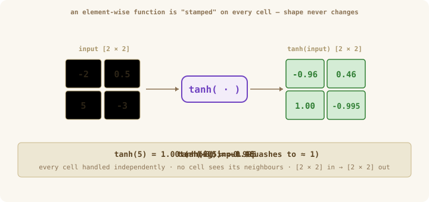
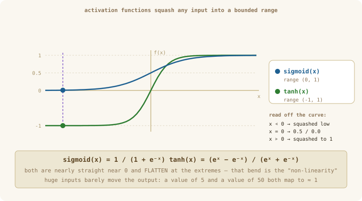
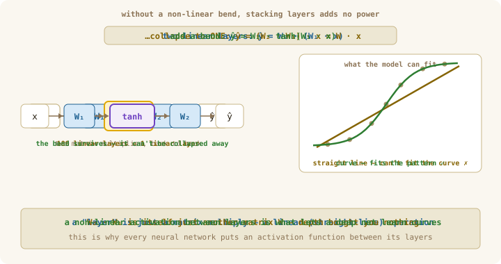

# Chapter 06: Math Primitives

> **Part 1 of 6 — Tensor Library**
> Source: [`src/tensor/math.ts`](../../src/tensor/math.ts)
> Tests: [`src/tensor/math.test.ts`](../../src/tensor/math.test.ts)
> Exercise: [`exercises/ch-06-math-primitives.ts`](../../exercises/ch-06-math-primitives.ts)

---

## Learning Goals

By the end of this chapter you can:

- Implement the element-wise math functions `exp`, `log`, `sqrt`, `pow`, `abs`, `clip`, `tanh`, and `sigmoid` on tensors.
- Explain in plain English what each curve *does* to a number — and why a neural network needs that exact shape.
- Explain the single most important idea in this chapter: why a network needs **non-linear** functions at all, and what happens without them.
- Spot and fix the three classic numerical traps: `log(0)`, `exp(big)`, and dividing by `sqrt(0)`.
- Write one small `applyElementwise` helper so every primitive is a one-line wrapper.

---

## Words we'll use in this chapter

| Word | Plain meaning |
|------|---------------|
| **element-wise** | Apply the same one-number function to *every* element independently. The shape never changes — a `[2, 3]` tensor stays `[2, 3]`. |
| **layer** | *(You'll build this in Ch 13.)* One step of a network: take a vector, multiply it by a grid of learned numbers (its **weights**) — the `matMul` from Ch 04 — and output a new vector. "Stacking layers" = feeding one layer's output into the next. |
| **activation function** | A curve applied to a neuron's output to give it a "bend." `tanh`, `sigmoid`, ReLU, and GELU are all activation functions. |
| **non-linear** | Not a straight line. A function whose graph bends. This bend is what lets a deep network learn complicated patterns (explained below — it's the heart of the chapter). |
| **overflow** | A number grows past the largest value a computer can store (~`1.8e308`) and becomes `Infinity`. Calculations involving `Infinity` often collapse to `NaN` ("not a number"). |
| **epsilon (ε)** | A tiny constant (like `1e-8`) added to a value to keep it safely away from 0, so we never take `log(0)` or divide by `0`. |
| **gradient** | *(You'll build this from Ch 07.)* How much the output moves when you nudge the input. For now: "the slope," the thing training uses to improve the network. |

---

## Intuition First — bending numbers, one at a time

So far our operations have done one of two things: **combine** numbers (`add`, `matMul`) or **summarize** them (`sum`, `mean`, `max` from Ch 05). Math primitives are a third, different kind: they **transform each number on its own**, leaving the tensor's shape untouched.

Think of a single function — say `tanh` — as a **stamp**. You press it onto every cell of the tensor independently:

```
input         tanh stamped on each cell        output
[[-2,  0.5],        tanh(-2) = -0.96           [[-0.96,  0.46],
 [ 5, -3  ]]        tanh(0.5) =  0.46    →       [ 0.9999, -0.995]]
                    tanh(5)  ≈  1.00
                    tanh(-3) ≈ -0.995
```

Notice two things. First, every cell is handled separately — no cell looks at its neighbours (that's what makes it "element-wise"). Second, `tanh` **bends** the numbers: huge values like `5` get squashed toward `1`, while small values like `0.5` pass through nearly straight. That bending is the whole point.

The functions themselves are not hard — JavaScript already gives us `Math.exp`, `Math.sqrt`, `Math.tanh`. The two things actually worth learning in this chapter are:

1. **Why the bend matters.** Those curves are what give a neural network its power. Without them, a 100-layer network is no smarter than a 1-layer one (we'll prove this below).
2. **How to keep them safe.** A few of these functions explode if you feed them the wrong value — `log(0)` is `-Infinity`, `exp(1000)` is `Infinity`. One bad number can poison an entire training run, so we learn the safe forms once and reuse them.

> **Why this matters later in the course**
> Each primitive is a building block you'll snap into something bigger:
> - **`exp`** → the engine of softmax (Ch 05) and the GELU/sigmoid curves.
> - **`log`** → scoring a prediction in cross-entropy loss (Ch 12): a confident-and-wrong guess gets a huge `-log(p)` penalty.
> - **`sqrt`** → LayerNorm divides by `sqrt(variance + ε)` (Ch 20); attention divides scores by `sqrt(dₖ)` (Ch 22).
> - **`tanh` / `sigmoid`** → the *activation functions* and *gates* that make deep networks able to learn at all.
> - **`clip`** → safety rails: stop `log(0)`, cap runaway gradients.

---

## The Mental Model — one scalar function, stamped on every cell

Every function in this chapter shares the exact same skeleton: walk the flat data array and apply a one-number function `f` to each element.

```text
applyElementwise(t, f):
    out = new array, same length as t.data
    for i in 0 .. t.data.length - 1:
        out[i] = f(t.data[i])
    return tensor(out, t.shape)        # shape is unchanged
```

$$f(T)[i_0, i_1, \ldots] = f\big(T[i_0, i_1, \ldots]\big)$$

<p align="center">
  
</p>

*Figure 1: `tanh` stamped cell-by-cell. Each element is transformed on its own and the shape stays `[2 × 2]`. This is the whole mechanism — the only thing that changes between `exp`, `log`, `sqrt`, `tanh`, … is which one-number function `f` you stamp.*

So `exp`, `log`, `sqrt`, `tanh`, … are all *the same function* with a different `f` plugged in. Write the helper once; everything else is a one-liner. The only place real thought is needed is the handful of functions that can blow up — covered in **Numerical Stability** below.

---

## Concepts

### The pattern: lifting a scalar function to a tensor

A "math primitive" for tensors is just: take a function that works on a single number and apply it to all of them. Because the shape is preserved and each element is independent, there's nothing clever in the loop itself — the interesting part is *which* curve you're applying and *why*.

### `exp` — turning any number positive, and growing fast

`exp(x)` is `eˣ` where `e ≈ 2.718`. Two properties make it indispensable:

1. **Its output is always positive** — even for negative inputs (`exp(-5) ≈ 0.0067`, still > 0). That's why softmax uses it: raw scores can be negative, but probabilities can't.
2. **It grows extremely fast** — small differences in input become large differences in output, which is how softmax turns a slightly-higher score into a clearly-higher probability.

```
exp([0, 1, 2]) = [1.000, 2.718, 7.389]      (each step ×2.718)
```

**Why a network needs it.** It's the engine of softmax (Ch 05) and of the sigmoid curve below. **Watch out:** `exp` overflows fast — `exp(710)` is already `Infinity` (see Numerical Stability).

### `log` — the inverse of `exp`, and how we score a probability

`log(x)` (natural log, base `e`) is the exact inverse of `exp`: it asks "`e` to what power gives `x`?" So `log(exp(x)) = x` and `exp(log(x)) = x`.

```
log([1, 2.718, 7.389]) ≈ [0, 1, 2]      (undoes the exp above)
log(1) = 0        log of "certainty"
log(0.5) ≈ -0.69  log of "maybe"
log(0.01) ≈ -4.6  log of "very unlikely"   ← big negative
```

Notice the pattern: as a probability shrinks toward 0, its `log` dives toward `-∞`. That is *exactly* what we want for a loss. Cross-entropy (Ch 12) scores a prediction as `-log(p)`: if the model said "1% chance" for the right answer, it eats a penalty of `-log(0.01) = 4.6`; if it confidently said "99%", the penalty is just `-log(0.99) ≈ 0.01`. **The trap:** `log(0) = -Infinity`, so a prediction that rounds to exactly 0 explodes — we clip first.

### `sqrt` — undoing a square, and rescaling

`sqrt(x)` answers "what number times itself gives `x`?" Plain and familiar:

```
sqrt([0, 1, 4, 9, 16]) = [0, 1, 2, 3, 4]
```

**Why a network needs it.** Two places, both about *rescaling*:
- **LayerNorm (Ch 20)** divides by `sqrt(variance + ε)` — i.e. by the standard deviation — to rescale activations to a typical size of 1.
- **Attention (Ch 22)** divides scores by `sqrt(dₖ)` to stop them from growing too large as the vector dimension grows.

`sqrt(0)` is a fine `0`, but we usually `sqrt(x + ε)` because the *next* step divides by the result, and `1 / 0` is `Infinity`.

### `pow` and `abs` — the small helpers

- **`pow(x, n)` = `xⁿ`.** Most common case: `pow(x, 2)` to square a number — e.g. the squared deviations inside variance (Ch 05), `(x − mean)²`.
- **`abs(x)` = `|x|`**, the distance from zero, always non-negative. Used to measure magnitude regardless of sign — e.g. clipping by gradient size, or L1 penalties.

```
pow([1, 2, 3], 2) = [1, 4, 9]        abs([-3, 0, 2]) = [3, 0, 2]
```

### `clip` — forcing every value into a safe range

`clip(x, lo, hi)` squeezes each value into the interval `[lo, hi]`: anything below `lo` becomes `lo`, anything above `hi` becomes `hi`, the rest pass through untouched.

```
clip([-3, 0.5, 9], 0, 1) = [0, 0.5, 1]
        │         │              │
   below 0 → 0   in range     above 1 → 1
```

**Why a network needs it.** It's a safety rail. `clip(p, 1e-7, 1.0)` before `log(p)` prevents the `log(0)` explosion. `clip(grad, -1, 1)` caps "exploding gradients" during training. (Bonus: `clip(x, 0, ∞)` is exactly the **ReLU** activation — "keep positives, zero out negatives.")

### `tanh` and `sigmoid` — the S-curves that make deep learning work

These two are **activation functions**: S-shaped ("sigmoidal") curves that squash any input, however large, into a bounded range.

- **`sigmoid(x) = 1 / (1 + e⁻ˣ)`** squashes into **(0, 1)**. Output reads like a probability or a soft on/off "gate."
- **`tanh(x) = (eˣ − e⁻ˣ)/(eˣ + e⁻ˣ)`** squashes into **(−1, 1)**, centered at 0.

```
        x:   −∞ ····· −2 ···· 0 ···· +2 ····· +∞
 sigmoid(x):   0     0.12    0.5    0.88      1      (range 0 → 1)
    tanh(x):  −1    −0.96     0     0.96      1      (range −1 → 1)
```

Both flatten out at the extremes (very large or very small inputs barely change the output) and are nearly straight through the middle. They're closely related: `tanh(x) = 2·sigmoid(2x) − 1`.

<p align="center">
  
</p>

*Figure 2: The two S-curves on one set of axes. Watch the sweeping cursor: near `x = 0` both curves are almost straight, but as `|x|` grows they flatten against their ceilings/floors — `sigmoid` toward 0 and 1, `tanh` toward −1 and 1.*

So that's *what* `tanh` and `sigmoid` look like: two functions that bend. But this should raise a question — **why would a neural network want a bendy function at all?** It seems like an odd, fiddly thing to bolt on. Couldn't we just stack lots of simple "multiply" layers and keep everything straight?

The answer to that question is the single most important idea in this chapter, and it's the whole reason activation functions exist.

> **First — what's a "layer"?** We haven't built one yet (that's the Linear layer in Ch 13), but the idea is small and we already have the tool for it. A **layer** takes a list of numbers (a vector), multiplies it by a grid of learned numbers called **weights** — this is exactly the `matMul` you wrote in Ch 04 — and produces a new list of numbers. **"Stacking layers"** just means feeding one layer's output straight into the next as its input. That single picture — *layer = multiply by a weight matrix* — is all we need to see why activations matter.

#### The big "why": stacking layers without a bend buys you nothing

Let's build the answer up slowly, starting with the simplest possible example.

**Start with one number.** Forget matrices for a moment. A neural-network layer, at its core, just *scales and combines* its inputs — the one-number version is "multiply by a number." Say:

- Layer 1 multiplies its input by **3**.
- Layer 2 multiplies *its* input by **2**.

Feed `x` through both: `2 × (3 × x) = 6 × x`. But that's just **one** layer that multiplies by 6! You stacked two layers and got something a single layer could already do. Stack ten such layers and it's *still* just "multiply by one number." **No amount of stacking gives you anything new.**

**Now the real version.** A real layer multiplies by a *matrix* instead of a single number (that's the `matMul` from Ch 04). The same collapse happens — multiplying by `W₁` then by `W₂` is the same as multiplying by one combined matrix `W = W₂ · W₁`:

```
layer 2 ( layer 1 (x) )  =  W₂ · (W₁ · x)  =  (W₂ · W₁) · x  =  W · x
                                                  └── one matrix ──┘
```

So **a hundred stacked plain layers are mathematically identical to a single layer.** And a single "multiply by a matrix" can only carve the world with a **straight line** (or a flat plane in higher dimensions). Real questions aren't straight-line rules — "is this email spam?", "is this a cat?" — they need *curved* boundaries. Plain stacked layers can never draw one.

**The fix: put a bend between the layers.** Insert a non-linear function (an activation) so the chain can't be flattened back into a single multiply:

```
layer 2 ( activation ( layer 1 (x) ) )      ← the bend cannot be collapsed away
```

Back to the one-number example: `2 × tanh(3 × x)` genuinely cannot be rewritten as "multiply by one number" — the `tanh` in the middle bends the result, and that bend stays. Now stacking layers *does* add power: each layer can bend the space a little more.

<p align="center">
  
</p>

*Figure 3: Two linear layers `W₂·(W₁·x)` collapse to a single matrix `W` — so depth alone only ever draws a straight line, which can't fit the curved data (amber line, ✗). Drop a `tanh` between the layers and the bend survives, letting the model fit the curve (green, ✓).*

The one-sentence takeaway: **the matrix multiplies decide how to mix the numbers; the activation functions are what let the network bend.** Without the bends, depth is an illusion. With them, stacked layers can fold space into arbitrarily complicated shapes (the informal *universal approximation* idea) — which is why a tiny chapter about `tanh` and friends matters far more than it looks.

#### Where you'll see this — and where it goes deep

This isn't a one-off curiosity; the bend is wired into *every* block you'll build later:

- **Ch 11 — Activations module.** You'll lift these curves (plus ReLU and GELU) into a proper activation layer the network calls between linear layers.
- **Ch 13 — Linear layer.** This is the "multiply by a matrix" layer itself — on its own, purely linear. It's *designed* to be sandwiched with an activation; that's the partnership this chapter sets up.
- **Ch 25 — Feed-forward block (the heart of the transformer).** Every transformer block contains a two-layer feed-forward network shaped exactly like our example: `Linear → GELU → Linear`. That middle **GELU is the bend** — remove it and the block's two linear layers would collapse into one, and the whole transformer would lose most of its power. (GELU is a smoother cousin of the curves here; `tanh` even appears inside its common approximation.)
- **Attention (Ch 22).** The `softmax` you built in Ch 05 is *also* a non-linearity — so attention bends too, not just the feed-forward part.

So the mental model to carry forward: a transformer is a tall stack of **`matMul` (mix) → activation (bend) → `matMul` (mix) → bend → …**. This chapter builds the "bend" half of that pattern.

> **A note on which curve is used where:** `sigmoid` squashes to (0, 1), so it reads as a probability or an on/off "gate" (classic in older RNN/LSTM gates and binary classifiers). `tanh` squashes to (−1, 1), zero-centered. Modern transformers mostly use ReLU/GELU, but `tanh` and `sigmoid` are the clearest way to first *understand* what an activation function is and why it's there.

---

## Numerical Stability — the three traps

Most primitives are perfectly safe. Three are not, and they cause real, hard-to-find training failures. Learn the safe form once.

**1. `log(0) = −Infinity`.** Cross-entropy computes `log(prediction)`. If a predicted probability rounds to `0`, the loss becomes `-Infinity` and training dies. **Fix:** clip first — `log(clip(p, 1e-7, 1.0))`.

**2. `exp(big) = Infinity`.** `exp(710)` already overflows. Softmax avoids this by subtracting the max before exponentiating — mathematically identical, numerically safe (full proof in the Ch 05 deep-dive [why-subtract-the-max](../deep-dives/ch-05-why-subtract-the-max.md)):

$$\text{softmax}(x_i) = \frac{e^{x_i - \max(x)}}{\sum_j e^{x_j - \max(x)}}$$

**3. Dividing by `sqrt(0)`.** `sqrt(0)` is a fine `0`, but LayerNorm and attention then *divide* by it, and `1 / 0 = Infinity`. **Fix:** add epsilon under the root — `sqrt(variance + ε)`.

The pattern across all three: **keep the input away from the value that explodes** — by clipping, shifting, or adding ε.

---

## What to Implement

| Function | Signature | What it does |
|----------|-----------|--------------|
| `exp` | `(t) => Tensor` | element-wise `eˣ` |
| `log` | `(t) => Tensor` | element-wise natural log (`log(0)` = `-Infinity` — clip before calling) |
| `sqrt` | `(t) => Tensor` | element-wise `√x` |
| `pow` | `(t, exponent) => Tensor` | element-wise `xⁿ` |
| `abs` | `(t) => Tensor` | element-wise `|x|` |
| `clip` | `(t, min, max) => Tensor` | clamp each element into `[min, max]` |
| `tanh` | `(t) => Tensor` | element-wise `tanh`, output in (−1, 1) |
| `sigmoid` | `(t) => Tensor` | element-wise `1/(1+e⁻ˣ)`, output in (0, 1) |

> Element-wise **between two tensors** (`maximum`, `minimum`) belongs with the broadcasting ops of Ch 03, not here — these eight are all one-input curves.

---

## TypeScript Hints

```typescript
// One helper does all the work; every primitive is a thin wrapper.
function applyElementwise(t: Tensor, fn: (x: number) => number): Tensor {
  const out = new Array<number>(t.size);
  for (let i = 0; i < t.size; i++) out[i] = fn(t.data[i]!);
  return createTensor(out, t.shape);   // shape unchanged
}

export const exp  = (t: Tensor): Tensor => applyElementwise(t, Math.exp);
export const log  = (t: Tensor): Tensor => applyElementwise(t, Math.log);
export const sqrt = (t: Tensor): Tensor => applyElementwise(t, Math.sqrt);
export const tanh = (t: Tensor): Tensor => applyElementwise(t, Math.tanh);
export const abs  = (t: Tensor): Tensor => applyElementwise(t, Math.abs);

export const pow = (t: Tensor, exponent: number): Tensor =>
  applyElementwise(t, (x) => x ** exponent);

export const clip = (t: Tensor, min: number, max: number): Tensor =>
  applyElementwise(t, (x) => Math.min(Math.max(x, min), max));

// sigmoid has no Math.* built-in — define it from exp:
//   σ(x) = 1 / (1 + e⁻ˣ)
```

---

## Common Pitfalls

- **`log` of a probability that rounded to 0.** Clip with a tiny epsilon (`1e-7`) before taking the log.
- **`exp` of a large value.** Anywhere you exponentiate raw scores, subtract the max first (softmax already does this).
- **Dividing by `sqrt(0)`.** Add ε under the root when the result is a denominator (LayerNorm, attention).
- **Forgetting shape is preserved.** These functions never change the shape — if your output shape differs from the input, the bug is in your helper, not the math.
- **Reaching for `tanh`/`sigmoid` thinking they're interchangeable.** Their ranges differ: `(−1, 1)` vs `(0, 1)`. Use `sigmoid` when you want a "probability" or a 0–1 gate; `tanh` when you want a zero-centered output.

---

## How to Verify

Run the tests and the exercise. Both should pass cleanly:

```bash
bun test src/tensor/math.test.ts
```
```bash
bun run exercises/ch-06-math-primitives.ts
```

Good properties to check (and the tests encode): `exp(0) = 1`; `log(exp(x)) ≈ x`; `sqrt(4) = 2`; `clip` floors/caps correctly; `tanh(0) = 0` and stays in `(−1, 1)`; `sigmoid(0) = 0.5` and stays in `(0, 1)`.

---

## Self-Check Questions

1. What is `exp(log(x))` for any `x > 0`, and why? Where do you use this identity in softmax?
2. A model predicts probability `0.02` for the correct answer. What cross-entropy penalty `-log(p)` does it pay? What if it had predicted `0.9`?
3. Why does a 50-layer network with **no** activation functions have exactly the same power as a single linear layer? Show the two-layer collapse algebraically.
4. What is `clip(t, 0, Infinity)` — and which famous activation function does it equal?
5. `sigmoid` and `tanh` both squash inputs. What is each one's output range, and when would you pick one over the other?

---

## End of Part 1

You now have a complete NumPy-like tensor library, built from scratch:

- A `Tensor` type with shape, flat data, and indexing *(Ch 01)*
- Factory functions for any standard tensor *(Ch 02)*
- Element-wise arithmetic with broadcasting *(Ch 03)*
- Matrix multiplication, transpose, reshape, concat *(Ch 04)*
- Reductions along axes *(Ch 05)*
- Scalar math curves lifted to tensors *(Ch 06)*

That is everything PyTorch's tensor module gives you — and you wrote every line.

---

## Further Reading

- [Wikipedia — Activation function](https://en.wikipedia.org/wiki/Activation_function) — gallery of the common curves (sigmoid, tanh, ReLU, GELU) and their shapes.
- [Goldberg — What Every Computer Scientist Should Know About Floating-Point](https://docs.oracle.com/cd/E19957-01/806-3568/ncg_goldberg.html) — why `exp`/`log` overflow and how floats really behave.
- [Wikipedia — LogSumExp](https://en.wikipedia.org/wiki/LogSumExp) — the trick behind stable softmax and stable cross-entropy.
- [Goodfellow, Bengio, Courville — Deep Learning](https://www.deeplearningbook.org/) — the standard graduate textbook; chapters map cleanly to this course.

---

## Next Chapter

**[Calculus for ML](../part-2-autodiff/ch-07-calculus-for-ml.md)** — with `exp`, `log`, and `sqrt` in hand, we turn to derivatives and start building the autograd engine that powers training.
