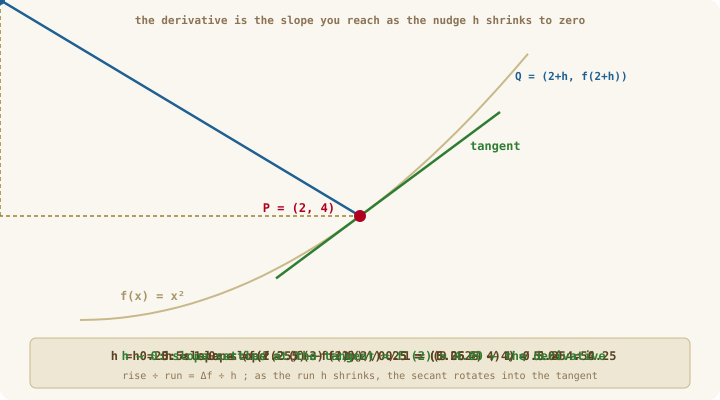
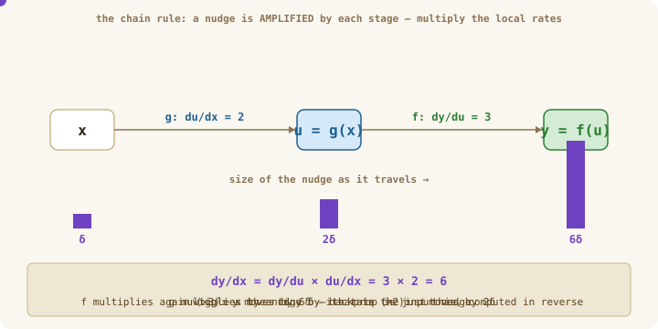
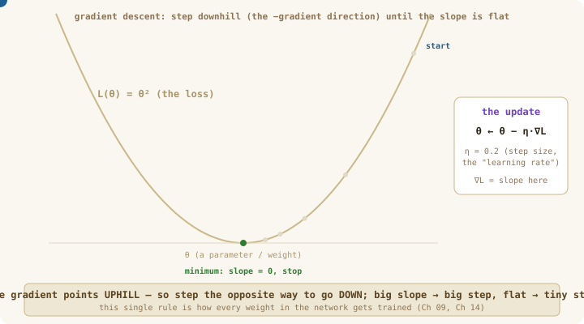

# Chapter 07: Calculus for Machine Learning

> **Part 2 of 6 — Autodiff Engine**
> Source: [`src/utils/numerical.ts`](../../src/utils/numerical.ts)
> Tests: [`src/utils/numerical.test.ts`](../../src/utils/numerical.test.ts)
> Exercise: [`exercises/ch-07-calculus-for-ml.ts`](../../exercises/ch-07-calculus-for-ml.ts)

---

## Learning Goals

By the end of this chapter you can:

- Explain a **derivative** in one plain sentence: "if I nudge the input a tiny bit, how much — and which way — does the output move?"
- Estimate any derivative with the **centered finite-difference** formula, and say why the *centered* version beats the one-sided one.
- Apply the **chain rule** to a small composition by hand, and see *why* it multiplies.
- Extend a single derivative to the **gradient** of a many-input function.
- Connect the gradient to the rule that trains every weight in the course: `θ ← θ − η·∇L`.

---

## Words we'll use in this chapter

| Word | Plain meaning |
|------|---------------|
| **derivative** | How fast the output changes when you nudge one input. A single number at a given point. |
| **slope** | The same thing, pictured: how steep the curve is at a point (rise ÷ run). |
| **gradient (∇)** | The derivative for a function with *many* inputs: a vector holding one slope per input. |
| **loss (L)** | *(Recall from Ch 05/06.)* One number measuring how wrong the network is. Training shrinks it. |
| **parameter / weight (θ)** | A knob the network can turn — a number inside a layer's matrix. Training adjusts these. |
| **learning rate (η)** | How big a step we take when adjusting a weight. "eta," a small number like 0.01. |
| **finite difference** | Estimating a derivative by actually nudging the input and measuring, instead of doing calculus by hand. |
| **epsilon (ε)** | A tiny number, used here both as the nudge size `h` and to avoid dividing by zero. |

---

## Intuition First — "if I nudge this knob, what happens?"

Imagine an old shower with one temperature knob. You turn it a hair and wait: did the water get *much* hotter or *barely* hotter? That sensitivity — **how much the output moves per tiny turn of the knob** — is exactly what a derivative measures. A big derivative means a touchy knob (small turn, big change); a small derivative means a sluggish one.

A neural network is a wall of millions of such knobs (its **weights**), and one dial you're watching: the **loss** (how wrong it is). Training asks, for every knob: *"if I nudge this one a hair, does the loss go up or down, and by how much?"* Answer that and you know which way to turn each knob to make the loss smaller. **That question is a derivative, and answering it for every weight is the entire mechanism of learning.**

This chapter is the calculus you actually need — no tricks, just three ideas:

1. **The derivative** — the nudge-response of one knob.
2. **The chain rule** — how to follow a nudge through a long chain of operations (a network is a very long chain).
3. **The gradient** — all the nudge-responses at once, and the rule that uses them to step downhill.

> **Why this matters for the rest of the course**
> Everything in Part 2 (Autodiff) exists to compute these nudge-responses *automatically*, for millions of weights, without you ever doing calculus by hand. This chapter builds the hand-tools and the intuition; Ch 08 turns them into a machine (the `Value` graph + backprop); Ch 09 and Ch 14 use them to actually train. The numerical gradient you write here also becomes your **test oracle** — the way you'll check that every fancy backward pass later is correct.

---

## The Mental Model — a derivative is a slope you sneak up on

You can't measure a slope "at a single point" directly — slope needs two points (a rise and a run). So we cheat: take a second point a tiny distance `h` away, measure the slope of the line between them (a **secant**), then shrink `h` toward 0. The secant rotates until it rests on the curve as the **tangent** — and *that* slope is the derivative.

<p align="center">
  
</p>

*Figure 1: For `f(x) = x²` at `P = (2, 4)`, the secant slope is `4 + h`. Shrink the run `h` from 1 → 0.5 → 0.25 and the slope slides 5 → 4.5 → 4.25, settling on the tangent slope **4** as `h → 0`. That limit is the derivative `f'(2) = 4`.*

---

## Concepts

### The derivative — the nudge-response of one input

Formally, the derivative is that "shrink the run to zero" limit:

$$f'(x) = \lim_{h \to 0} \frac{f(x + h) - f(x)}{h}$$

In words: *the change in output divided by the tiny change in input, as the input change goes to zero.* For our shower knob, `f` is "water temperature" and `x` is "knob angle"; `f'(x)` is how many degrees per degree-of-turn.

**Worked example.** For `f(x) = x²`, the derivative is `f'(x) = 2x` (a rule you can look up). So at `x = 2`, `f'(2) = 4` — matching Figure 1. In ML, if `f` were the loss and `x` a weight, `f'(2) = 4` says: *nudge this weight up by a hair and the loss rises about 4× as fast as the nudge.* So you'd push it the other way.

### Computing a derivative without calculus — finite differences

We rarely know the tidy formula `2x`; the network is far too tangled. Instead we measure the slope directly by nudging — a **finite difference**. The naive ("one-sided") version just uses a point to the right:

$$f'(x) \approx \frac{f(x + h) - f(x)}{h} \qquad \text{(one-sided — okay, but lopsided)}$$

The **centered** version nudges *both* ways and is markedly more accurate for the same `h`:

$$\boxed{\;f'(x) \approx \frac{f(x + h) - f(x - h)}{2h}\;} \qquad \text{(centered — use this)}$$

Why is centered better? Because it's symmetric: the leading errors from the left and right nudges cancel, leaving error proportional to `h²` instead of `h` (so halving `h` cuts the error 4×, not 2×). A short Taylor-series proof is in the deep dive — [why centered differences are O(h²)](../deep-dives/ch-07-why-centered-difference.md) (optional).

**Worked example (from the exercise).** Check the sigmoid's known derivative `σ'(x) = σ(x)(1 − σ(x))` at `x = 0.5`:

```
numerical:  (σ(0.5 + 1e-5) − σ(0.5 − 1e-5)) / (2·1e-5)  ≈  0.235004
analytical:  σ(0.5)·(1 − σ(0.5)) = 0.6225 · 0.3775       ≈  0.235004   ✓ match
```

This is the **gradient check** you'll use for the rest of the course: compute a derivative the slow-but-trustworthy way (nudging) and compare it to the fast analytical one your code claims.

> **Pitfall — the Goldilocks `h`.** Too *large* and the secant misses the true slope (truncation error). Too *small* and floating-point round-off swamps the tiny difference `f(x+h) − f(x−h)` (Ch 06's numerical hygiene returns). `h = 1e-5` is the sweet spot for centered differences.

### The chain rule — following a nudge through a chain

Networks are **compositions**: `x` goes into `g`, its output goes into `f`, and so on for dozens of layers. The chain rule says how a nudge at the input survives the trip to the output — **you multiply the local rates**:

$$y = f(g(x)) \quad\Longrightarrow\quad \frac{dy}{dx} = \frac{dy}{du}\cdot\frac{du}{dx} \quad (u = g(x))$$

<p align="center">
  
</p>

*Figure 2: Think of each stage as an amplifier. If `g` turns a nudge `δ` into `2δ`, and `f` turns that into `6δ`, then overall the input was amplified ×6 — and `6 = 3 × 2`, the product of the local rates. The chain rule is just "multiply the amplifications along the path."*

**Worked example.** For `y = sin(x²)`: the outer rate is `cos(u)` (derivative of `sin`), the inner rate is `2x` (derivative of `x²`), so `dy/dx = cos(x²) · 2x`. Outer rate times inner rate — nothing more.

**Why it's the heart of deep learning.** A network's loss is a deep composition: `L = loss(softmax(linear(relu(linear(x)))))`. To find how the loss responds to a weight buried five layers deep, you multiply the local rates along the path from that weight to the loss. Doing this multiplication *automatically, in reverse,* is **backpropagation** — the engine you build in Ch 08.

### Partial derivatives and the gradient — many knobs at once

Real functions have many inputs. A **partial derivative** `∂f/∂xᵢ` is just the ordinary derivative with respect to one input while the others are held still — *"nudge only knob i, freeze the rest."* Stack all of them into a vector and you get the **gradient**:

$$\nabla f = \left(\frac{\partial f}{\partial x_1},\ \frac{\partial f}{\partial x_2},\ \ldots,\ \frac{\partial f}{\partial x_n}\right)$$

**Worked example.** For `f(x, y) = x²y + y³`:
- `∂f/∂x = 2xy` (treat `y` as a constant)
- `∂f/∂y = x² + 3y²` (treat `x` as a constant)
- At `(1, 2)`: `∇f = (2·1·2,  1 + 3·4) = (4, 13)`.

The gradient has a beautiful geometric meaning: **it points in the direction of steepest *increase*.** Each entry says how touchy the output is to that one knob, and together they point straight uphill.

### Gradient descent — the rule that trains everything

If the gradient points uphill and we want the loss to go *down*, we step the **opposite** way. That's the whole training rule:

$$\boxed{\;\theta \leftarrow \theta - \eta\,\nabla L\;}$$

— move each weight `θ` a little (`η`, the learning rate) in the *negative* gradient direction.

<p align="center">
  
</p>

*Figure 3: The loss as a bowl; the ball is the current weight value. At each step it reads the local slope (`∇L`) and rolls the opposite way. Notice the steps are **big where the slope is steep and small where it flattens** — the gradient's size automatically tunes the step. At the bottom the slope is 0, so the update stops. This one rule, repeated over millions of weights, is how the whole network learns (Ch 09, Ch 14).*

### A note on the Jacobian

When a function's *output* is also a vector (not a single number), its full derivative is a grid of partials called the **Jacobian**: `J_{ij} = ∂f_i/∂x_j`. In deep learning the final loss is always a single number, so we almost always work with gradients (a vector), not full Jacobians. But the idea explains *why* matrix multiplication has the gradient it does — we'll meet it again in Ch 08 when we differentiate `matMul`.

---

## What to Implement

| Function | Signature | What it does |
|----------|-----------|--------------|
| `numericalGradient` | `(fn: (x:number)=>number, x, h?) => number` | Centered finite-difference slope of a scalar function at `x` |
| `numericalGradientTensor` | `(fn: (t:Tensor)=>number, t, h?) => Tensor` | Same idea, perturbing **each element** of a tensor one at a time |
| `checkGradient` | `(analytical, numerical, tol?) => boolean` | `true` when the two agree within `tol` (default `1e-5`) |

---

## TypeScript Hints

```typescript
// Centered difference for a one-number function — the whole idea in 3 lines:
function numericalGradient(fn: (x: number) => number, x: number, h = 1e-5): number {
  // nudge both ways and divide by the total run (2h)
  return (fn(x + h) - fn(x - h)) / (2 * h);
}

// For a tensor input, do the same one element at a time. Copy the data so each
// perturbation is isolated, and write the slope for that element into the output.
function numericalGradientTensor(fn: (t: Tensor) => number, t: Tensor, h = 1e-5): Tensor {
  const grad = new Array<number>(t.size);
  for (let i = 0; i < t.size; i++) {
    const plus  = Array.from(t.data); plus[i]  += h;
    const minus = Array.from(t.data); minus[i] -= h;
    const fPlus  = fn(createTensor(plus,  t.shape));
    const fMinus = fn(createTensor(minus, t.shape));
    grad[i] = (fPlus - fMinus) / (2 * h);
  }
  return createTensor(grad, t.shape);
}
```

---

## Common Pitfalls

- **Using the one-sided difference** when the centered one is nearly free and far more accurate. Default to centered.
- **Picking `h` badly.** Too small → round-off noise dominates; too large → you measure the wrong slope. `1e-5` is the safe default.
- **Adding instead of multiplying in the chain rule.** It is `(dy/du)·(du/dx)`, a product — every wrong sign or factor in backprop traces back to this.
- **Treating the gradient as one number.** It's a *vector* — one slope per input. A 1000-weight layer has a 1000-entry gradient.
- **Comparing derivatives with absolute error** when the values are large. Use a tolerance (and for big magnitudes, a *relative* tolerance) — that's what `checkGradient` is for.

---

## How to Verify

```bash
bun test src/utils/numerical.test.ts
```
```bash
bun run exercises/ch-07-calculus-for-ml.ts
```

A good sanity check: the numerical gradient of `f(x) = x³` at `x = 2` should be ≈ `12` (since `f'(x) = 3x²`).

---

## Self-Check Questions

1. Estimate the numerical (centered) gradient of `f(x) = x³` at `x = 2` with `h = 0.001`. The analytical answer is `3x² = 12` — how close do you get?
2. Why is the centered difference `(f(x+h) − f(x−h)) / 2h` more accurate than the one-sided `(f(x+h) − f(x)) / h`?
3. Apply the chain rule: what is `d/dx sin(x²)`?
4. For `f(x, y) = x²y + y³`, write `∇f` and evaluate it at `(1, 2)`.
5. A numerical gradient check fails (the numbers disagree). Name three likely causes.

---

## Further Reading

- **Deep dive: why centered differences are O(h²).** A short Taylor-series proof of the accuracy claim, with the round-off trade-off that sets the best `h`. [docs/deep-dives/ch-07-why-centered-difference.md](../deep-dives/ch-07-why-centered-difference.md)
- [3Blue1Brown — Essence of Calculus](https://www.3blue1brown.com/topics/calculus) — the visual intuition for derivatives and the chain rule.
- [Stanford CS231n — Backpropagation notes](https://cs231n.github.io/optimization-2/) — the best short write-up of chain-rule-as-computational-graph.
- [Khan Academy — Multivariable derivatives](https://www.khanacademy.org/math/multivariable-calculus/multivariable-derivatives) — partials and gradients at an undergrad pace.

---

## Next Chapter

**[Autograd Foundations](ch-08a-autograd-forward.md)** — turn the chain rule into a small graph data structure that records every operation, so the multiplications happen automatically.
