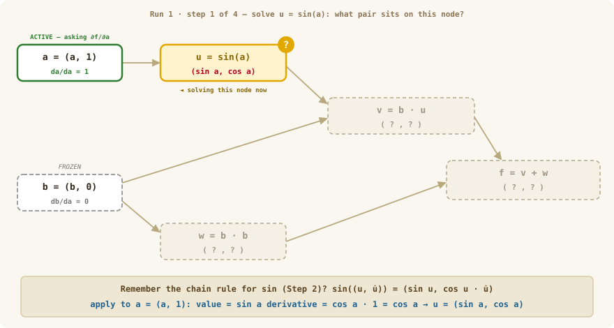
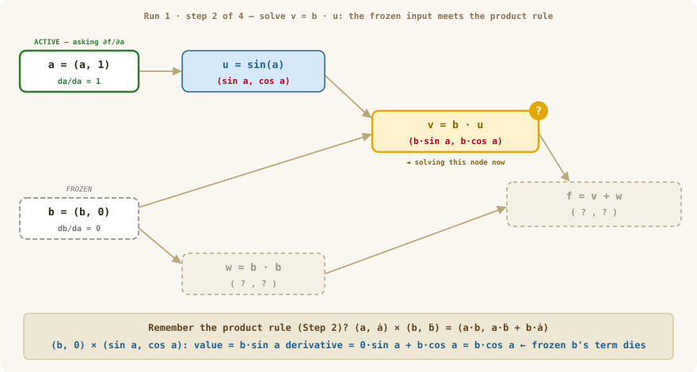
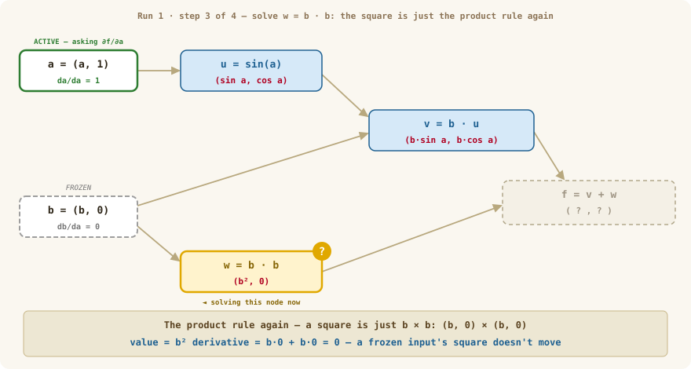
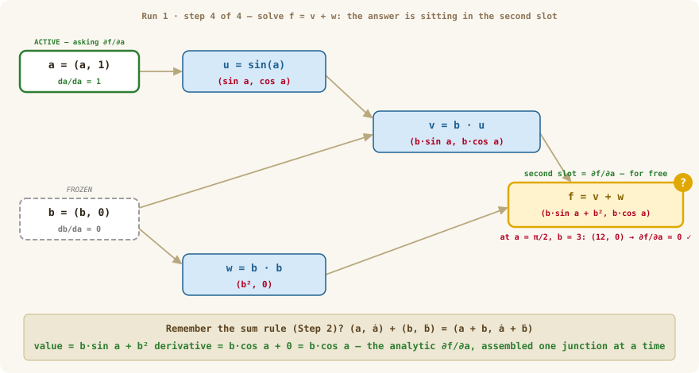
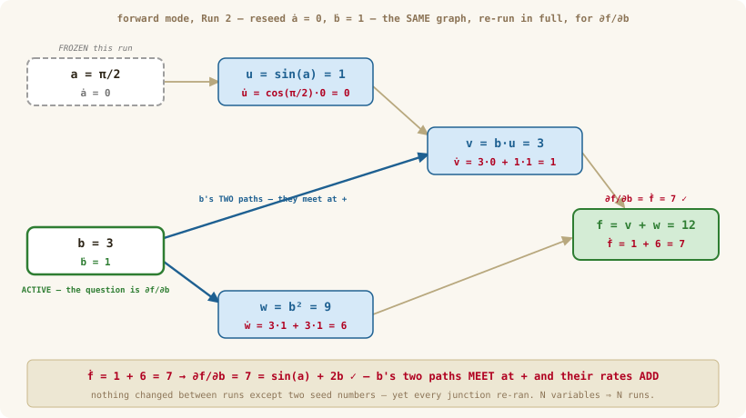
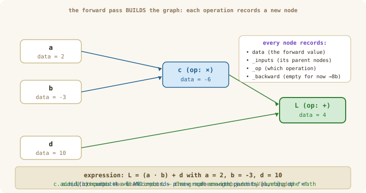

# Chapter 08a: Autograd — Building the Forward Graph

> **Part 2 of 6 — Autodiff Engine**
> Source: [`src/autograd/value.ts`](../../src/autograd/value.ts)
> Tests: [`src/autograd/value.test.ts`](../../src/autograd/value.test.ts)
> Exercise: [`exercises/ch-08-autograd.ts`](../../exercises/ch-08-autograd.ts)

---

## Where we left off (and why this chapter exists)

In Chapter 07 you learned to find a gradient two ways:

- **By hand**, with the chain rule — multiply the local rate of each step along the path.
- **Numerically**, by nudging each input and measuring (`numericalGradient`).

Both work, and both *fail to scale*. Doing the chain rule by hand for a network with millions of weights is hopeless. And the numerical check needs **two forward passes per weight** — for a million weights that's two million forward passes for a *single* training step. Unusable.

This chapter (and 08b) builds the thing that fixes both problems at once: **autograd** — code that does the chain rule for you, automatically, for every weight, in *one* backward pass. The key realization:

> The chain rule is mechanical. If a program just *records* every operation as it happens — what it was, and what fed into it — then later it can replay those operations in reverse and apply the chain rule itself.

Chapter 08a builds the **recording** half (the forward graph). Chapter 08b builds the **replay** half (the backward pass). Together they're ~80 lines of code that power every model in the rest of the course.

> **🗺️ Your path through Chapter 8** — in this order, and resist reading ahead:
> 1. Read this doc (08a), then implement the recording half in [`value.ts`](../../src/autograd/value.ts).
> 2. Read [08b](ch-08b-autograd-backward.md), then implement `topoSort` + `backward()`.
> 3. Run `bun test src/autograd/value` until green — `numericalGradient` is the referee.
> 4. **Only after your tests pass**, the deep dives, as victory-lap reading: [is autograd really just the chain rule?](../deep-dives/ch-08-three-ways-to-a-gradient.md) · [why is one backward pass enough?](../deep-dives/ch-08-why-reverse-mode.md) · [why not just use ordinary calculus?](../deep-dives/ch-08-symbolic-vs-autodiff.md)
>
> None of the deep dives is required to write the code. If you feel confused mid-chapter, the fix is almost always *writing the next method*, not reading another explanation.

---

## Learning Goals

By the end of this chapter you can:

- Compute a derivative **during** the forward pass with dual numbers — and explain exactly why that elegant trick cannot train a network.
- Wrap a single number in a `Value` that remembers where it came from.
- Build a **computation graph** automatically just by doing arithmetic on `Value`s.
- Explain what each node records (`data`, `_inputs`, `_op`, and a `_backward` slot for later) — and why the derivative work is *deferred* instead of done on the spot.

---

## Words we'll use in this chapter

| Word | Plain meaning |
|------|---------------|
| **autograd** | Short for "automatic differentiation" — code that computes gradients for you. |
| **dual number** | A pair `(value, derivative)` that computes both at once — the warm-up below. |
| **forward mode** | Autodiff that carries derivatives along *with* the forward computation (dual numbers). |
| **reverse mode** | Autodiff that records the forward computation, then replays it backward. What we build. |
| **Value** | Our wrapper around one number that also remembers its parents and operation. |
| **computation graph** | The picture of which values were computed from which — a flow chart of the math. |
| **node** / **leaf** | One `Value` in that graph / an input node with no parents (e.g. a weight). |
| **DAG** | "Directed Acyclic Graph" — arrows have a direction (inputs → outputs) and never loop back. |
| **closure** | A small function that "remembers" the variables around it — we'll store one per node. |

---

## Warm-up — the two-number trick (forward-mode autodiff)

Before we build the *real* engine, let's spend ten minutes building the **wrong** one — because it's beautiful, it's only a few lines, and feeling exactly where it fails is what makes the right design obvious.

The question it answers: *can we compute a function's value **and** its derivative at the same time?* Yes.

### Step 1 — every variable carries two numbers

Normally `x = 3` holds one number, and the derivative is a *separate* calculation. Forward mode asks: **can we compute the function's value and its derivative at the same time?** Yes — by making every variable carry a **pair**:

$$x = (3, \; 1)$$

— the **value**, and the **derivative with respect to the input we care about**.

Why is the derivative `1`? Because

$$\frac{dx}{dx} = 1.$$

Think of the seed `1` as declaring: *"I want the derivative with respect to `x`."*

### Step 2 — teach every operation to update both slots

**Addition.**

$$(a, \dot a) + (b, \dot b) = (a + b,\; \dot a + \dot b)$$

Why? Because $(a + b)' = a' + b'$. Nothing new.

**Multiplication.**

$$(a, \dot a) \times (b, \dot b) = (a \cdot b,\; a\dot b + b\dot a)$$

The second slot is exactly $(ab)' = a'b + ab'$. Notice something amazing: **the product rule is built into multiplication itself.**

**Sine.**

$$\sin\big((u, \dot u)\big) = (\sin u,\; \cos u \cdot \dot u)$$

Again — that's just the chain rule.

Every elementary operation now carries the derivative forward on its own. Differentiation has become ordinary arithmetic.

### Step 3 — worked example: `f(x) = sin(x²)` at `x = 3`

**Start.**

$$x = (3, 1)$$

**Square** — multiply the pair by itself with the multiplication rule:

```
value:       3 × 3        =  9
derivative:  3·1 + 3·1    =  6
x² = (9, 6)
```

Check the second slot: `6` is exactly $\frac{d}{dx}x^2\big|_{x=3} = 2x = 6$ — the derivative appeared without us asking for it.

**Apply sine** to the pair `(9, 6)`:

```
value:       sin 9
derivative:  cos 9 · 6
f = (sin 9,  6·cos 9)
```

Done. `f(3) = sin 9` and `f′(3) = 6·cos 9` — **exact** (no `h`, no truncation error), with **no symbolic algebra** anywhere. The derivative simply fell out of the arithmetic.

### Step 4 — several inputs: the seed chooses the question

For `f(a, b) = b·sin(a) + b²`, which partial derivative you get is decided entirely by the **seeding**:

- Want `∂f/∂a`? Seed `a = (a, 1)` — because $\partial a/\partial a = 1$ — and `b = (b, 0)` — because $\partial b/\partial a = 0$; `a` and `b` are independent. Giving `b` a zero derivative **is** Chapter 07's "freeze `b`", made literal.
- Want `∂f/∂b`? Re-seed the other way: `a = (a, 0)`, `b = (b, 1)`.

Same function, same arithmetic — only the two starting derivatives change.

### Step 5 — watch it run on the DAG, junction by junction

Now let's actually *run* both seedings at a concrete point — `a = π/2, b = 3` — and write down the **dual number sitting on every node** of the graph.

Notice the shape of what's about to happen: in any one run, exactly **one variable is active** (the one seeded `1`) and **every other variable is frozen** (seeded `0`). One run answers one question — "how does `f` respond to *this* variable?" — and nothing else. So to assemble the full gradient, forward mode is forced into a loop, **one full run per variable**:

```
for each input xᵢ  (i = 1 … N):                ← N iterations for N variables
    seed xᵢ = (value, 1), every other input = (value, 0)
    run the ENTIRE graph forward
    read ∂f/∂xᵢ from f's second slot
```

Our `f` has two variables, so we need **two** complete runs — Run 1 for `a`, Run 2 for `b`. First break `f` into one-operation steps (this decomposition is itself a preview of what `Value` will record):

```
u = sin(a)      v = b·u      w = b·b      f = v + w
```

**Run 1 — seed for `∂f/∂a`:** `a = (a, 1)`, `b = (b, 0)`.

Walk it junction by junction — symbolically first, so you can watch the formula assemble itself; then plug in the numbers. Each step's picture shows the state of the whole graph: solved nodes carry their pairs, the node we're solving wears the **`?` badge**, and everything downstream still reads `( ? , ? )`.

**Junction 1 — the sine.**

<p align="center">
  
</p>

*Figure 1a: Solving `u`. The rule panel recalls Step 2's chain rule for `sin`; everything downstream is still `( ? , ? )`.*

$$\sin\big((a, 1)\big) = (\sin a, \; \cos a \cdot 1) = (\sin a, \; \cos a)$$

The chain rule at work: `a` came in with rate `1`, and the sine junction scales that rate by its local slope `cos a`.

At our point: value `sin(π/2) = 1`, derivative `cos(π/2) = 0` — so `u = (1, 0)`. **`a`'s wiggle dies right here**: sine sits on its hilltop at `π/2`, so the rate through this junction is `0`.

**Junction 2 — multiply by `b`.**

<p align="center">
  
</p>

*Figure 1b: Solving `v` with Step 2's product rule — and watching the frozen input's term die.*

$$(b, 0) \times (\sin a, \; \cos a)$$

Value:

$$b \sin a$$

Derivative — the product rule, term by term:

$$\underbrace{0 \cdot \sin a}_{\text{b's term — frozen}} + \underbrace{b \cdot \cos a}_{\text{u's term}} = b\cos a$$

Watch what the seed did: because `b` is frozen (`ḃ = 0`), *its entire half of the product rule vanished* — `0·sin a = 0` — leaving only `b·cos a`. Freezing an input erases its contributions everywhere downstream. That is the mechanism behind "treat `b` as a constant."

At our point: value `3·1 = 3`; derivative `3·0 + 1·0 = 0` (since `cos(π/2) = 0`) — so `v = (3, 0)`.

**Junction 3 — the square.**

<p align="center">
  
</p>

*Figure 1c: Solving `w` — no new rule needed; a square is the product rule applied to `b × b`.*

$$(b, 0) \times (b, 0) = (b^2, \; b\cdot 0 + b\cdot 0) = (b^2, \; 0)$$

Both product-rule terms carry `b`'s rate — and `b`'s rate is `0`. A frozen input's square doesn't move.

At our point: `w = (9, 0)`.

**Junction 4 — the add.**

<p align="center">
  
</p>

*Figure 1d: Solving `f` with Step 2's sum rule. The second slot holds the analytic `∂f/∂a = b·cos a` — and only now do the numbers `a = π/2, b = 3` collapse it to `(12, 0)`.*

Value:

$$b\sin a + b^2$$

Derivative — the sum rule just adds the incoming rates:

$$b\cos a + 0 = b\cos a$$

At our point: `f = (12, 0)`.

**Result:** the second slot of `f` is $b\cos a$ — *exactly the analytic `∂f/∂a`*, assembled junction by junction with nobody doing calculus on the whole expression. At `a = π/2, b = 3` that's `3·0 = 0`, so **`∂f/∂a = 0`**. And the graph shows you *why* it's zero: the wiggle was gated at the very first junction, and everything downstream just carried the 0 along.

**Run 2 — re-seed for `∂f/∂b`:** `a = (π/2, 0)`, `b = (3, 1)`. Same graph, same four rules — only the seeds changed:

<p align="center">
  
</p>

*Figure 2: Run 2 — the seeds flipped, everything re-run, shown with the numbers already in. You've done the symbolic pass once, so read this one straight off the graph. `b`'s **two paths** are drawn bold; follow them to the `+` junction, where their rates meet and **add**: `1 + 6 = 7`. That junction becomes the `+=` accumulation rule in 08b.*

| Junction | Rule | Value slot | Derivative slot | What happened |
|---|---|---|---|---|
| `u = sin(a)` | chain | `1` | `cos(π/2)·0 = 0` | now `a` is the frozen one — no wiggle to gate. |
| `v = b × u` | product | `3·1 = 3` | `3·0 + 1·1 = 1` | `b`'s wiggle passes through, scaled by the *other* operand `u = 1`. |
| `w = b × b` | product | `9` | `3·1 + 3·1 = 6` | the product rule computes `2b = 6` all by itself. |
| `f = v + w` | sum | `12` | `1 + 6 = 7` | **`b`'s two paths through the graph meet here, and their rates add.** |

Result: `f = (12, 7)`, so **`∂f/∂b = 7`** — matching `sin(a) + 2b = 1 + 6`.

Two junctions are worth staring at before moving on:

1. **The last junction added `1 + 6`.** `b` reaches `f` along **two paths** — through the product and through the square — and its total influence is the *sum* of both. Remember this junction: in 08b it becomes the `+=` accumulation rule.
2. **Between the two runs, nothing changed except two seed numbers.** Same graph, same rules — and yet we had to re-run *every* junction. That is the sound of a trap springing. Hold that thought through the exercise.

### 🖊️ Warm-up exercise (do it now — 15 minutes, throwaway code)

In a scratch file (say `exercises/ch-08-warmup-dual.ts` — it will not become part of the library):

1. Write a tiny `Dual` type: `{ data: number; deriv: number }` with three functions — `dAdd(a, b)`, `dMul(a, b)`, `dSin(a)` — implementing the three pair-rules above.
2. Compute `f(x) = sin(x²)` at `x = 3` and check the derivative slot against Ch 07's `numericalGradient` (or the closed form `6·cos 9 ≈ -5.467`).
3. Compute `∂f/∂a` and `∂f/∂b` for `f(a,b) = b·sin(a) + b²` at `a = π/2, b = 3` by seeding twice — reproduce Run 1 and Run 2 from Step 5 and check your pairs at every junction: you should land on `(12, 0)` and `(12, 7)`.
4. Now answer honestly: for a network with **1,000,000 weights**, how many times must you re-run step 3's computation to fill the whole gradient vector?

### The wall

That's the limitation: **one seeded pass gives the derivative with respect to one input.** `N` inputs → `N` full passes. Forward mode is wonderful when you have *few inputs and many outputs*. A neural network is the exact opposite: **millions of inputs (the weights), one output (the loss)**. A million-weight model would need a million forward passes *per training step* — dead on arrival. (The full cost accounting lives in the [why reverse-mode wins](../deep-dives/ch-08-why-reverse-mode.md) deep dive; the wall is all we need here.)

---

## The reverse-mode bet — remember now, differentiate later

Forward mode failed because it commits to **one input** before the pass even starts (the seed), and pays a full pass per input. Reverse mode makes the opposite bet:

> During the forward pass, compute **no derivatives at all**. Just **remember what happened** — every operation, and what fed into it. Then, later, answer **one** question from the *output* side — "how did everything affect the loss?" — in a single backward replay that serves **all** inputs at once.

That "remember what happened" is the **computation graph**, and building it is this chapter. This is also why `_backward` stays empty until 08b — *deferring the derivative work is the entire design*:

| | `Dual` (warm-up) | `Value` (the library) |
|---|---|---|
| second thing each number carries | its derivative, computed **now** | breadcrumbs (`_inputs`, `_op`) + an empty `_backward` for **later** |
| when the question is chosen | at seed time — one *input* per run | at `backward()` time — one *output*, answered for **all** inputs |
| passes for `N` gradients | `N` | ~2 (one forward, one backward) |

---

## Intuition First — autograd is just bookkeeping

Here's the whole idea in one sentence: **every time you do arithmetic, secretly write down what you did.**

When you compute `c = a * b`, a plain calculator throws away everything except the answer `-6`. Autograd instead keeps a sticky note on `c`:

> "I am `c`. I came from `a` and `b`. The operation was `×`."

Do that for every operation and you've recorded a trail — a **graph** — of the entire calculation. Later, to get gradients, you just walk that trail backwards and apply the chain rule at each step (that's 08b). Nothing magic: the forward pass *builds* the trail, the backward pass *walks* it.

> **Why this matters for the whole course**
> Every layer you build from here on — linear layers, attention, the whole transformer — is just more operations on `Value`s (later, on tensor-valued `Value`s in Ch 10). Because each operation records itself, you will *never* hand-derive a gradient again: you build the forward pass, call `.backward()`, and the gradients appear. This chapter is the foundation that makes that possible.

---

## The Mental Model — the graph builds itself

Take the small expression `L = (a · b) + d` with `a = 2, b = -3, d = 10`. You don't draw the graph; it *emerges* as each operation runs and drops a new node:

<p align="center">
  
</p>

*Figure 3: The forward pass doubles as graph construction. `a.mul(b)` doesn't just return `-6` — it returns a new node `c` that remembers its parents `[a, b]` and its operation `×`. Then `c.add(d)` records `L`. You wrote ordinary math; the graph appeared as a side effect.*

---

## Concepts

### A `Value` is a number that remembers its origin

A normal variable holds a number and forgets the rest. A `Value` holds the number **plus** the breadcrumbs needed to differentiate it later:

```typescript
class Value {
  data: number;            // the forward value (e.g. -6)
  grad: number = 0;        // ∂L/∂this — filled during backward (Ch 08b); starts at 0
  _inputs: Value[] = [];   // the parent nodes this came from
  _op: string = "";        // which operation produced it ("+", "*", "tanh", …)
  _backward: () => void = () => {};  // how to push gradient to parents (empty until 08b)
}
```

The four bookkeeping fields are exactly the sticky note from the intuition: *where did I come from* (`_inputs`, `_op`), *what's my value* (`data`), and two slots reserved for the backward pass (`grad`, `_backward`). Compare with the warm-up's `Dual`: where `Dual` carried a finished derivative, `Value` carries the *ingredients* to compute any derivative later.

### Each operation does two jobs

Every method (`add`, `mul`, `exp`, …) must (1) compute the forward number and (2) record a node. Here is the pattern **once** — every other operation follows it:

```typescript
mul(other: Value): Value {
  const out = new Value(this.data * other.data, [this, other], "*");
  // out._backward will be filled in Ch 08b — for now the graph is just recorded
  return out;
}
```

That's the entire trick: **the graph is built implicitly by running the forward pass.** There is no separate "build the graph" step — you just compute, and the wiring records itself through `_inputs`.

### Why store a `_backward` *closure* on each node?

You might expect one big `switch (op)` statement in `backward()`. Instead each node carries its own little `_backward` function. Why?

Because the backward step for a node needs the *specific parents and values from that node's forward pass* — and a closure captures exactly those. When `mul` builds `out`, it can write a `_backward` that already "knows" which `this` and `other` produced it. At backward time we just call `out._backward()` and the right local gradients flow to the right parents, with no lookup and no giant switch. (We fill these in next chapter; 08a only leaves the empty slot.)

### Operations to support

For scalar `Value` in this chapter:

| Method | Math | Method | Math |
|--------|------|--------|------|
| `add(other)` | `a + b` | `neg()` | `-a` |
| `mul(other)` | `a · b` | `exp()` | `eˣ` |
| `sub(other)` | `a - b`  (= `add(other.neg())`) | `log()` | `ln(a)` |
| `div(other)` | `a / b`  (= `mul(other.pow(-1))`) | `tanh()` | `tanh(a)` |
| `pow(n)` | `aⁿ` | | |

Notice `sub` and `div` are *built from* the others — fewer primitives to differentiate later.

---

## Build Order — milestones with checkpoints

Implement in this order; each milestone has a checkpoint you can verify before moving on. (The only solution code you've been given is the `mul` pattern above and the class fields — the rest is yours.)

**Milestone 1 — the `Value` skeleton.** The class with its five fields and a constructor taking `(data, inputs = [], op = "")`. Initialize `_backward` to a no-op: `() => {}`.
✅ *Checkpoint:* `new Value(2).data === 2`, `grad === 0`, `_inputs` is `[]`.

**Milestone 2 — `printGraph(v)` first.** Write the debugging helper *before* the interesting ops — it's your eyes for everything after. Walk `_inputs` recursively, indenting per level.
✅ *Checkpoint:* `printGraph(new Value(5))` prints a single node.

**Milestone 3 — `add` and `mul`.** Follow the two-jobs pattern.
✅ *Checkpoint:* for `a=2, b=-3, d=10`:

```
const c = a.mul(b);            // c.data === -6, c._inputs === [a, b], c._op === "*"
const L = c.add(d);            // L.data === 4
printGraph(L);
```
```
Value(L=4.0, op=+)
├── Value(c=-6.0, op=×)
│   ├── Value(a=2.0)
│   └── Value(b=-3.0)
└── Value(d=10.0)
```

**Milestone 4 — `pow`, `neg`, then `sub` and `div` by composition.**
✅ *Checkpoint:* `a.sub(b)` creates **two** nodes (a `neg`, then an `add`) — confirm with `printGraph`. Composition means fewer `_backward` rules to write in 08b.

**Milestone 5 — the unary trio: `exp`, `log`, `tanh`.** Each records exactly one parent.
✅ *Checkpoint:* a chained expression like `x.mul(x).add(x).tanh()` builds a graph three levels deep — and `x` appears as a parent in **two** places (that reuse becomes the `+=` story in 08b).

Then run the forward-pass tests:

```bash
bun test src/autograd/value.test.ts
```

Backward-related tests staying red/`todo` is **expected** — that's 08b's job.

---

## Common Pitfalls

- **Computing derivatives during the forward pass** — that was `Dual`'s job in the warm-up, and the wall is why we don't. `Value`'s forward pass *only records*; every derivative waits for `backward()`.
- **Storing parents in a `Set`** and losing order — use an array; the backward pass relies on stable ordering.
- **Returning a primitive `number`** from an operation when you must return a `Value` (or the graph breaks at that node).
- **Reusing one `Value` across two unrelated computations** — build a fresh graph per forward pass.
- **Forgetting `Value` is scalar here** — tensor autograd waits until Ch 10. One number per node for now.
- **Trying to fill in `_backward` already** — resist; 08a only records structure. The gradients come next chapter.

---

## How to Verify

```bash
bun test src/autograd/value.test.ts
```
```bash
bun run exercises/ch-08-autograd.ts
```

Forward-pass checks: `a.mul(b).data` is correct, `_inputs` records both operands, and a chained expression builds a graph more than one level deep.

---

## Self-Check Questions

1. In the warm-up, why must `b` be seeded `(b, 0)` when computing `∂f/∂a`? What would `(b, 1)` compute instead?
2. `Dual` computed derivatives *during* the forward pass; `Value` defers them. In one sentence: what does deferring buy us at one million weights?
3. Draw the computation graph for `L = (a · b + c)²`. Label each node's op and value at `a=2, b=3, c=1`.
4. How many `Value` nodes does `(x + y) · (y − z)` create? (One per operation — careful with `sub`.)
5. Why must `_backward` be a closure stored on the node, rather than a `switch` evaluated at call time?
6. Why is the computation graph always a DAG (no cycles)? What would a cycle mean?
7. The forward pass produces a *number* you could've gotten from a calculator. What did building the graph buy you that the calculator didn't?

---

## Further Reading

- [Karpathy — micrograd](https://github.com/karpathy/micrograd) — the ~100-line autograd this chapter mirrors.
- [Wikipedia — Automatic differentiation](https://en.wikipedia.org/wiki/Automatic_differentiation) — the dual-number formalism behind the warm-up, and both modes side by side.
- [Chris Olah — Calculus on Computational Graphs](https://colah.github.io/posts/2015-08-Backprop/) — the best intuition piece on graph-based backprop.
- [Karpathy — Neural Networks: Zero to Hero](https://karpathy.ai/zero-to-hero.html) — the video build of micrograd and beyond.

---

## Next Chapter

**[Autograd — The Backward Pass](ch-08b-autograd-backward.md)** — fill in every node's `_backward`, walk the graph in reverse, and watch all the gradients appear in a single sweep.
