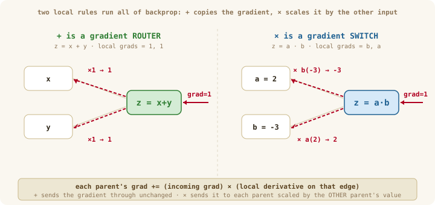
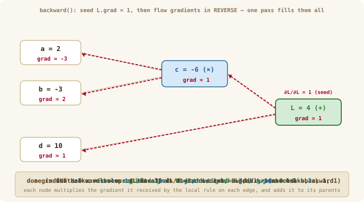

# Chapter 08b: Autograd — The Backward Pass

> **Part 2 of 6 — Autodiff Engine**
> Source: [`src/autograd/value.ts`](../../src/autograd/value.ts) · [`src/autograd/engine.ts`](../../src/autograd/engine.ts)
> Tests: [`src/autograd/value.test.ts`](../../src/autograd/value.test.ts)
> Exercise: [`exercises/ch-08-autograd.ts`](../../exercises/ch-08-autograd.ts)

---

## Where we left off

In **08a** you built the *recording* half of autograd: every operation on a `Value` drops a node that remembers its parents (`_inputs`), its operation (`_op`), and leaves an empty `_backward` slot. Running `L = (a·b) + d` built this graph but every `grad` was still `0`.

You also built forward mode (`Dual`) in the warm-up and hit its wall. This chapter is the other half of that contrast — keep it in view, because it explains every design choice below:

| | Forward mode (the warm-up) | Reverse mode (this chapter) |
|---|---|---|
| Propagates | values *and* derivatives, inputs → output | recorded values forward; **sensitivities output → inputs** |
| One pass gives | derivative w.r.t. **one input** (the seed) | derivatives w.r.t. **all inputs**, for one output |
| Best when | few inputs, many outputs | **one output — a loss. That's us.** |

This chapter fills in those `_backward` slots and writes `backward()` — the *replay* half. Instead of asking "how does *this input* affect everything?" (forward mode's question, once per input), we ask **once**: "starting from the output, how much did each quantity contribute to it?" After this, calling `L.backward()` computes `∂L/∂` for **every** node in the graph in a single sweep. Backpropagation stops being a mysterious AI algorithm — it's simply reverse-mode automatic differentiation. That's the whole payoff of Part 2.

---

## Learning Goals

By the end of this chapter you can:

- Derive the entire backward pass by hand on `f = b·sin(a) + b²` — pure chain rule, no code, no "flowing gradients" hand-waving.
- State the one rule behind all of backprop, and apply it node by node.
- Write the `_backward` for `add`, `mul`, `pow`, `exp`, `log`, `tanh` from their local derivatives.
- Explain why gradients must **accumulate** (`+=`) and why we walk the graph in **reverse topological order**.
- Implement `topoSort` and `backward()`, and verify every operator against Ch 07's `numericalGradient`.

---

## Words we'll use in this chapter

| Word | Plain meaning |
|------|---------------|
| **local gradient** | For one operation `z = f(x,y)`, how much `z` moves when a parent moves — `∂z/∂x`. A small, fixed rule per operation. |
| **incoming gradient** | The gradient that has already reached a node from the loss above it — `∂L/∂z`, stored in `z.grad`. |
| **backpropagate** | Push a node's gradient to its parents: `parent.grad += incoming × local`. |
| **gradient accumulation** | *Adding* (`+=`) contributions when a node feeds more than one child. |
| **topological order** | An ordering of the graph where every node comes after all its inputs. |
| **seed** | The starting gradient `∂L/∂L = 1` we place on the loss node to kick things off. |

---

## Derive it by hand first — no "flowing gradients," just calculus

Most explanations of backprop become confusing because they *start* with the language of "gradients flowing backward." Let's ignore that language entirely and derive the algorithm mathematically. We'll use the warm-up's function — this is your **third visit** to this graph, and this time we walk it in the opposite direction:

$$f(a, b) = b\sin(a) + b^2$$

### Step 1 — split the function

Exactly like the warm-up, name every intermediate quantity — one operation per line:

$$u = \sin(a), \qquad v = b\,u, \qquad w = b^2, \qquad f = v + w$$

```
a ──► [sin] ──► u ──┐
                    ├──► [×] ──► v ──┐
b ──────────────────┘                ├──► [+] ──► f
│                                    │
└────────► [b·b] ─────────────► w ───┘
```

The **forward pass** is just evaluating these, top to bottom.

### Step 2 — evaluate the forward pass (and store everything)

At `a = π/2, b = 3`:

$$u = \sin(\pi/2) = 1, \qquad v = 3 \cdot 1 = 3, \qquad w = 3^2 = 9, \qquad f = 3 + 9 = 12$$

| Variable | `a` | `b` | `u` | `v` | `w` | `f` |
|---|---|---|---|---|---|---|
| Value | π/2 | 3 | 1 | 3 | 9 | 12 |

Notice: **backward mode needs these stored values.** (They're about to appear inside every chain-rule step below — this is why `Value` keeps `data` on every node.)

### Step 3 — ask a different question

Forward mode asked: *"how does each variable affect the next one?"* — pushing rates from the inputs toward the output.

Backward mode asks: **"how sensitive is the final output `f` to each variable?"** That means we want the numbers

$$\frac{\partial f}{\partial u}, \quad \frac{\partial f}{\partial v}, \quad \frac{\partial f}{\partial w}, \quad \frac{\partial f}{\partial a}, \quad \frac{\partial f}{\partial b}$$

— one *sensitivity* per node, all measured against the same output `f`.

### Step 4 — start at the end

$$\frac{\partial f}{\partial f} = 1$$

Why? Because `f = f`. This free fact is the starting point (the **seed**).

### Step 5 — move one step backward

The last equation was $f = v + w$. Differentiate it:

$$\frac{\partial f}{\partial v} = 1, \qquad \frac{\partial f}{\partial w} = 1$$

Two sensitivities down, three to go.

### Step 6 — continue backward through `v = b·u`

We already know $\partial f/\partial v = 1$. The chain rule converts it into sensitivities for `v`'s parents.

For `u`:

$$\frac{\partial f}{\partial u} = \frac{\partial f}{\partial v} \cdot \frac{\partial v}{\partial u} = 1 \cdot b = 1 \cdot 3 = 3$$

For `b`:

$$\frac{\partial f}{\partial b} = \frac{\partial f}{\partial v} \cdot \frac{\partial v}{\partial b} = 1 \cdot u = 1 \cdot 1 = 1$$

(Both `b = 3` and `u = 1` came straight out of Step 2's table — the stored forward values, earning their keep.)

At this moment $\partial f/\partial b = 1$… **but we are not finished with `b`.**

### Step 7 — visit the second branch, and ADD

Remember $w = b^2$, and we know $\partial f/\partial w = 1$. Chain rule again:

$$\frac{\partial f}{\partial b} \;\text{(via } w\text{)} = \frac{\partial f}{\partial w} \cdot \frac{\partial w}{\partial b} = 1 \cdot 2b = 6$$

But `b` affects `f` through **two different paths**:

1. `b → v → f` — contributed `1`
2. `b → w → f` — contributed `6`

Therefore the total is the **sum**:

$$\boxed{\frac{\partial f}{\partial b} = 1 + 6 = 7}$$

This is the first beautiful idea of backpropagation:

> **Whenever multiple paths reach the same variable, their derivative contributions add.**

(You saw this exact junction in the warm-up's Run 2, where the two rates met at `+`. In code, this "add the contributions" is precisely the `+=` you'll write in every `_backward`.)

### Step 8 — continue to `a`

$u = \sin(a)$, and we computed $\partial f/\partial u = 3$. Chain rule:

$$\frac{\partial f}{\partial a} = \frac{\partial f}{\partial u} \cdot \frac{\partial u}{\partial a} = 3 \cdot \cos(a) = 3 \cdot \cos(\pi/2) = 3 \cdot 0 = 0$$

Done.

### Final result

$$\boxed{\frac{\partial f}{\partial a} = 0} \qquad \boxed{\frac{\partial f}{\partial b} = 7}$$

— matching the analytical derivatives at $(\pi/2, 3)$: $\;b\cos(a) = 3·0 = 0$ and $\sin(a) + 2b = 1 + 6 = 7$. Same answers as forward mode's two runs — from **one** backward walk.

### The key insight

Notice what each variable carried in the two modes:

| | Forward mode (warm-up) | Backward mode (just now) |
|---|---|---|
| Each node carries | its value + its rate w.r.t. **one chosen input** | its value (stored in the forward pass) + **one sensitivity**: `∂f/∂(this node)` |
| e.g. at `u` | `(1, 0)` in Run 1, `(1, 0)` in Run 2 | `∂f/∂u = 3` — once, serving everything |
| e.g. at `v` | `(3, 0)` / `(3, 1)` per run | `∂f/∂v = 1` |

That one-sensitivity-per-node number **is** the `grad` field sitting in your `Value` class. And the order we walked — `f`, then `v` and `w`, then `u` and `b`, then `a`; every node only *after* all its children — is **reverse topological order**, which `topoSort` will guarantee mechanically.

**Why is backward mode so efficient?** Replace `a` and `b` with **100 million parameters**. Forward mode needs one full run *per parameter*. Backward mode performs one forward evaluation and one backward propagation — and that single backward walk produces the derivative with respect to **every** parameter, because each step we took above computed sensitivities for *all* of a node's parents at once. That's why virtually every deep learning library implements reverse-mode automatic differentiation, alias **backpropagation**. It isn't a different kind of calculus — it's a very efficient way to organize repeated applications of the chain rule.

The rest of this chapter turns the eight steps you just did by hand into ~30 lines of code.

---

## Intuition First — one rule, applied everywhere

Look back at Steps 5–8: every single one was the *same move* — take the sensitivity that has already reached a node, multiply by one local derivative, hand the product to a parent (adding, if the parent was visited before). You executed the whole algorithm without knowing its name. Here it is, named — all of backpropagation is this single sentence:

> **A node's gradient is the gradient that flowed into it, times the local derivative on each edge — and that product is *added* to each parent.**

That's it. It's Chapter 07's chain rule (`outer rate × inner rate`) plus Chapter 07's gradient idea (a node used in several places sums its contributions). The only new engineering is doing it in the **right order** so every node has collected its full gradient before it passes anything on.

Two local rules cover most of what you need, and they have memorable personalities:

<p align="center">
  
</p>

*Figure 1: The two everyday local rules. **`+` is a router** — it copies the incoming gradient to both parents unchanged (its local derivatives are both 1). **`×` is a switch** — it sends the incoming gradient to each parent scaled by the *other* parent's value (the local derivative of `a·b` w.r.t. `a` is `b`). Memorize these two and you can hand-trace most graphs.*

---

## The Mental Model — seed at the loss, flow backward

We start by putting `grad = 1` on the loss (a value's derivative w.r.t. itself is 1), then visit nodes from the output back toward the inputs. Each node applies its local rule and hands gradient to its parents. Here is the *same* graph from 08a, run backward:

<p align="center">
  
</p>

*Figure 2: One sweep, right to left. Seed `L.grad = 1` → `+` copies to `c` and `d` → `×` scales `c`'s gradient by the other operand to reach `a` and `b`. The leaves end up with `dL/da = -3` and `dL/db = 2` — exactly `b` and `a`, which is what `L = a·b + d` should give. Autograd just did Chapter 07's chain rule for you.*

---

## Concepts

### The key insight: local gradient × incoming gradient

For an operation `z = f(x, y)`, you only ever need its **local** gradients — how `z` responds to each parent, in isolation:

$$\frac{\partial z}{\partial x}, \quad \frac{\partial z}{\partial y}$$

Then the chain rule turns the gradient that reached `z` (namely `∂L/∂z`, already sitting in `z.grad`) into the gradient for each parent:

$$\frac{\partial L}{\partial x} \;\mathrel{+}= \; \underbrace{\frac{\partial L}{\partial z}}_{\text{z.grad (incoming)}} \cdot \underbrace{\frac{\partial z}{\partial x}}_{\text{local rule}}$$

### Local gradient table

| Operation | `z = f(x, y)` | `∂z/∂x` | `∂z/∂y` |
|-----------|--------------|---------|---------|
| add | `x + y` | `1` | `1` |
| mul | `x · y` | `y` | `x` |
| pow | `xⁿ` | `n·xⁿ⁻¹` | — |
| neg | `-x` | `-1` | — |
| exp | `eˣ` | `eˣ = z` | — |
| log | `ln x` | `1/x` | — |
| tanh | `tanh x` | `1 − tanh²x = 1 − z²` | — |

Each `_backward` just applies its row of this table:

```typescript
// add: z = x + y   (the "router")
out._backward = () => {
  x.grad += out.grad * 1;
  y.grad += out.grad * 1;
};

// mul: z = x * y   (the "switch")
out._backward = () => {
  x.grad += out.grad * y.data;   // scaled by the OTHER input
  y.grad += out.grad * x.data;
};
```

Notice `exp` and `tanh` reuse the **already-computed output** (`out.data`) instead of recomputing — cheaper and avoids drift.

### Why `+=` and not `=`

A node can feed more than one child (e.g. `x² + x` uses `x` twice). Each child sends back a gradient, and the true `∂L/∂x` is their **sum** — so we accumulate with `+=`. Using `=` would keep only the last contribution and silently halve (or worse) the gradient. This is the same "a node used in many places sums its contributions" idea from Ch 07's gradient.

### Why reverse topological order

A node must have its **full** incoming gradient before it backpropagates — otherwise it passes on a half-finished number. **Topological order** lists every node after all its inputs; processing in *reverse* therefore visits every node only after all of its *children* (downstream users) have already contributed to it.

```
topoSort(node):                 # depth-first post-order
    if node visited: return
    mark visited
    for input in node._inputs: topoSort(input)
    append node                 # node lands AFTER its inputs

backward():
    this.grad = 1               # seed ∂L/∂L = 1
    for node in reverse(topoSort(this)):
        node._backward()        # safe: all of node's children already ran
```

> **📖 Deep dive — why this is the *right* algorithm:** one backward sweep computes *all* gradients at roughly the cost of one forward pass (versus `numericalGradient`'s two passes *per weight*), and reverse-topological order is the only order that's correct. Both arguments are in [why reverse-mode autodiff wins](../deep-dives/ch-08-why-reverse-mode.md) (optional).

### Zeroing gradients between steps

Because `backward()` *accumulates* into `.grad`, you must reset gradients to `0` before each new backward pass — otherwise yesterday's gradients pile onto today's and training diverges. This is exactly why PyTorch makes you call `optimizer.zero_grad()`.

```typescript
zeroGrad(): void { this.grad = 0; }   // call on every node before re-running backward
```

### Looking ahead: the same idea for tensors

In Ch 10 a `Value` will wrap a **Tensor** instead of a number. The structure is identical; only the local rules become tensor operations. The headline one: for `Z = A·B` (matMul),

$$\frac{\partial L}{\partial A} = G \cdot B^{\mathsf{T}}, \qquad \frac{\partial L}{\partial B} = A^{\mathsf{T}} \cdot G \quad (G = \partial L/\partial Z)$$

— the transpose-and-multiply you'll recognize from Ch 04.

---

## What to Implement

| Symbol | Description |
|--------|-------------|
| `topoSort(root)` | All nodes reachable from `root`, inputs-before-outputs (don't reverse here) |
| `Value.backward()` | Seed `grad = 1`, then call `_backward()` in reverse topo order |
| `Value.zeroGrad()` | Reset `.grad` to 0 |
| `add/mul/pow/neg/exp/log/tanh._backward` | Each applies its row of the local-gradient table with `+=` |

---

## TypeScript Hints

```typescript
function topoSort(root: Value): Value[] {
  const visited = new Set<Value>();
  const order: Value[] = [];
  const dfs = (node: Value) => {
    if (visited.has(node)) return;
    visited.add(node);
    for (const input of node._inputs) dfs(input);
    order.push(node);            // post-order: after its inputs
  };
  dfs(root);
  return order;                  // backward() reverses this
}

// exp, wired with its backward (∂/∂x eˣ = eˣ = out.data):
exp(): Value {
  const out = new Value(Math.exp(this.data), [this], "exp");
  out._backward = () => { this.grad += out.grad * out.data; };
  return out;
}
```

---

## Common Pitfalls

- **`=` instead of `+=`** when accumulating — a node reused twice loses gradient. This is the #1 backprop bug.
- **Wrong order** — visiting forward instead of reverse means a node backpropagates before it's fully accumulated.
- **`tanh` backward as `1 − x²` instead of `1 − out²`** — use the cached *output*, not the input.
- **Forgetting `zeroGrad()`** between steps — gradients accumulate across iterations and blow up.
- **Re-running `backward()` on an already-backwarded graph** — build a fresh forward graph each step.

---

## How to Verify

```bash
bun test src/autograd/value.test.ts
```
```bash
bun run exercises/ch-08-autograd.ts
```

The decisive test is the **gradient check**: for each operator, compare `backward()`'s analytical gradient against `numericalGradient` from Ch 07. If they agree to ~`1e-5`, your `_backward` is correct. (This is why we built the numerical tool first — it's the oracle for everything from here on.)

---

## Self-Check Questions

1. For `z = x · y` with `x = 3, y = 4`: if `∂L/∂z = 2`, what are `∂L/∂x` and `∂L/∂y`?
2. For `L = (x + y)²` with `x = 1, y = 2`: compute `∂L/∂x` by hand, then confirm with `backward()`.
3. Why `+=` and not `=` when accumulating gradients? Give an expression where `=` gives the wrong answer.
4. What breaks if you call the `_backward`s in *forward* topological order instead of reverse?
5. For `Z = A·B` with `A` shape `(M,K)`, `B` shape `(K,N)`, `G = ∂L/∂Z` shape `(M,N)`: what shape is `G · Bᵀ`, and why must it match `A`?

---

## Further Reading

- [Karpathy — micrograd walkthrough (video)](https://www.youtube.com/watch?v=VMj-3S1tku0) — the same backward pass, built live.
- [Goodfellow et al. — Deep Learning, §6.5 (Back-Propagation)](https://www.deeplearningbook.org/contents/mlp.html) — the formal treatment of reverse-mode AD.
- [Chris Olah — Calculus on Computational Graphs](https://colah.github.io/posts/2015-08-Backprop/) — multivariate backprop intuition.

---

## Next Chapter

**[Gradient Descent](ch-09-gradient-descent.md)** — gradients now flow automatically; next we use them to actually move parameters downhill (the `θ ← θ − η∇L` rule from Ch 07, applied for real).
